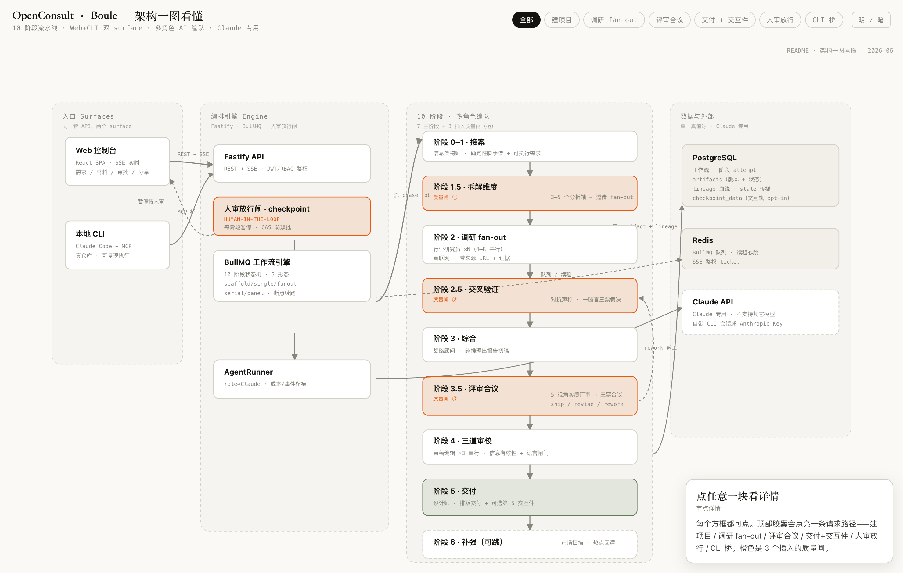

# OpenConsult — AI 驱动的咨询工作台

> **Claude-only**: OpenConsult/Boule 专为 Claude Agent SDK/Claude CLI 工作流设计，不支持其它模型。运行前需服务端具备 Claude CLI 订阅会话或 Anthropic API Key。


> **开发代号 Boule。** 把 10 阶段 × 多角色创作团队 Web 化。接案、调研、综合、评审、三筛、交付——每一步都留下可追溯的来源与裁决记录。

<p align="center">
  <a href="https://github.com/ZCDeng/OpenBoule/stargazers"></a>
  <a href="https://github.com/ZCDeng/OpenBoule/issues"></a>
  <a href="LICENSE"></a>
</p>

<p align="center">
  <a href="https://zcdeng.github.io/OpenBoule"></a>
  <a href="#能力矩阵"></a>
  <a href="#角色编队"></a>
  <a href="#工作台界面"></a>
</p>

---

## 一句话

OpenConsult 把咨询交付变成一条**流水线**。你不是在等一个模型写出一篇长文，而是在调度一支多角色创作团队——每个角色有明确的阶段、工具集和交付标准。

## 架构一图看懂

[](https://zcdeng.github.io/OpenBoule/architecture.html)

> **▶ [点图打开可交互版本](https://zcdeng.github.io/OpenBoule/architecture.html)** — 节点可点看详情、顶部胶囊点亮 6 条请求路径（建项目 / 调研 fan-out / 评审合议 / 交付+交互件 / 人审放行 / CLI 桥）、明暗主题可切。橙色是 10 阶段里 3 个插入的质量闸。

入口（Web 控制台 + 本地 CLI）→ 编排引擎（Fastify + BullMQ 10 阶段状态机 + 人审放行闸）→ 多角色编队（7 主阶段 + 3 质量闸）→ 数据与外部（Postgres 单一真值源 · Redis 队列 · Claude API）。

## 能力矩阵

| # | 能力 | 说明 |
|---|---|---|
| **01** | 确定性脚手架 | Phase 0 秒级生成项目骨架与目录。该用代码答的判断，绝不空转 agent。 |
| **02** | 多角色 agent 编排 | researcher / strategy / review-panel / editor / designer 按 7+3 阶段 DAG 分工，fan-out 并发、串行放行闸，合议交付。 |
| **03** | 真实联网检索 | researcher 接 Aditly MCP（安思派 / 博查 / Jina / Reach）真检索，带来源 URL 落进报告，不靠模型记忆编造。 |
| **04** | 对抗验证三票 | source-verifier 对每条断言独立三票裁决，refute 优先。站不住的论据当场出局。 |
| **05** | AI persona 访谈 | atypica-research 生成 3–5 个 AI persona 深度访谈，抽取用户痛点与决策动机（basis 标 simulated，占比 ≤20%）。 |
| **06** | Web-CLI 协同 | `boule mcp` 把本地 Claude Code / Cursor 接进 workflow；`--local` 免登录单机起；项目可关联本地 git repo，agent 直接在真实文件夹里干活。 |
| **07** | 可审计实时进度 | 工作流实时事件只暴露工具调用、token 用量、阶段状态；agent 的思考过程和高频文本块在落库前就被滤掉。盯得住进度，泄不出模型内部。 |
| **08** | 输入材料与产物分离 | 客户给的参考资料（references）走独立通道上传，映射 Skill 的 `sources/`，启动工作流时冻结快照；不和 agent 生成的 artifact 混在一起。来源可追，产物可信。 |

## 角色编队

每个角色是一份独立的 skill prompt，引擎自动接管编排。新增一个角色 = 一份 `roles/your-role.md` + 一条 dispatch 映射。

| 角色 | 阶段 | 职责 |
|---|---|---|
| 行业研究员 | Phase 2 | 按轴真检索，带来源 URL |
| 对抗声称验证 | Phase 2.5 · 3.5 | 断言三票裁决 + 方案级评审合议（五视角 → 三票 → ship/revise/rework） |
| 战略顾问 | Phase 3 | 合成结构化报告；评审判返工时据裁决重写 |
| 审稿编辑 | Phase 4 | 串行三筛（含信息有效性审查）+ 语言闸门 |
| 设计师 | Phase 5 | 排版交付 + 可选交互件 |
| 市场扫描员 | Phase 6 | 热点扫描，回灌调研轴 |
| 信息架构师 | Phase 0 | 梳理目录与产物结构 |

## Web-CLI 协同层

Web 当指挥中心，本地 CLI 当执行器。重度用户已经在本地跑 Claude Code，里面有完整的项目上下文和记忆——不该逼他们切到浏览器里重新输一遍。

| 能力 | 怎么用 |
|---|---|
| **MCP 桥** | `boule mcp` 起一个 stdio MCP server，暴露 7 个 tool（`list_projects` / `get_workflow` / `submit_artifact` …）。Claude Code 里直接「把这份调研提交到 Boule」，产物出现在 Web 待审批队列。 |
| **Active Context** | MCP 工具不传 project/workflow 时，自动命中你在 Web UI 当前打开的那个。CLI 和 Web 之间不用来回贴 id。 |
| **本地免登录** | `MODE=local` 起，跳过 JWT、单用户、只监听 `127.0.0.1`（带 Host 头校验防 DNS 重绑定）。先体验再决定要不要建团队。 |
| **Thin CLI** | `boule` 命令，零依赖。`boule submit --workflow <id> --type research --file r.md` 这类脚本化场景；`boule mcp` 复用同一个 server。 |
| **Git-linked** | 项目关联本地 git repo，agent 的 cwd 指向真实文件夹（锁死子树不外放），产出物天然进版本控制。仅本地模式；团队项目走 `gitUrl` clone 到服务端。 |
| **认证分层** | Web 走 JWT cookie；MCP / CLI 走 `Authorization: Bearer bk_…`（project-scoped + read/write，可撤销，只存 hash）。 |

本地创建的项目可以 export 成一个 bundle，登录后 import 到团队空间（owner 重映射到导入者）。

> 设计取舍写在 `docs/plans/2026-05-31-002-feat-web-cli-bridge-plan.md`：本地模式原想用 SQLite 做到零基础设施，spike 发现 62 处 Postgres 专用 SQL 挡路，退回 docker PG——保留「零注册」，放弃「零基础设施」。

## 技术栈

| 层 | 选型 |
|---|---|
| 前端 | React 19 + Vite 6 + Tailwind v4 + zustand（含主题）+ cmdk（⌘K）|
| API | Fastify + BullMQ + Drizzle ORM |
| 数据库 | Postgres 16 + Redis |
| Agent 运行时 | Claude Agent SDK `query()` |
| Web 检索 | Aditly MCP（安思派 / 博查 / Jina / Reach）|
| AI 访谈 | atypica-research MCP |
| CLI ↔ Agent | `@modelcontextprotocol/sdk`（stdio MCP server）+ Thin CLI `boule` |

## 快速开始

```bash
git clone https://github.com/ZCDeng/OpenBoule.git
cd OpenBoule
cp .env.example .env
# 编辑 .env 填入数据库和 Redis 配置
docker compose up -d   # PG + Redis
pnpm install
pnpm dev               # api@3100 + web@5173
```

## 项目结构

```
apps/api/     — Fastify API + BullMQ 工作流引擎 + Agent 执行器 + MCP server（src/mcp/）
apps/web/     — React 前端（公开落地页 + 工作台）
packages/cli/ — Thin CLI `boule`（零依赖，复用 apps/api 的 MCP server）
skills-cache/ — 角色 skill prompt（从 consulting-team 仓库同步）
docs/         — 架构文档、计划、进度
```

## 工作台界面

登录后的工作台是一套**终端寄存器**形态：mono 字体打底、编号行、状态当大写标签、电光蓝左轨、硬发丝线、零柔阴影、小圆角。仪表盘感，不是通用 SaaS 卡片堆。

| 特性 | 说明 |
|---|---|
| **控制台形态** | Projects / ProjectDetail / Methodology / Settings 全部终端寄存器化。颜色与形态收敛进 `index.css` 的 `--boule-*` / 语义 token 单一源——一处改、全站生效。 |
| **⌘K 命令栏** | `cmdk` 驱动的全局命令面板，处处可唤起（含 tiptap 编辑区），导航与动作统一入口。 |
| **暗色模式** | 跟随系统 + 手动三态切换（◐ 跟随 / ○ 亮 / ● 暗），写 `localStorage` 记忆，首帧前内联脚本防闪烁。深色强调块在暗色下自动提升为表面，亮色像素零回归。 |

> 落地页（公开站）保留野性现代美术稿，定向固定亮色；暗色只覆盖登录后的工作台。

## Landing 页

[👉 在线预览](https://zcdeng.github.io/OpenBoule)

野性现代（Brutalist neo-grotesque）风格：超大粗体、电光蓝 accent、原始黑边、非对称网格。包含项目介绍、能力矩阵、角色编队、底层运行时、方法论 7+3 阶段、用户登录。

## License

Apache-2.0
