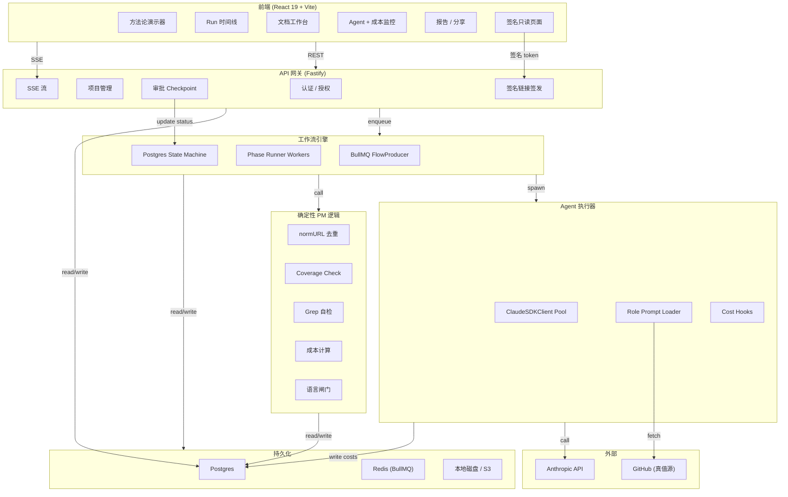
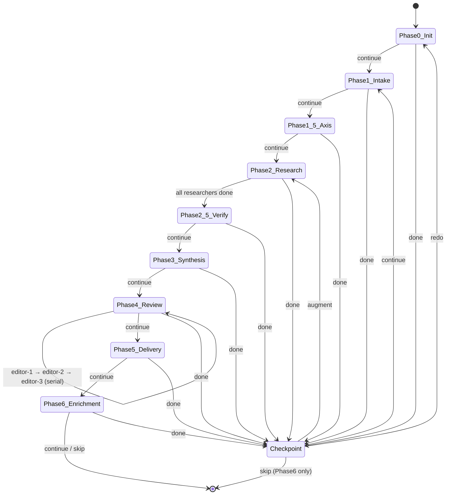
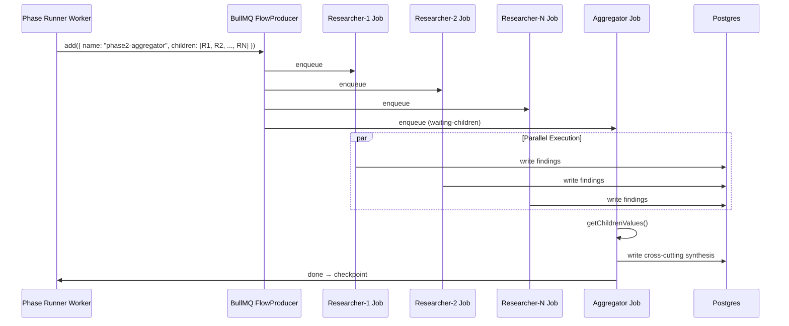

# Boule 架构实施计划

> 状态：active
> 日期：2026-05-30
> 深化：2026-05-30（整合 open-design 反向研究；本机 fork `~/projects/open-design`）
> 类型：Deep / 架构实施
> 来源：`docs/brainstorms/2026-05-30-boule-architecture-requirements.md`

---

## 1. Summary

Boule 是一个 AI 驱动咨询流程的 Web app（前后端），将目前在 Claude Code CLI 里跑的 `/consulting-team` v2.4 skill（7 phase × 7 role 的 creative-team 编排）变成可持久化运行、实时可见进度与成本、可协作编辑、可签名分享的 Web 工作台。

**技术骨架**：Fastify (TypeScript) + BullMQ (Redis) + Postgres + React 19 + React Flow v12 + TipTap。

**核心设计**：BullMQ 的 FlowProducer 跑 phase 状态机（fan-out / join / serial），Postgres 做状态机真值源和 checkpoint 持久化，role 执行器抽象成"归一化事件流 runtime"（`claude-sdk` 按需 spawn / `messages-api` fallback 共享同一事件契约），确定性 PM 逻辑（去重、coverage、grep、成本）全部写成代码、模型只给判断代码做裁决。

> **深化记录（2026-05-30）**：整合 open-design 反向研究——runtime-def 抽象（KTD-17）、checkpoint surface（KTD-18）、SSE 回放（KTD-19）、truth_digest + drift（KTD-20）、裁决纪律（KTD-21）、cost 真值源（KTD-22），及 U2~U10 对应增补。
> **doc-review 修正（2026-05-30，6 reviewer）**：纠正深化时 3 处问题——(a) KTD-17 不再假托 OD 背书（OD runtime 层实为 per-runtime parser，6-event 是 Boule 自有设计，契约测试降为语义等价 + U0 验证映射）；(b) KTD-19 回放缓冲改跨进程 `workflow_events`（OD in-heap Map 是单进程专属，Boule 多 worker 会丢）；(c) KTD-18 弃用 user_id 缓存键（团队共享 run 里 checkpoint 是 run 级事实，越权防线改为 respond 写授权）。另落地一批安全控制（JWT 传输、API key、审批 CAS、inline-assets SSRF、GitHub token 最小权限、回放鉴权）；langfuse 与 snapshot-diff 移入 Deferred；设计 UX 态入 Open Questions。

---

## 2. Problem Frame

（见来源文档 §1 — 五个驱动痛点 + 非显然组合后果）

---

## 3. Requirements Traceability

| 来源 R-ID | 需求 | 对应 IU |
|---|---|---|
| R1 | Web 发起真实客户 run，看 7 phase 实时 agent 进度 + token/成本 | U3, U4, U6, U8 |
| R2 | 每个 phase checkpoint 在 UI 做等价 CLI 决策（continue / augment / skip / redo / mode / axis / frame） | U4, U6, U8 |
| R3 | App 内查看并编辑每个 phase 产出文档，编辑持久化并喂给下游 | U6, U9 |
| R4 | 方法论作为交互式可视化演示给客户（免登录），签名只读链接分享报告 | U7, U8, U10 |
| R5 | 确定性 PM 逻辑（normURL / coverage / grep / 成本 / 语言闸门）跑在代码里 | U5 |
| R6 | 真值源唯一：改 `roles/*.md` 即改变 Boule 行为 | U2 |

---

## 4. Key Technical Decisions

| # | 决策 | 选择 | 理由 |
|---|---|---|---|
| KTD-1 | 工作流引擎 | **BullMQ + Postgres**（vs Temporal） | Boule 的 7-phase 是静态状态机，不需要 Temporal 的动态编排能力。BullMQ 的 FlowProducer 原生支持 fan-out/join/serial，Postgres 做状态持久化。Temporal 的运维复杂度（独立集群 + Go/Protobuf）对咨询团队过重 |
| KTD-2 | Role 执行器 | **Agent SDK `ClaudeSDKClient`**（按需 spawn） | `query()` 每次 ~12s 冷启动不可接受。持久会话复用连接。"按需 spawn"（phase 开始时连、结束后释放）vs "keep-warm 连接池"：选前者，Boule 是顾问工具不是高并发 SaaS，phase 间有人审批间隔，keep-warm 浪费资源 |
| KTD-3 | Checkpoint/HITL | **Postgres 状态机 + SSE 推送** | BullMQ 无原生 HITL。Postgres `workflows.status` 字段驱动状态（`running` → `paused_for_approval` → `approved`）。前端通过 SSE 监听状态变更，自动刷新视图 |
| KTD-4 | 后端框架 | **Fastify + TypeScript** | 性能优于 Express，原生 async/await，插件生态丰富，与 BullMQ（Node.js）同生态。不用 NestJS（过重）、不用 Next.js API routes（前后端分离更清晰） |
| KTD-5 | 前端框架 | **React 19 + TypeScript + Vite** | 生态最全（React Flow、TipTap、shadcn/ui 都是 React-first）。React 19 Compiler 自动 memoization 对实时 dashboard 有帮助 |
| KTD-6 | Methodology 可视化 | **React Flow v12 + ELK.js** | 节点是完整 React 组件（可嵌进度/成本/badge）。v12 新增 `useHandleConnections`、`ViewportPortal`。ELK.js 处理复杂分层布局。GoJS 排除（许可证费 + Canvas 黑盒） |
| KTD-7 | 实时通信 | **SSE (EventSource)** | 单向 server→client，浏览器原生自动重连，HTTP 兼容。Boule v1 不需要双向实时协作，SSE 够用。WebSocket 留作未来扩展 |
| KTD-8 | Markdown 编辑 | **TipTap (ProseMirror)** | WYSIWYG + markdown 双向转换最成熟。协作扩展路径清晰（Yjs + Hocuspocus）。Lexical 备选（bundle 更小但生态较新） |
| KTD-9 | 组件库 | **shadcn/ui + Tailwind CSS** | 无运行时依赖，样式完全可控， consulting-grade 专业感。配合 Tremor 做 dashboard 图表 |
| KTD-10 | 认证 | **自建 JWT + bcrypt** | 用户量小（me + team），不需要 Clerk/Auth0 的复杂度。团队级 RBAC 足够 |
| KTD-11 | 文件存储 | **本地磁盘（开发）→ S3（生产）** | 初版本地文件系统简化，后期加 S3 适配层。报告/deck/assets 统一抽象 |
| KTD-12 | RBAC 模型 | **四级角色：Owner / Editor / Viewer / External** | Owner 全权限；Editor 可编辑文档 + checkpoint 决策；Viewer 只读 + 可看 cost；External 仅通过分享链接访问。比粗粒度"团队级"更精确 |
| KTD-13 | 签名链接安全 | **Opaque random token + 服务端持久化记录** | token = `crypto.randomUUID()`，服务端 DB 存储 `{token → {workflow_id, scope, expiry, nonce, created_by, access_count}}`。验证：查 DB → check expiry → check revocation → increment access_count。nonce 防重放（存 Redis Set）。单 token 限流 10 次/分钟 |
| KTD-14 | SSE 鉴权 | **握手时携带 JWT（HttpOnly cookie 或短时一次性 ticket，不走 query param）**，连接建立后校验 run 读取权限 | 禁止按 run_id 盲订阅。**query param 会把 token 写进访问日志/Referer**，故 SSE 鉴权用 HttpOnly cookie，或先用 Bearer 头换一个 30s TTL 的一次性 ticket（存 Redis）再放 query。未授权连接立即断开；CORS 只做预检，**不作访问控制**（Origin 头可伪造，访问控制一律走 JWT / opaque token） |
| KTD-15 | Artifact 隔离 | **存储层前缀隔离** — internal 前缀与 client 前缀物理分离 | 分享服务对 internal 前缀无读取权限（IAM 级）。`internal-vs-client` 标记仅作冗余校验 |
| KTD-16 | 单写者锁 | **Redis 分布式锁（带 TTL + 心跳续期）** | 锁存 Redis，TTL 默认 5 分钟，心跳每 30 秒续期。UI 显示锁持有者 + 剩余时间。超时自动释放并通知排队者 |
| KTD-17 | Role 执行器抽象 | **归一化事件流 runtime-def**（`claude-sdk` / `messages-api` 两个 def 共享同一事件契约）— **Boule 自有设计，非照搬 OD** | 6 类归一化事件（`text_delta`/`thinking_delta`/`tool_use`/`tool_result`/`usage`/`status`）是 Boule 自己定义的契约。**澄清**：OD 的 `runtimes/` 恰恰相反——每个 runtime 各带 `streamFormat`（8+ 种）+ 各自 parser，**没有**统一事件契约；且其 6 类事件解析的是 `claude` CLI 的 stdout，不是 `ClaudeSDKClient`。Boule 借的只是 OD 的一条**教训**（BYOK/API 路径没纳入抽象导致 tool-loop 写两遍），不是它的 runtime 层结构。抽象边界划在"产出归一化事件流"，token 记账 / hooks / SSE / 落库 / 超时只写一遍；SDK 不稳时切 `messages-api` 是换 def。**注**：`ClaudeSDKClient` 与 Messages API 的底层流形态不同（thinking delta 分块、partial tool_use 组装），两 runtime 只保证**经归一化后语义等价**，非逐字节相同序列；该映射须在 U0 验证 |
| KTD-18 | Checkpoint 模型 | **结构化 surface 事件**（id + schema_digest + status + 状态，可重放 / 可超时） | 借鉴 OD GenUI surface。checkpoint 语义就是"agent 暂停等人回填"，建模成 `surface_request{pending}` → 前端渲染 → `respond` → `surface_response`。获得：重连看到仍 pending 的 checkpoint、超时处理。**越权控制澄清**：团队共享 run 里 checkpoint 决策是 **run 级事实**（editor 替全队决定 continue），不是 per-user 偏好——OD 的 per-(project) 缓存复用对单用户成立，但 Boule **不能按 user_id 加缓存键**（要么几乎不命中，要么被迫跨用户复用＝越权）。正确的越权防线是**"谁能 respond"的写授权**（RBAC + `responded_by{user_id, role}` 留痕，`external` 禁止回填），缓存按 **run 作用域**而非 user 作用域。surface 租期/超时 ≠ phase lease（人审批可挂数小时，见 U4 注） |
| KTD-19 | SSE 可靠投递 | **持久化事件日志（Redis Streams 或 Postgres `workflow_events`）+ 单调 event id + Last-Event-ID 续传** | 仅前端有界队列不够——断线期间的 `agent-progress` 会永久丢。**关键修正**：OD `runs.ts` 的 in-heap `Map` 缓冲是**单进程 daemon** 专属；Boule 是多 worker BullMQ——**产事件的 worker 进程 ≠ 持 SSE 连接的 Fastify 进程**，in-heap 缓冲重连必丢。因此回放源必须是**跨进程共享存储**：worker 写 Redis Streams（`XADD ... MAXLEN ~2000`）或 Postgres `workflow_events(run_id, event_id, event, data)`，任意 Fastify 副本按 `Last-Event-ID` range-scan 补发 `id > lastEventId`。in-heap ring 仅作 per-process best-effort。配套：整帧单次 write + `X-Accel-Buffering: no` + 25s keepalive。**回放时重新校验权限**（见 U6） |
| KTD-20 | 真值源指纹 | **逐文件 hash + 聚合 `truth_digest`（canonical JSON + SHA-256，frozen）+ drift 检测** | 借鉴 OD plugin digest。聚合 digest 做 O(1) 判同源/判漂移；后台重算 GitHub HEAD 的 digest 对比已固化快照 → 不一致标 stale 并提示"现有 workflow 仍用旧快照，新建才生效"，把"改 skill 只影响新 workflow"的核心承诺变可观测。算法 **frozen + 配 CI fixture**（改算法会让历史快照静默漂移） |
| KTD-21 | 质量裁决纪律 | **模型给判断、代码给裁决；裁决规则表"顺序即正确性"** | 借鉴 OD critique。agent 自报分数/结论一律 advisory，代码用确定性规则重算 composite / 数票才作数，分歧记 flag 以代码为准。四态裁决 / coverage / grep 用自上而下"第一条匹配即赢"的规则表，判定顺序固化并写进注释（OD 真实 bug：顺序错会把"报警告又崩"误判成"干净"）。落地全局规则第 5 条 |
| KTD-22 | 成本可观测 | **v1：自建三层 cost 表为结算真值源；langfuse trace 推迟** | 多用户要结算/配额/账单，不能像 OD 把金额外包给 langfuse——自建 cost 表（run/phase/job）是 v1 唯一真值源。langfuse 旁路**移到 Deferred**（plan Open Q 本就建议默认关、cost 表先行，且零 v1 消费者）。**采纳前置条件**：langfuse `generation` span 默认捕获 prompt/completion，会把客户机密（宇润/正治 等真实交付）发第三方——启用前必须默认 `mask_input/mask_output`（只传 token 数 / model / 延迟），全量 prompt 日志另设独立 env flag。其 `trace → span → generation` 映射 `run → phase → job` 的可视化价值留待 fan-out 调试确有需要时再做 |

---

## 5. High-Level Technical Design

### 5.1 系统架构



### 5.2 Phase 状态机



### 5.3 数据流：Phase 2 Fan-Out



---

## 6. Output Structure

```
Boule/
├── docker-compose.yml          # Postgres + Redis + app
├── .env.example
├── package.json                # workspace root
├── tsconfig.json
├── .eslintrc.js
│
├── apps/
│   ├── api/                    # Fastify 后端
│   │   ├── src/
│   │   │   ├── index.ts        # 入口
│   │   │   ├── config.ts       # 环境配置
│   │   │   ├── plugins/        # Fastify 插件
│   │   │   ├── routes/         # API 路由
│   │   │   ├── services/       # 业务服务层
│   │   │   ├── workflow/       # U4: 工作流引擎
│   │   │   ├── agents/         # U3: Agent SDK 执行器
│   │   │   ├── pm/             # U5: 确定性 PM 逻辑
│   │   │   ├── truth/          # U2: 真值源同步
│   │   │   ├── auth/           # U6: 认证
│   │   │   ├── costs/          # U6: 成本追踪
│   │   │   └── share/          # U10: 签名分享
│   │   ├── tests/
│   │   └── package.json
│   │
│   └── web/                    # React 19 前端
│       ├── src/
│       │   ├── main.tsx
│       │   ├── App.tsx
│       │   ├── routes/         # 路由
│       │   ├── components/     # 共享组件
│       │   ├── hooks/          # 自定义 hooks
│       │   ├── stores/         # Zustand stores
│       │   ├── views/
│       │   │   ├── MethodologyDemo/   # U8
│       │   │   ├── RunTimeline/       # U8
│       │   │   ├── AgentMonitor/      # U8
│       │   │   ├── DocumentWorkspace/ # U9
│       │   │   └── ReportShare/       # U9, U10
│       │   └── lib/            # 工具函数
│       ├── public/
│       ├── index.html
│       └── package.json
│
├── packages/
│   ├── shared/                 # 前后端共享类型
│   │   └── src/
│   │       ├── types/
│   │       │   ├── workflow.ts
│   │       │   ├── phase.ts
│   │       │   ├── agent.ts
│   │       │   ├── cost.ts
│   │       │   └── share.ts
│   │       └── index.ts
│   │
│   └── ui/                     # 共享 UI 组件（可选）
│
├── skills-cache/               # U2: 真值源本地缓存
│   └── (gitignored, runtime 下载)
│
└── docs/
    ├── brainstorms/
    └── plans/
```

---

## 7. Implementation Units

> **实施顺序：U0（前置验证）→ U1 → U2 → U3 → U4 → U5 → U6 → U7 → U8 → U9 → U10**
> U0 不通过则停止后续开发。

### U0. Feasibility Spike（前置验证）

**Goal:** 在投入完整实现前，验证架构最核心的三个假设。

**Requirements:** R1（架构可行性前置条件）

**Dependencies:** 无

**Files:**
- `spikes/u0-agent-sdk/executor.ts`
- `spikes/u0-agent-sdk/test-role.ts`
- `spikes/u0-truth-sync/sync.ts`

**Approach:**
Spike 分三个并行验证项，全部通过才算 U0 完成：

1. **Agent SDK headless 执行**：
   - 从 `skills-cache/roles/information-architect.md` 加载真实 role prompt
   - 在服务端 spawn `ClaudeSDKClient`，执行一个简单任务（如"生成 3 个 test axis"）
   - 验证：(a) client 能正常启动和结束 (b) 能调用 `WebSearch` tool（或至少能声明 `allowedTools`）(c) 返回结果可解析 (d) usage token 可提取

2. **并发隔离**：
   - 同时 spawn 3 个独立 client，各执行不同任务
   - 验证：(a) 互不干扰 (b) 各自的 usage 可独立追踪 (c) 总 token 归账正确

3. **真值源快照消费**：
   - 从 GitHub 拉取 `skills/` 目录
   - 创建 workflow 时固化 truth_snapshot（commit SHA + manifest + hash）
   - 验证 executor 读取 snapshot 中的 role prompt 而非实时缓存

**退出条件（全部满足才能进 U1）：**
- ✅ Agent SDK 服务端 headless 跑通真实 role
- ✅ 必需 tools（WebSearch 等）可解析或有明确降级方案（文档化哪些 skill 不可用、替代策略是什么）
- ✅ 并发 job 会话隔离成立，usage 可按 job 归账
- ✅ executor 消费 workflow 创建时固化的 truth snapshot
- ✅ **`ClaudeSDKClient` → 6 类归一化事件映射成立**（产出一张映射表：哪个 SDK 流消息产哪个归一化事件、partial tool_use 怎么缓冲、thinking delta 怎么出）。任一事件无 SDK 来源则 fail-stop——KTD-17 的"两 runtime 语义等价"是 U3 最承重的未验证假设，不能假托 OD CLI parser 直接成立

**如果失败：** 回退方案 = 用 Anthropic Messages API 直接调用 + 自建 prompt 管理 + 自建 tool 封装。此时需要重新评估 U3/U4 设计。

---

### U1. 基础设施与数据层

**Goal:** 项目脚手架、Docker 编排、数据库 Schema、目录结构。

**Requirements:** R1 (infra baseline)

**Dependencies:** 无

**Files:**
- `docker-compose.yml`
- `package.json` (workspace 配置)
- `apps/api/src/db/schema.sql`
- `apps/api/src/db/migrations/001_initial.sql`
- `apps/api/src/db/client.ts`
- `.env.example`
- `tsconfig.json`

**Approach:**
- Docker Compose：Postgres 16 + Redis 7 + app 服务
- Postgres Schema：workflows, phases, phase_attempts, workflow_jobs, workflow_costs, workflow_events, artifacts, users, projects, project_members, share_links, checkpoint_surfaces
- **跨进程事件日志**：`workflow_events(run_id, event_id, event, data, created_at)`（或 Redis Streams）做 SSE 回放真值源（KTD-19）；worker 写、Fastify 读。security 关键 Redis 隔离：nonce 撤销集 + 分布式锁用独立 Redis DB（非 BullMQ 的 DB 0）且开 AOF 持久化，避免 BullMQ flush 连带清空已撤销 nonce
- 使用 `drizzle-orm` 或 `kysely` 做类型安全的数据库访问（Drizzle 更轻，Kysely 查询更灵活。选 Drizzle，因为它有迁移系统和 schema 定义，对 greenfield 更友好）
- 目录结构用 pnpm workspace

**Test scenarios:**
- Happy path: Docker compose up 后 Postgres 和 Redis 都健康
- Edge case: 迁移脚本在空数据库上幂等执行
- Error path: 数据库连接失败时应用优雅退出

**Verification:** `docker compose up` 成功，所有服务 health check 通过，schema migration 跑完无报错。

---

### U2. 真值源同步服务

**Goal:** 从 GitHub 拉取 `skills/` 目录，本地缓存，运行时热重载。

**Requirements:** R6

**Dependencies:** U1

**Files:**
- `apps/api/src/truth/sync.ts`
- `apps/api/src/truth/loader.ts`
- `apps/api/src/truth/digest.ts`（聚合 `truth_digest`，frozen canonical-JSON 算法）
- `apps/api/src/truth/drift.ts`（后台 drift 检测 + stale 标记）
- `apps/api/src/truth/types.ts`
- `apps/api/src/truth/README.md`
- `apps/api/tests/truth/digest.test.ts`（含 frozen fixture）

**Approach:**
- **同步策略**：deploy 时拉取 + GitHub API token（避免匿名限流）+ 本地缓存（TTL 1 小时）；手动触发 `/api/admin/sync-truth-source` 强制刷新。热重载：文件变更时重新解析 role prompt，**不影响正在运行的 workflow**
- **truth_snapshot**：workflow 创建时固化快照，存入 `workflows.truth_snapshot` 字段：
  ```json
  {
    "commit_sha": "<git commit SHA>",
    "synced_at": "<ISO timestamp>",
    "truth_digest": "<sha256(canonical_json(manifest 排序 + 解析后 config))>",
    "manifest": [
      { "path": "skills/SKILL.md", "hash": "<sha256>" },
      { "path": "skills/roles/information-architect.md", "hash": "<sha256>" },
      ...
    ]
  }
  ```
  所有 phase / retry / redo 只读该快照。后续新建 workflow 使用最新快照。snapshot 内容写为 immutable JSON 存入 Postgres，**不可覆盖**。
- **聚合 `truth_digest`（借鉴 open-design `digest.ts`）**：逐文件 hash 留作细粒度 diff 用，另加一个 `truth_digest = SHA256(canonical_json({manifest 键递归排序, 解析后的 mode→axis 模板 / dispatch matrix / 阈值}))` 作整体锚点，O(1) 判"两 workflow 是否同源 / 上游是否漂移"。**算法 frozen + 配 CI fixture**——改算法必须同步更 fixture，否则历史快照静默漂移。
- **写入收口单模块**：所有 `workflows.truth_snapshot` 的写入只经一处（`truth/sync.ts`），配 CI guard 禁止旁路写表；stale 只翻状态位、**绝不重写已固化的 snapshot 内容**（reproducibility-first）。
- **drift 检测（`truth/drift.ts`）**：后台周期任务重算 GitHub HEAD 的 `truth_digest`，与已固化快照比对，不一致 → 不动在途 workflow，仅标记"上游已变"并在 UI 提示"现有 workflow 仍用旧快照，新建才生效"。把"改 skill 只影响新 workflow"从一句话变成可观测机制。
- **GitHub token 最小权限**：`GITHUB_TOKEN` 必须是 fine-grained PAT，**只读、只限 skills 单仓 Contents** 权限（默认宽权限 PAT 一旦服务环境泄露＝攻击者可改真值源）。token 走环境密钥不入库；启动时 dry-run 校验，缺失/无效则 fail loud。
- **snapshot-diff（字段级变更报告）推迟**：drift 检测（标 stale + UI 提示）已满足 R6 的可观测要求；字段级 `+/-/~` diff 是增值调试功能，移到 Scope Boundaries Deferred，等有具体痛点再做。
- GitHub API：带 `GITHUB_TOKEN`（避免匿名限流），`raw.githubusercontent.com` 读文件内容并计算 SHA256 hash
- 缓存结构：`skills-cache/` 目录下保持原目录结构
- 解析：直接读 `.md` 文件内容（role 执行器当 system prompt 用），不做复杂解析
- `augment-map.md` 解析为结构化 JSON，供 checkpoint 时 PM offer 用

**Test scenarios:**
- Happy path: 启动时成功拉取所有 7 个 role + SKILL.md + augment-map.md
- Edge case: GitHub 不可用时使用本地缓存（优雅降级）
- Error path: 文件内容变更后热重载生效，新 workflow 使用新 prompt
- Happy path: `truth_digest` 对相同 manifest + config 输入稳定可复现（frozen fixture 回归）
- Edge case: GitHub 上 skill 文件改动后，drift 检测把上游标为已变，但**在途 workflow 仍读旧快照**（隔离性）
- Error path: `GITHUB_TOKEN` 缺失或非只读单仓权限时启动 fail loud

**Verification:** `/api/admin/sync-truth-source` 返回已同步文件列表，本地 `skills-cache/` 目录与 GitHub 一致。

---

### U3. Agent SDK 执行器

**Goal:** ClaudeSDKClient 生命周期管理、role prompt 加载、成本 hooks。

**Requirements:** R1, R5

**Dependencies:** U1, U2

**Files:**
- `apps/api/src/agents/runtime.ts`（`BouleRoleRuntime` 接口 + 6 类归一化事件契约）
- `apps/api/src/agents/runtimes/claude-sdk.ts`（`ClaudeSDKClient` runtime def）
- `apps/api/src/agents/runtimes/messages-api.ts`（Anthropic Messages API fallback runtime def，自跑有界 tool loop，吐同一事件契约）
- `apps/api/src/agents/executor.ts`（消费归一化事件流：记账 / hooks / 超时，与具体 runtime 无关）
- `apps/api/src/agents/event-types.ts`（6 类归一化事件定义）
- `apps/api/src/agents/errors.ts`（结构化 error code + 兜底派生链 + stderr/异常文本分类器）
- `apps/api/src/agents/log-scrubber.ts`（脱敏：所有结构化日志发出前抹掉 `ANTHROPIC_API_KEY` 等密钥模式）
- `apps/api/src/agents/hooks.ts`
- `apps/api/src/agents/types.ts`
- `apps/api/tests/agents/executor.test.ts`
- `apps/api/tests/agents/runtime-contract.test.ts`（两 runtime 事件契约一致性）

**Approach:**
- **runtime-def 抽象（KTD-17，借鉴 open-design `runtimes/`）**：抽象边界划在"产出归一化事件流"，不划在"如何调用后端"。定义 `BouleRoleRuntime.run(roleCtx): AsyncIterable<NormalizedEvent>`，事件统一为 6 类：`text_delta` / `thinking_delta` / `tool_use` / `tool_result` / `usage` / `status`。两个实现：
  - `claude-sdk`：按需 spawn `ClaudeSDKClient`（systemPrompt + allowedTools + maxTurns），迭代其消息流归一成 6 类事件
  - `messages-api`（fallback）：直接 `fetch /v1/messages`，**自跑有界 tool loop**（参考 OD `MAX_BYOK_TOOL_LOOPS` 同款上界循环），吐**同一** 6 类事件
  - 关键：`executor.ts` / hooks / token 记账 / SSE / 落库 / 超时 watchdog 只消费归一化事件流，**只写一遍**，与 runtime 无关。SDK 不稳时切 `messages-api` 是换 def，不是事后改造（避开 OD"两条 tool-loop 写两遍"的坑）
- **按需 spawn**：每个 role 执行时新建 runtime 实例，phase 结束后释放（`claude-sdk` 调 `disconnect()`）
- Prompt 加载：从 truth snapshot 读 `roles/<role>.md` 当 system prompt（不是实时缓存，见 U2）
- 工具配置：根据 role 需求动态设置 `allowedTools`（researcher 需要 WebSearch/Grep/Read，editor 需要 Read/Edit）；放进 `roleCtx`，两 runtime 各自映射（SDK 的 `allowedTools` / Messages 的 `tools` 数组）
- 成本 hooks：监听归一化 `usage` 事件，一处记录到 `workflow_costs` 表（不管哪个 runtime）
- 并发：Phase 2 的 N=4–8 researcher 各自独立 runtime 实例（独立 cwd/env，无连接池），BullMQ worker 并发数控制
- **API key 处理**：Anthropic key 在 worker 进程启动时从环境载入，**绝不进 BullMQ job payload / DB**；所有日志经 `log-scrubber.ts` 抹密钥后再发出（13 个并发 verifier 时 key 在多进程内存，stdout/stderr 未脱敏即泄露）
- 超时：`claude-sdk` 用原生 `maxTurns`（默认 50）；`messages-api` 用有界 tool loop 上界
- **结构化失败（`errors.ts`，借鉴 OD `run-result.ts` + `auth.ts`）**：失败永远派生非空 error code（兜底链 `显式 code → SIGNAL → EXIT_<n> → TERMINATED_UNKNOWN`）；stderr/异常文本分类器把"auth / rate / upstream 5xx"翻成结构化码（先判 auth 再判 rate，避免 401 误判 5xx），供 dashboard 用并**决定何时从 `claude-sdk` 降级到 `messages-api`**

**KTD 岔路落地：按需 spawn**（非 keep-warm 连接池）。理由：Boule 不是高并发 SaaS，phase 间有人审批间隔（可能几分钟到几小时），keep-warm 占内存不划算。~12s 冷启动在 phase 开始时可接受。

**Test scenarios:**
- Happy path: 成功 spawn runtime、执行单轮对话、返回结果、记录成本
- Edge case: 网络中断时重试（BullMQ job retry）
- Error path: Agent SDK 不可用时报错，不阻塞 workflow（fail loud），失败行带非空结构化 error code
- Integration: 多并发 runtime 各自独立，token 归账正确
- Contract: `claude-sdk` 与 `messages-api` 对同一 `roleCtx` 输入产出**经归一化后语义等价**的事件流（最终状态一致 + 关键事件类型齐全；不要求逐字节相同序列——底层流分块不同）
- Error path: SDK 返回 auth / rate-limit 错误时，分类器产出对应结构化码并触发降级到 `messages-api`

**Verification:** 写一个 mock test（不真调 API）验证 client 生命周期 + hooks 回调正确；集成测试用 staging API key 跑一次简单 researcher。

---

### U4. 工作流引擎

**Goal:** BullMQ FlowProducer 编排 7 phase 状态机 + Postgres checkpoint 持久化。

**Requirements:** R1, R2

**Dependencies:** U1, U3

**Files:**
- `apps/api/src/workflow/engine.ts`
- `apps/api/src/workflow/state.ts`
- `apps/api/src/workflow/checkpoint.ts`
- `apps/api/src/workflow/phases/`（每个 phase 一个 runner）
- `apps/api/src/workflow/queues.ts`
- `apps/api/tests/workflow/engine.test.ts`

**Approach:**
- **状态机**：Postgres `workflows` 表字段：`id`, `project_id`, `current_phase`, `status` (`running` | `paused_for_approval` | `approved` | `rejected`), `checkpoint_data`, `mode`, `axes`, `created_at`, `updated_at`
- **Phase Runner**：每个 phase 一个 BullMQ worker，统一接口 `(workflowId, phaseConfig) => result`
- **Fan-out (Phase 2)**：FlowProducer 的 `children` 数组，每个 researcher 一个子 job。Aggregator parent job 在 `waiting-children` 状态等全部完成
- **Serial (Phase 4)**：Editor-1 job → `waitUntilFinished` → Editor-2 job → `waitUntilFinished` → Editor-3 job。**放行闸 = 硬闸门 + 软评分**（借鉴 OD `ship iff composite ≥ 阈值 且 mustFix === 0`）：三个 editor 跑完仍有"必修项/语言闸门 flag"未清时，**不丢弃**，取质量最高的一稿标 `below_threshold` 兜底（借鉴 OD `selectFallbackRound`），上报 checkpoint 由人决断。**`below_threshold` 由 Phase 4 aggregator 在三 editor 结果合并后计算并写 artifact 状态字段**（在 checkpoint 状态翻转前），U8 前端读此字段显示徽章
- **Checkpoint 审批用 CAS**：`UPDATE workflows SET status='approved' WHERE id=:id AND status='paused_for_approval'`，rowcount≠1 返回 409（防两个 editor 同时点 approve 或重试导致下一 phase 重复 enqueue）
- **surface 租期 ≠ phase lease**：人审批的 checkpoint surface 可合法挂数小时，其超时**不得**复用 phase_attempts 的 2 分钟 lease（`paused_for_approval` 是非 leased 状态），否则会把等人的 run 误判失联
- **Checkpoint**：phase runner 完成后 update Postgres `status = 'paused_for_approval'`，前端通过 SSE 收到事件。用户审批后 API update `status = 'approved'`，enqueue 下一 phase
- **Phase Attempt 可靠性**：
  - `phase_attempts` 表记录每次 phase 执行：`id`, `workflow_id`, `phase`, `attempt_number`, `status` (`leased` | `running` | `completed` | `failed`), `lease_expires_at`, `heartbeat_at`, `bullmq_job_id`, `idempotency_key`, `recovery_reason`, `created_at`
  - **Lease 机制**：worker 启动 phase 时获取 2 分钟 lease，每 30 秒 heartbeat 续期。lease 过期未续期 = 判定失联
  - **幂等写入**：artifact 和状态写入使用 `idempotency_key`（`workflow_id:phase:attempt_number`），重复写入被忽略（INSERT ON CONFLICT DO NOTHING）
  - **Recovery**：启动时扫描 `status = 'running'` 且 `lease_expires_at` 已过的 workflow → 核对 BullMQ job 状态（`job.getState()`）→ 若 job 确实不存在或 stalled → 只允许**当前 attempt 的 owner** 接管（通过 attempt_id 匹配），禁止重复 enqueue。recovery 写 `recovery_reason` 留痕（`lease_expired` / `heartbeat_timeout` / `daemon_restart`）；**CAS 守卫必须原子推进它所守的判别字段**——`UPDATE ... SET attempt_number = attempt_number+1, status='leased', owner=:me WHERE status='running' AND attempt_number=:n AND lease_expires_at < now()`，0 行受影响＝别人已赢。OD 是单恢复者（一个 daemon 收自己的孤儿 run），其 CAS 形态在 Boule **多 worker 并发恢复**下必须靠 DB 写（而非先读后写）裁定赢家，否则两个恢复 worker 会同时通过 CAS。注意：lease + heartbeat 是**运行期持续探活**，比 OD 的 boot-time 一次性扫描更稳（能抓"进程活着但 phase 卡死"），boot 扫描只作重启兜底。**heartbeat 由 phase runner 进程内 `setInterval` 发送时，须与 BullMQ job active 状态对账**（进程崩溃 setInterval 停但 job 可能仍 active）
  - **事件回放缓冲（KTD-19）**：每个 run 维护单调自增 `event_id` + 服务端有界环形缓冲（默认 2000 条），供 SSE 断线重连按 `Last-Event-ID` 补发（见 U6/U7）。同时 best-effort 落 ND-JSON 事件日志，外部可 tail
  - **Partial failure（Phase 2）**：BullMQ Flow `ignoreDependencyOnFailure: true`，aggregator 收到 `getChildrenValues()` 时缺失的子 job 值记为 `null`，不阻塞整体

**KTD 岔路落地：SSE 推送 + 前端状态驱动**。BullMQ 无原生 HITL，用 Postgres 状态字段 + SSE 事件实现。前端监听 `workflow-status-changed` 事件自动刷新。

**Test scenarios:**
- Happy path: 完整跑通 7 phase（mock agent 调用），每个 checkpoint 正确暂停
- Edge case: 服务器重启后恢复 running workflow
- Error path: Phase 2 某个 researcher job 失败，重试 3 次后标记失败但不阻塞整体（aggregator 收到 partial results）
- Edge case: 用户点击 "redo" 时重新 enqueue 当前 phase
- Integration: Fan-out 4 个 researcher，aggregator 正确合并结果

**Verification:** 集成测试跑一个完整 workflow（用 mock agent，不真调 API），验证状态机转换、checkpoint 暂停、审批后继续。

---

### U5. 确定性 PM 逻辑

**Goal:** 把 SKILL.md 里 PM 主线程的确定性活儿全部写成代码。

**Requirements:** R5

**Dependencies:** U1, U3, U4

**Files:**
- `apps/api/src/pm/url-dedup.ts`
- `apps/api/src/pm/coverage-check.ts`
- `apps/api/src/pm/grep-check.ts`
- `apps/api/src/pm/cost-calc.ts`
- `apps/api/src/pm/language-gate.ts`
- `apps/api/src/pm/types.ts`
- `apps/api/tests/pm/`（各模块单元测试）

**Approach：**
- **代码职责收缩为 invariant helper**（不随 skill 方法论演进）：
  - `normURL` 去重（去 www + 去尾斜杠 + 小写），标记 `source_shared_with`
  - `coverage-check`：用"声明 axis 全集 − 实到 axis 集"差集找 gap，**按 axis 分桶、不跨桶凑数**（借鉴 open-design `incomplete_panel`：axis A 的 finding 不能拿 axis B 的来凑）；空 axis 标记 gap（**不**自动 recovery，只报给 checkpoint）
  - `grep-check`：检查产出文档是否含禁用词（黑话列表从真值源读，不硬编码）
  - `cost-calc`：汇总 `workflow_costs`，按 run / phase / job 分层
  - `language-gate`：Phase 4 后检查客户交付物，命中流程黑话即 flag（黑话列表从真值源读）
- **真值源配置化**（随 skill 演进，从 `skills/` 读取）：
  - `mode→axis` 默认模板、`axis→lane` 路由表 → 从 SKILL.md 解析为 JSON config
  - `dispatch matrix`（N 数量、frame 池、axis×frame 分配规则）→ 从 SKILL.md 解析
  - `allowedTools` policy → 由 role prompt 自身声明（如 `roles/industry-researcher.md` 的 frontmatter），执行器读取 frontmatter 动态设置
  - `FETCH_BUDGET`、`VERIFY_CAP`、`REFUTATIONS_REQUIRED` 等阈值 → 从 SKILL.md 解析为 config
- **不代码化的行为**：cross-cutting synthesis（显式合并）、选承重声称、阶梯投票分配 — 这些由 PM Agent 执行（通过 Agent SDK 调用 `roles/source-verifier.md` 的 system prompt）

**裁决纪律（KTD-21，借鉴 open-design critique）：**
- **模型给判断、代码给裁决**：verifier / editor / PM Agent 自报的分数或结论一律 advisory，代码用确定性规则重算 composite、数 survive/refute 票才作数；模型自报值与代码裁决分歧时**记 flag、以代码为准**（落地全局规则第 5 条）。
- **裁决规则表"顺序即正确性"**：四态裁决（confirmed/salvage/killed/undetermined）、coverage、grep 的判定写成自上而下"第一条匹配即赢"的规则表，**判定顺序固化并写进注释**解释为什么（OD 真实 bug：把"报了警告又崩掉"误判成"干净但不完整"，因为规则排序反了）。
- **缺席不拉偏**：某 verifier 没返回，不让其缺席把整体票数拉偏，在**实际投票者间归一化**（OD `computeComposite`：缺席角色权重在在场者间按比例重分配）。
- **两段式 flag**：单次产出命中黑话/软违规 → 记 flag 不阻断；但聚合层把"任何 flag = 这份产物不 protocol-clean"（OD parser_warning → conformance degraded 的两段式）。

**Role vs Code 边界（开放问题 2 落地）：**

| Phase | Agent SDK（判断/合成类） | 代码（invariant helper） | 真值源配置（随 skill 演进） |
|---|---|---|---|
| 0 init | 骨架生成 | 目录创建、模板复制 | — |
| 1 intake | Subject/Mode/Substance gate、brief 生成 | — | mode 决策树模板 |
| 1.5 axis | axis 分解（3-5 个） | — | mode→axis 模板、axis→lane 路由表 |
| 2 | researcher 调研 | — | dispatch matrix、frame 池、FETCH_BUDGET |
| 2.4 | cross-cutting synthesis（PM Agent 执行） | normURL、coverage check | — |
| 2.5 | source-verifier 对抗验证 | — | VERIFY_CAP、阶梯投票规则、四态裁决阈值 |
| 3 | strategy 合成报告 | per-rec basis 标签检查 | — |
| 4 | editor 三筛子 | 语言闸门、grep 自检 | 禁用词/黑话列表 |
| 5 | designer 排版交付 | — | 导出顺序、设计合规 checklist |
| 6 | market-scanner 热点扫描 | — | — |
| 全局 | — | cost calc、checkpoint plumbing、artifact 归档 | — |

**Test scenarios：**
- Happy path: normURL 正确去重（`https://www.example.com/` = `https://example.com`）
- Edge case: coverage check 发现空 axis，不触发 recovery（recovery 由 PM Agent 决策），仅上报 checkpoint 显示 gap 列表（fail loud）
- Edge case: coverage check 按 axis 分桶，axis A 的 finding 不被 axis B 的凑数掩盖
- Error path: grep 自检发现客户交付物含 `basis: external:`，flag 为失败
- Happy path: 成本计算汇总 7 phase 的 token 和金额正确
- Edge case: verifier 自报"已确认"但证据/票数不足时，代码裁决为 `undetermined`（不直接采信模型自报）
- Error path: 裁决规则表顺序回归——"报 flag 又崩"的产出不被误判为 `confirmed`

**Verification:** 用 宇润 项目的历史产出做回归测试，比对 CLI skill 的 PM 逻辑输出与代码输出一致性。

---

### U6. API 网关层

**Goal:** REST API + 认证 + 项目 RBAC + 审批 checkpoint + 签名分享链接。

**Requirements:** R2, R3, R4

**Dependencies:** U1, U3, U4, U5

**Files:**
- `apps/api/src/routes/auth.ts`
- `apps/api/src/routes/projects.ts`
- `apps/api/src/routes/workflows.ts`
- `apps/api/src/routes/artifacts.ts`
- `apps/api/src/routes/approvals.ts`
- `apps/api/src/routes/surfaces.ts`（checkpoint surface 请求/回填/超时）
- `apps/api/src/routes/shares.ts`
- `apps/api/src/routes/sse.ts`
- `apps/api/src/middleware/auth.ts`
- `apps/api/src/artifacts/publication-guard.ts`（残留模板占位符 → 拒绝发布）
- `apps/api/src/artifacts/stub-guard.ts`（退化检测：新版本字节 < 旧版本 20% → warn）
- `apps/api/src/services/surface-cache.ts`（run 作用域 surface 缓存）
- `apps/api/src/services/`（业务逻辑层）
- `apps/api/tests/routes/`（路由测试）

**Approach:**
- **认证**：JWT（access token + refresh token），bcrypt 密码。注册/登录/登出 API
- **项目 RBAC**：`project_members` 表（user_id, project_id, role）。四级角色：
  - `owner`：全权限（项目管理、成员管理、workflow 创建/删除、所有 checkpoint 决策、分享链接签发）
  - `editor`：文档编辑、checkpoint continue/skip/redo/augment 决策、查看 cost
  - `viewer`：只读 + 可查看 cost 数据（无量纲比例）
  - `external`：仅通过签名分享链接访问，无登录
- **Workflow API**：`POST /api/workflows`（创建，仅 owner）、`GET /api/workflows/:id`（状态，viewer 及以上）、`POST /api/workflows/:id/approve`（审批 checkpoint，editor 及以上）
- **Artifact API**：`GET /api/artifacts/:id`（查看，viewer 及以上）、`PUT /api/artifacts/:id`（编辑，editor 及以上）、`GET /api/artifacts/:id/versions` + `GET /api/artifacts/:id/versions/:vid`（历史版本，支撑 R3"编辑持久化并喂给下游"）。写入前过两道 fail-loud 护栏（借鉴 open-design）：**publication-guard**（html/deck 残留模板占位符如 `待确认`/`$X.XM` → 拒发 `ARTIFACT_PUBLICATION_BLOCKED`）+ **stub-guard**（新 body 字节 < 同 artifact 历史最大版本 20% → warn"疑似写崩"，三态 `reject`/`warn`/`off` 可配）
- **SSE（KTD-19）**：`GET /api/sse/workflows/:id`，握手时校验 JWT + run 读取权限（JWT 走 cookie/ticket，不走 query param，见 KTD-14）。推送 `workflow-status-changed`、`agent-progress`、`cost-update`、`surface-*` 事件。事件带单调 `event_id`；断线回放从**跨进程 `workflow_events`（Redis Streams / Postgres）**补发 `id > lastEventId`（不是 worker in-heap Map，见 KTD-19）；整帧单次 write + `X-Accel-Buffering: no` + 25s keepalive。**重连＝一次全新鉴权**：回放前重新查当前 project 成员/角色，中途被移除/降权的用户重连带 `Last-Event-ID` 返回 403（防回放它已无权接收的 agent-progress）。未授权连接立即断开
- **Checkpoint surface（KTD-18，借鉴 OD GenUI）**：checkpoint 建模为结构化 surface 事件（`surface_request` / `surface_response` / `surface_timeout`），存 `checkpoint_surfaces` 表（`id`, `workflow_id`, `phase`, `schema_digest`, `status` [`pending`/`resolved`/`timeout`/`invalidated`], `persist_tier`, `responded_by` {`user_id` + `role`}, `created_at`）。获得可重放（重连看到仍 pending 的 checkpoint）、可超时。**越权防线在写授权，不在缓存键**（KTD-18）：checkpoint 决策是 run 级事实，缓存按 **run 作用域**（`surface_cache:{workflow_id}:{schema_digest}`，不含 user_id——否则团队共享 run 几乎不命中）；防越权靠 **respond 动作的 RBAC 门控**——只有 editor+ 能回填，`external` 禁止，每次回填写 `responded_by{user_id, role}` 留痕。测试须显式验证 viewer 无法回填、external 被拒
- **签名分享**：`POST /api/shares` 创建签名链接（owner/editor）。token = `crypto.randomUUID()`（Opaque token），服务端 DB 存储 `{token → {workflow_id, scope, expiry, nonce, created_by, access_count}}`，URL `/s/{token}`。验证流程：查 DB → check expiry → check revocation → increment access_count。nonce 防重放（存 Redis Set）。单 token 限流 10 次/分钟。访问日志记 `access_count` + `last_accessed_at` + `ip_address`
- **权限检查点**：每个路由前置 `requireRole(minRole)` 中间件，拒绝时返回 403 并记录审计日志
- **成本可观测（KTD-22）**：v1 只做自建三层 cost 表（run/phase/job），是**结算真值源**（多用户要配额/账单，不外包给 langfuse）。langfuse trace 旁路移到 Deferred（采纳前置：prompt/completion 默认脱敏，见 KTD-22 + Scope Boundaries）

**Test scenarios:**
- Happy path: 注册 → 登录 → 创建项目 → 创建 workflow → 审批 checkpoint
- Edge case: 非项目成员访问 workflow 返回 403
- Error path: 过期签名链接返回 410 Gone
- Integration: SSE 客户端连接后收到 workflow 状态变更事件
- Integration: SSE 客户端断线带 `Last-Event-ID` 重连，服务端只补发缺失的 `id > lastEventId` 事件（不重投、不漏投）
- Edge case: viewer 重连看到仍 pending 的 checkpoint surface；同 schema 已回填则不重复弹出
- Error path: external 角色尝试回填 checkpoint surface 被拒；viewer 不复用 editor 的回填答案
- Error path: PUT artifact 残留模板占位符被 publication-guard 拒发；新 body < 旧版本 20% 被 stub-guard warn
- Error path: 无效 JWT 返回 401

**Verification:** Postman/HTTPie 集合跑通完整用户流：注册 → 创建项目 → 启动 workflow → 等 checkpoint → 审批 → 完成。

---

### U7. 前端骨架与共享组件

**Goal:** React 19 项目脚手架、路由、布局、主题、共享组件。

**Requirements:** R4 (infra baseline)

**Dependencies:** U1, U6 (API 可用）

**Files:**
- `apps/web/src/main.tsx`
- `apps/web/src/App.tsx`
- `apps/web/src/routes/index.tsx`
- `apps/web/src/components/Layout.tsx`
- `apps/web/src/components/Navigation.tsx`
- `apps/web/src/components/CheckpointCard.tsx`
- `apps/web/src/stores/auth.ts`
- `apps/web/src/stores/workflow.ts`
- `apps/web/src/lib/api.ts`
- `apps/web/src/lib/sse.ts`
- `apps/web/src/lib/surface.ts`（checkpoint surface 客户端：渲染 pending、回填、超时）
- `apps/web/src/index.css`

**Approach:**
- Vite + React 19 + TypeScript
- 路由：`react-router-dom`，页面：/login, /projects, /projects/:id, /workflows/:id, /methodology, /shares/:token
- 状态：Zustand（auth store, workflow store）+ React Query（server state）
- SSE：封装 `useSSE` hook，有界队列（保留最近 500 条），指数退避重连；**重连携带 `Last-Event-ID`，从断点续传**而非从 0（服务端回放见 U4/U6），网络抖动不丢中间 `agent-progress`
- Checkpoint surface（KTD-18）：`lib/surface.ts` 消费 `surface_request{pending}` → 渲染 `CheckpointCard` → 用户回填 `respond` → 收 `surface_response`；处理 `surface_timeout`；同 `schema_digest` 已 resolved 则不重复弹出
- 主题：shadcn/ui + Tailwind CSS，中文优先（思源宋体标题 + 无衬线正文）
- 共享组件：CheckpointCard（显示 phase 完成信息 + augment 选项 + 操作按钮）

**全局状态设计规范（所有视图必须覆盖 6 种核心状态）：**
每个页面/组件必须显式处理：
1. **初始加载态** — skeleton 占位，禁用交互
2. **空态** — 无数据/无项目时的引导（如"创建第一个项目"CTA）
3. **内容态** — 正常展示数据
4. **错误态** — 分 P0（阻塞，红色置顶横幅 + 重试按钮）、P1（影响质量，黄色内联提示）、P2（信息备注，灰色可折叠）
5. **离线/降级态** — SSE 断线时显示"连接中断，正在重连..."，允许只读浏览
6. **权限不足态** — 当前角色无权访问时的友好提示（如"请联系项目 Owner 申请 Editor 权限"）

**Test scenarios:**
- Happy path: 登录后导航到项目列表 → 进入项目 → 查看 workflow
- Edge case: Token 过期时自动刷新，刷新失败跳转登录页
- Error path: SSE 断线后自动重连，带 `Last-Event-ID` 续传，断线期间的事件被补齐（无空洞）
- Happy path: 收到 `surface_request` 渲染 checkpoint，回填后收 `surface_response` 关闭；超时显示 `surface_timeout` 态

**Verification:** `pnpm dev` 启动前端，能登录、能看到项目列表、SSE 连接成功。

---

### U8. 前端核心视图：方法论 + Run 时间线 + Agent 监控

**Goal:** 三个核心可视化界面。

**Requirements:** R1, R2, R4

**Dependencies:** U6, U7

**Files:**
- `apps/web/src/views/MethodologyDemo/MethodologyGraph.tsx`
- `apps/web/src/views/MethodologyDemo/PhaseNode.tsx`
- `apps/web/src/views/RunTimeline/Timeline.tsx`
- `apps/web/src/views/RunTimeline/PhaseCard.tsx`
- `apps/web/src/views/AgentMonitor/Dashboard.tsx`
- `apps/web/src/views/AgentMonitor/CostChart.tsx`
- `apps/web/src/views/AgentMonitor/AgentJobList.tsx`
- `apps/web/src/views/AgentMonitor/VerdictView.tsx`

**视图优先级（5 个前端界面）：**

| 优先级 | 视图 | 依赖 | 说明 |
|---|---|---|---|
| P0 | **Run 时间线** | U4 工作流引擎 | 核心工作流 — 没有它无法做 checkpoint 决策 |
| P0 | **文档工作台** | U6 Artifact API | 核心工作流 — 编辑产出、喂给下游 |
| P1 | **Agent 监控** | U4 + SSE | 增强体验 — 看进度和成本，但时间线已覆盖基本状态 |
| P1 | **方法论演示器** | 无（可静态） | 对外销售工具 — 可独立发布，不阻塞核心工作流 |
| P2 | **报告分享** | U10 | 交付物分发 — 第一次端到端 run 通后才需要 |

**Approach:**

- **Run 时间线（P0）**：垂直时间线，每个 phase 一个卡片。卡片内显示：开始/结束时间、agent 列表、token 消耗、状态（等待中/进行中/已完成/需审批）。当前 phase 高亮。审批按钮 inline。
  - *状态设计*：空态显示"暂无 run，点击创建"；加载态 skeleton 卡片；错误态 P0（工作流引擎不可用）/ P1（单个 phase 失败）；离线态显示"连接中断，进度可能延迟"

- **文档工作台（P0）**：详细设计见 U9（实现 IU）。

- **Agent 监控（P1）**：实时 dashboard。顶部 KPI（总 token、总成本、运行中 agent 数）。中部：每个 agent job 的进度条 + 状态 + 成本。底部：成本趋势图（Tremor/Recharts）。
  - *状态设计*：空态显示"启动一个 run 后在此查看 agent 进度"；加载态 KPI skeleton；错误态 P1（部分 agent 数据缺失）；SSE 断线时 KPI 冻结并显示"数据暂停更新"徽章

- **方法论演示器（P1）**：React Flow + ELK.js 自动布局。7 phase 节点，每个节点显示：状态色块、phase 名称、示例产出数。点击节点展开详情面板。支持对外分享（免登录只读）。
  - *状态设计*：空态不适用（静态内容）；离线态完全可用（内容已缓存）；权限不足态不适用（公开页）

- **报告分享（P2）**：签名链接管理 + 报告预览。列表显示所有分享链接（创建时间、过期时间、访问次数）。预览仅支持 HTML（v1 不承诺 PDF/deck，客户浏览器打印即可）。
  - *状态设计*：空态"暂无分享链接，点击创建"；过期链接显示 410 友好页（"链接已过期，请联系顾问重新分享"）；撤销链接显示"链接已撤销"

**四态裁决（Phase 2.5）**：独立视图，P1 优先级。与 Agent 监控同一页面（标签切换："进度" / "验证"）。验证标签页显示：
- 顶部：本次验证统计（承重声称数 M、 verifier 派工数、预估/实际 token）
- 中部：claim 列表，每 claim  verdict 徽章（confirmed/salvage/killed/undetermined）+ survive/refute 票数。**徽章是代码裁决结果**（数票），verifier 自报不直接采信（KTD-21）
- 底部：salvage 窄版对照（原始过强版 → refuter 建议窄版）+ 驳倒附录（killed claims）
- 顾问可点击 verdict 展开证据链，提供"接受/质疑"操作（质疑需填写理由并留痕）

Phase 4 交付物若触发 `below_threshold` 兜底（三筛子未清必修项，见 U4），时间线卡片显示黄色"未达放行闸"徽章 + 取用稿次，hover 展示未清项列表。

**Test scenarios:**
- Happy path: 方法论图正确渲染 7 phase，节点可点击
- Edge case: 大量 agent job（13 个 verifier）时虚拟列表渲染不卡顿（只渲染可视区域）
- Integration: SSE 推送 agent 进度时 dashboard 实时更新（100ms 内响应）
- Happy path: 时间线显示正确的 checkpoint 审批按钮（editor 角色可见，viewer 隐藏）
- Error path: 网络断线时编辑器自动保存失败，提示"将保存在本地，恢复后同步"

**Verification:** 用 mock workflow 数据渲染所有视图，交互流畅，SSE 更新响应 <100ms。

---

### U9. 前端核心视图：文档工作台 + 报告预览

**Goal:** 文档编辑和报告预览界面。

**Requirements:** R3, R4

**Dependencies:** U7

**Files:**
- `apps/web/src/views/DocumentWorkspace/Editor.tsx`
- `apps/web/src/views/DocumentWorkspace/DocumentList.tsx`
- `apps/web/src/views/DocumentWorkspace/VersionHistory.tsx`
- `apps/web/src/views/ReportShare/ReportViewer.tsx`
- `apps/web/src/views/ReportShare/SharePanel.tsx`

**Approach:**
- **文档工作台**：TipTap 编辑器（WYSIWYG + markdown 源码切换）。左侧文档树（按 phase 分组），中间编辑器，右侧预览。自动保存（debounce 2s）。
- **报告预览**：**职责边界**——U9（前端）只负责 iframe 预览组件（`sandbox="allow-scripts"`、不给 `allow-same-origin`、`srcdoc`，opaque origin 隔离 cookie/storage/API）；**服务端渲染 + 资源内联 + CSP 头由 U10 提供**（U9 调 U10 的 report 端点拿已内联、CSP 合规的 HTML，前端不做渲染逻辑）。客户语言版（去流程黑话）。v1 不承诺"导出 PDF"——报告分享走签名链接渲染 HTML，客户浏览器打印即可。
- **编辑锁定**：单写者锁（Redis 分布式锁，TTL 5 分钟 + 心跳续期）。用户 B 尝试打开用户 A 正在编辑的文档时：
  - 检测锁状态 → 显示锁持有者头像 + 剩余时间
  - 提供"只读查看"和"排队等编辑"两个选项
  - 锁释放时通知排队者（浏览器通知或 SSE 事件）
  - 锁超时自动释放，被编辑内容自动保存为最新版本
- **Artifact Lineage**：
  - 每个 phase 记录 `input_artifact_versions`（JSONB，列出本 phase 读取了哪些 artifact 的哪个 version）
  - 依赖图：`Phase 1 (intake-brief) → Phase 1.5 (axis) → Phase 2 (research) → Phase 2.5 (verifier) → Phase 3 (synthesis) → Phase 4 (review) → Phase 5 (delivery)`。编辑 Phase N 产出后，Phase N+1 及之后所有下游标记 `stale = true`
  - UI 显示"受影响的下游 phase"列表（如"编辑 intake-brief 将影响 axis → research → ..."），用户选择"仅保存"或"保存并重跑下游"
  - **触发时机**：用户点击"保存"时（手动或 debounce 自动保存），若检测到 artifact 已修改且下游有依赖，弹出确认对话框（不阻塞保存本身）；stale 状态持久化到 DB，文档树左侧对 stale 下游 phase 显示黄色 ⚠ 徽章，hover 展示"受影响原因 + 重跑选项"
  - v1 不自动级联 — 用户确认后才重跑，避免意外消耗 token（与 open-design live-artifact 的"refresh 是显式 action 而非 reactive effect"同哲学）
  - 下游 phase 重跑时读取最新 artifact version，有端到端测试覆盖
  - **重跑审计日志（借鉴 OD `refreshes.jsonl` + provenance）**：每次重跑追加一条 `{step, status, duration, error, read_artifact_versions}`；hover 弹层的"受影响原因"直接读 provenance 的 `sources[]`（这次产出读了哪些上游 + version）

*状态设计（文档工作台）：*
- 空态："选择左侧文档开始编辑"
- 加载态：编辑器骨架 + 文档树 skeleton
- 错误态：P0（保存失败，本地草稿保留，提示"恢复草稿？"）/ P1（自动保存冲突，提示"覆盖/放弃"）
- 离线态：禁用编辑，提示"离线模式，仅浏览。恢复连接后自动同步"
- 锁定态：显示"正在被 X 编辑，预计 Y 分钟后释放"，提供"排队"按钮
- 权限不足态：viewer 角色打开编辑器时，工具栏隐藏，显示"只读模式"

**Test scenarios:**
- Happy path: 打开 intake-brief.md，编辑内容，自动保存成功
- Edge case: 切换 markdown 源码和 WYSIWYG，内容一致
- Error path: 网络断开时编辑内容本地缓存，恢复后同步
- Happy path: 创建签名分享链接，复制 URL

**Verification:** 能编辑文档、能切换视图、能创建分享链接。

---

### U10. 报告渲染与签名分享

**Goal:** HTML 渲染 + 签名只读链接。（v1 不承诺 PDF/deck 导出）

**Requirements:** R4

**Dependencies:** U6, U7

**Files:**
- `apps/api/src/share/renderer.ts`
- `apps/api/src/share/inline-assets.ts`（资源内联：stat-then-read + 多层大小上限防 OOM）
- `apps/api/src/share/signer.ts`
- `apps/api/src/share/routes.ts`
- `apps/web/src/views/PublicShare/MethodologyPublic.tsx`
- `apps/web/src/views/PublicShare/ReportPublic.tsx`

> **注**：`apps/api/src/delivery/puppeteer.ts`（PDF 渲染服务）v1 不实现，推迟到 PDF 导出功能上线时创建。

**Approach:**
- **签名链接**：token = `crypto.randomUUID()`（Opaque token），服务端 DB 存储映射：`{token → {workflow_id, scope, expiry, nonce, created_by, access_count}}`。URL 结构 `/s/{token}`（不可预测路径）。验证流程：
  1. 查 DB 取 token 记录（不存在 → 404）
  2. 检查 expiry 未过期（过期 → 410 Gone）
  3. 检查 nonce 不在撤销 Redis Set（撤销 → 410 Gone）
  4. 检查 scope 与请求资源匹配（不匹配 → 403）
  5. 限流：单 token 10 次/分钟，超限时返回 429
  6. 记录访问日志（access_count++, last_accessed_at, ip_address）
- **免登录页面**：`GET /s/:token` → 验证通过 → 根据 scope 渲染。方法论页面用 React Flow 只读模式，报告页面用静态 HTML 渲染
- **Sandbox 渲染（双层，借鉴 open-design，经其 issue 锁定的成熟方案）**：
  1. 前端 iframe `sandbox="allow-scripts"` + `srcdoc`，**不给 `allow-same-origin`**（opaque origin，隔离 cookie/storage/API）
  2. 顶层导航场景（直接打开报告 URL，无 Origin 头）加响应头 `Content-Security-Policy: sandbox allow-scripts`，强制降级成 opaque-origin sandbox
  3. 资源内联（`inline-assets.ts`）：只内联顶层相对 `<link>`/`<script src>`，img/font/url() 保持外链；stat-then-read 先判文件大小再读，带 owner/单 asset/总量多层上限防 OOM。**SSRF/路径穿越防护**（inline-assets 跑在主 Node 进程、有全文件系统访问权，与 puppeteer 网络隔离是两回事）：解析任何 asset 路径前校验 (a) scheme 非 `file://`，(b) realpath 落在该 artifact 自己目录内（防 `../../etc/passwd`），(c) 若带 host 则非私网/loopback/link-local
  4. 若报告由"模板 + 结构化数据"生成：渲染前正则硬拒 `<script>`/`<iframe>`/`on*=`/`javascript:`，插值只取标量、强制 HTML-escape、只允许白名单路径前缀（零-XSS）
- **puppeteer 安全**：运行在隔离网络命名空间（禁止访问 localhost、metadata endpoint、file://）。禁用 JavaScript 执行或限制为已知 safe 列表。无特权用户运行 chromium
- **v1 不承诺 deck PDF** — 报告分享走签名链接渲染 HTML。PDF 导出移到"推迟"

**Test scenarios:**
- Happy path: 创建签名链接 → 免登录访问 → 内容正确
- Edge case: 过期链接返回 410
- Error path: 撤销链接后访问返回 410
- Happy path: 创建签名链接 → 免登录访问 HTML report → 内容正确渲染

**Verification:** 创建链接 → 免登录访问 → 撤销 → 再次访问失败。

---

## 8. Scope Boundaries

### 在本产品内
- 全部 10 个 Implementation Units

### 推迟（later）
- 移动端适配（responsive 基础有，但不做移动端优先设计）
- 多人实时协同编辑（v1 单写者锁）
- augment 的全量 Web 化（初版只移植判断类 augment，⚡CC-only 的如 deep-research 暂不移植）
- MCP server 集成（Agent SDK 的 MCP 支持尚在演进）
- S3 文件存储（初版本地磁盘）
- **langfuse trace 旁路**（KTD-22）：v1 只建自建 cost 表；langfuse 待 fan-out 可视化确有需要再开，且采纳前必须做 prompt/completion 默认脱敏（客户机密不外泄第三方）
- **truth snapshot 字段级 diff**（snapshot-diff）：drift 检测已满足 R6 可观测；字段级变更报告待有具体调试痛点再做

### 不属于本产品身份
- 客户登录门户 / 对外多租户 SaaS
- 替代 CLI skill（skill 永远是真值源，Boule 是它的 Web 化执行+可视化层）

### 推迟到后续工作
- 高级团队协作（评论、@提及、通知中心）
- Workflow 模板市场（保存/复用自定义 workflow 配置）
- API 对外暴露（ webhook、第三方集成）

---

## 9. Open Questions

1. **成本归账粒度**：按 run / phase / job 三层归账已覆盖，是否需要按 augment 单独计？（初版不按 augment 分，因为 augment 是可选补充，归到所在 phase 即可）
2. **Agent SDK 版本锁定**：Agent SDK 仍在快速迭代，是否需要 pin 版本？（初版 pin 到当前稳定版，真值源同步时检查 compatibility）
3. **Deck PDF 渲染服务**：v1 不承诺 deck PDF — 报告分享走签名链接渲染 HTML，客户浏览器打印即可。PDF 导出移到"推迟"。puppeteer 仅在需要时启用，运行在隔离网络命名空间
### 从 2026-05-30 doc-review 沉淀（实现期 UX 设计 + 待定）

4. **checkpoint surface UX 态**（design-lens）：pending / timeout / invalidated 各长啥样、操作可用性？重连回放遇到 45 分钟前的 pending surface 怎么呈现（紧急阻塞 vs 陈旧通知）？回放流里 `surface_request` 紧跟 `surface_timeout` 如何处理？`surface.ts` 与既有 `CheckpointCard` 的 IA 关系（是同一渲染器还是两个元素，Phase 4 同时有 below_threshold 徽章 + surface_request 时谁优先）？— 留实现期定，先在 U7/U8 显式枚举须处理的 status 态
5. **surface 租期数值**：人审批 checkpoint 的 lease 时长 + 是否显示倒计时/到期前预警（短租期会让顾问离开后静默超时）
6. **below_threshold 徽章生命周期**：点击目标（仅 hover 还是可点开详情）、checkpoint"继续"后徽章是否保留在完成态卡片
7. **verdict 质疑交互**：理由输入是内联/模态/抽屉？提交后徽章状态（是否变色标"已质疑"、是否跨会话/对其他成员实时可见）
8. **drift stale 提示位置**：哪个视图/组件展示"上游已变"、可否 dismiss 及时效
9. **U5 纯函数可与 U3/U4 并行**：normURL / coverage / grep / language-gate 是纯函数，仅 cost-calc 需 U4；实施时 U5 纯函数部分可在 U1 后即开，不必等 U3/U4
10. **publication-guard 占位符列表来源**：硬编码 vs 从真值源读（硬编码会违反 R6 真值源唯一）
11. **share link `ip_address` 的 PII 合规**（PIPL/GDPR，中国客户语境）：留存期 + 删除路径
12. **KTD-15 internal/client 隔离的 v1 落地**：本地磁盘无 IAM，v1 用文件系统权限还是应用层路径闸？需在 U6/U10 前定

---

## 10. Risks & Dependencies

| 风险 | 严重度 | 缓解 |
|---|---|---|
| Agent SDK `ClaudeSDKClient` 在服务端 headless 环境不稳定 | 高 | 先用 staging key 跑通 U3 集成测试； fallback 到 Anthropic Messages API（放弃 tool use） |
| `roles/*.md` 引用的其他 skill（deep-industry-research / seek）在 Agent SDK 环境里无法解析 | 高 | 预研 Agent SDK 的 tool/skill 注册机制；可能需要把这些 skill 也同步到 skills-cache/ |
| BullMQ + Postgres 的 checkpoint 机制在并发场景下竞态 | 中 | 用 Postgres 行锁（`SELECT ... FOR UPDATE`）确保状态转换原子性； extensive 测试 |
| React Flow + ELK.js 在复杂布局下调参困难 | 中 | U8 早期做 prototype 验证布局效果 |
| 宇润历史数据回归测试困难（CLI 产出 vs Web 产出比对） | 低 | 手动比对关键检查点（normURL 结果、coverage 报告、成本数字） |
| 签名链接被暴力扫描/爬虫滥用 | 中 | Opaque random UUID（不可预测）+ 单 token 限流 10 次/分钟 + 访问日志审计 |
| puppeteer 渲染服务 SSRF 攻击 | 中 | 隔离网络命名空间 + 禁用 localhost/file:// 访问 + 无特权用户运行 |
| API key 在多 job 并发时泄露 | 中 | 每个 job 独立 env 注入 + 日志脱敏 + 按 job 成本归账发现异常 |
| 真值源同步被篡改（GitHub 仓库被恶意提交） | 低 | deploy 时拉取 + 版本锁定；skill 升级前人工 review diff |
| 两个 runtime（claude-sdk / messages-api）行为分叉，fallback 时结果不一致 | 中 | 抽象边界划在归一化事件流；契约一致性测试（同输入须吐相同 6 类事件序列）；`messages-api` runtime 早期就建，不留到出事才写 |
| checkpoint surface 跨用户缓存复用导致越权（viewer 复用 editor 回填） | 中 | 越权防线在**写授权**非缓存键：respond 动作按 RBAC 门控（仅 editor+，`external` 禁止），缓存按 run 作用域不含 user_id；每次回填记 `responded_by{user_id, role}` 审计（KTD-18） |
| SSE 回放服务于失效会话 / 跨进程缓冲丢失 | 中 | 回放源用跨进程 `workflow_events`（Redis Streams/Postgres）非 worker in-heap；重连＝全新鉴权，重新查角色，被降权用户重连返回 403（KTD-19） |
| SSE JWT / API key 泄露进日志 | 中 | JWT 走 cookie/ticket 不入 query param；API key worker 启动载入、不入 job payload、`log-scrubber` 抹密钥（KTD-14 / U3） |
| langfuse 启用后客户机密 prompt 外泄第三方 | 中 | v1 不启用；采纳前置 `mask_input/mask_output` 默认开，全量 prompt 日志另设独立 env flag（KTD-22） |
| `truth_digest` 算法变更导致历史快照静默漂移 | 低 | digest 算法 frozen + CI fixture 锁，改算法必须同步更 fixture（借鉴 open-design `digest.ts` 纪律） |

---

## 11. Sources & Research

- 真值源：`https://github.com/ZCDeng/consulting-team/tree/main/skills/`
- **open-design 反向研究**（本机 fork `~/projects/open-design`，2026-05-30）：6 子系统深读，借鉴点已落进 KTD-17~22 及对应 IU——
  - runtime-def 抽象（`apps/daemon/src/runtimes/`）→ KTD-17 / U3
  - critique 棘轮 + 裁决纪律（`apps/daemon/src/critique/` orchestrator/ratchet/conformance/scoreboard）→ KTD-21 / U5 / U8
  - plugin snapshot/digest/drift/snapshot-diff（`apps/daemon/src/plugins/` + `registry/` + `packages/plugin-runtime/src/digest.ts`）→ KTD-20 / U2
  - artifact manifest + live-artifact refresh + sandbox 渲染（`apps/daemon/src/live-artifacts/` + `inline-assets.ts` + `artifact-*-guard.ts`）→ U9 / U10 / U6 护栏
  - HTTP adapter + SSE 回放 + GenUI surface + origin 安全（`apps/daemon/src/http/` + `runs.ts` + `genui/` + `origin-validation.ts`）→ KTD-18/19 / U6 / U7
  - 持久化 + run recovery + langfuse trace（`apps/daemon/src/db.ts` + `critique/persistence.ts` + `langfuse-trace.ts`）→ KTD-22 / U4
- Agent SDK server-side patterns：subagent 研究报告（`ClaudeSDKClient` 持久会话、hooks、并发）
- BullMQ workflow patterns：subagent 研究报告（FlowProducer、checkpoint 自建、vs Temporal）
- 前端技术栈 landscape：subagent 研究报告（React 19、React Flow v12、TipTap、SSE）
- ToolJet Temporal→BullMQ migration：https://docs.tooljet.com/docs/setup/workflow-temporal-to-bullmq-migration/
- BullMQ Flows：https://docs.bullmq.io/guide/flows
- React Flow v12：https://reactflow.dev/
- TipTap：https://tiptap.dev/
