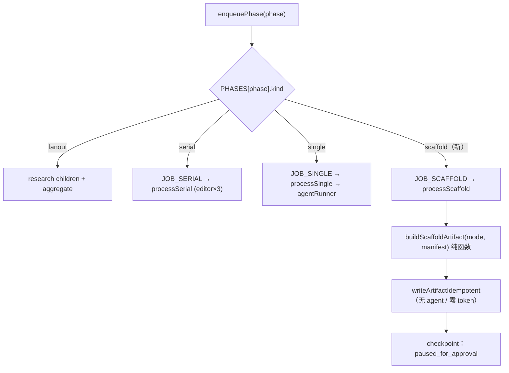

# feat: phase0 确定性脚手架 + web 场景 agent 工具集/超时

## Summary

把 `phase0_init` 从「调 LLM agent」改成「引擎内确定性产出脚手架 artifact」——它本就是「骨架生成、目录创建」，不需要判断。同时给**真正需要 agent 的 phase**配一套 web 场景的运行策略：researcher 接 [Aditly](https://github.com/ZCDeng/Aditly) MCP 的 web 搜索/抓取工具，纯推理 role（strategy / editor / verifier）剥掉文件系统工具，并把过紧的 120s 事件-watchdog 默认值调大、按 role 可配。

这直接解决本会话实测暴露的卡点：`phase0_init` 被派给 `information-architect` agent，在无真实 workspace 的 sandbox 里 `ls` 被拦后空转、被 120s watchdog 掐断 → 整条 workflow 走不完（见 `related` 计划的「已知遗留」与 commit `d29f160` 的诊断记录）。

## Problem Frame

Boule 的 workflow 引擎对每个 phase 统一走 `agentRunner`（U4/组合根）。但方法论里的 phase 并非都需要 LLM：

- **phase0「骨架生成、目录创建」是确定性的**——却被 `mapRoleToFile` 映射到 `information-architect` agent。该 agent 在 web 进程的 sandbox 里尝试 `ls`/`Glob` 探测一个根本不存在的文件系统 workspace，反复空转，触发 executor 的「无事件 120s」watchdog → `TERMINATED_UNKNOWN` → job failed。cost 已落库（真跑了 32k token）但 phase 永远完不成。
- **真正需要 agent 的 phase 缺 web 能力**：researcher 在 CLI 版方法论里靠本地文件 + 联网，但 web 进程里既没文件系统又没接任何检索工具，只能凭模型内部知识硬编——达不到「调研」的意图。
- **超时模型对 web 工具调用过紧**：executor 的 watchdog 是「事件间隔 120s」，而一次 MCP web 抓取可能 >120s，正常工具调用也会被误杀。

确认的范围（用户拍板）：**只去 agent 化 phase0**（其余真判断 phase 保留 agent）；researcher **真接 Aditly**；超时**保留 watchdog 机制、调大默认值**。

## Requirements

- **R1** `phase0_init` 完全不调 `agentRunner`，在引擎内确定性产出一个合法 artifact，并照常进入 checkpoint（`paused_for_approval`）。
- **R2** phase0 不再产生 `workflow_costs` 行、不再触发任何 agent 事件——零 token 消耗。
- **R3** researcher role 在运行时可调用 Aditly MCP 的 web 工具（至少 `anspire_web_search` / `bocha_web_search` / `jina_read_url` / `reach_read_url`），并能真实执行（permissionMode 允许）。
- **R4** 纯推理 role（strategy-advisor / editor / source-verifier / designer / market-scanner / information-architect）**不**获得文件系统工具（Bash/Glob/Read），不再 sandbox 空转。
- **R5** watchdog 默认值从 120s 调大（默认 300s），并可按 role/全局经 env 配置；researcher 的 `maxTurns` 可上调以容纳多步检索。
- **R6** Aditly MCP endpoint 经 env 配置（不硬编码），缺失时 researcher 的 web 工具优雅降级或 fail-loud（择一，见 KTD-5），不静默假装联网。
- **R7** 既有 114 api / 24 web 测试不回归；新增确定性脚手架与策略表有单测覆盖。

## High-Level Technical Design

### phase dispatch：新增 scaffold 路径（只 phase0 走）

`phase0_init` 的 kind 从 `single` 改为 `scaffold`；其余 8 个 phase 的 kind 不变（仍 single/fanout/serial → agent）。这就是「只动 phase0」的物理边界。

### role 运行策略表（web 场景）

按 role 决定工具集、是否允许执行、回合数、watchdog——取代当前「所有 role 同一套空 allowedTools」。

| role 类别 | allowedTools | allowToolExecution | maxTurns | watchdog |
|---|---|---|---|---|
| researcher-*（industry-researcher） | Aditly MCP web 工具白名单 | true | 高（默认 12） | 大（默认 300s） |
| strategy / editor / verifier / designer / market-scanner / information-architect | 空（显式禁文件系统工具） | false | 低（默认 4–6） | 默认 300s |

> directional：具体白名单字符串与 SDK 选项键以实现时为准（见 KTD-3 验证项）。

## Key Technical Decisions

- **KTD-1（phase0 去 agent 的切口）** 新增 `PhaseKind = "scaffold"`，`phase0_init` 归入。引擎加 `JOB_SCAFFOLD` 路由到 `processScaffold`，后者调纯函数 `buildScaffoldArtifact` 写 artifact，不碰 `agentRunner`。
  - *理由*：显式 kind 比在 `processSingle` 里 `if (phase==="phase0_init")` 特判更自洽、可测、可被 lineage/rerun 复用既有 `withAttempt`+checkpoint 机制。state.ts 已有 `FANOUT`/`SERIAL` Set 机制，加一个 `SCAFFOLD` Set 成本极小。
  - *备选*：在 `processSingle` 内特判 phase0（更少文件、但把「这不是 agent phase」的语义藏起来）——见 Alternatives。
- **KTD-2（脚手架内容来源）** `buildScaffoldArtifact(mode, manifest)` 从 workflow 的 `mode` + truth snapshot 的 `manifest` 确定性推导一个骨架（目录/章节 TOC 的 JSON），artifact `type="scaffold"` `status="draft"`。
  - *理由*：phase0 产物当前不被下游 phase 当输入消费（`processSingle` 用 `task: phase`，非上游 artifact），故脚手架只需是「合法、确定、可展示」的结构记录，内容形态可直接由 mode+manifest 算出，无需模型。精确字段留实现期（见 Deferred）。
- **KTD-3（工具网关 = Aditly MCP，经 SDK mcpServers 注入）** 在 `RoleContext` 加 `mcpServers?` 字段，`claude-sdk` runtime 的 `query({ options })` 传 `mcpServers`，researcher 的 `allowedTools` 列 Aditly 工具（SDK 约定名 `mcp__<server>__<tool>`）。
  - *理由*：Aditly 是 HTTP MCP server（`http://127.0.0.1:8643/mcp/`），Claude Agent SDK 原生支持 `mcpServers` 注入。本会话已可见 `mcp__seek__*` 工具，说明本机已跑着该网关，验证可行。
  - *已坐实（context7 / SDK 文档）*：`mcpServers: Record<string, McpServerConfig>`；HTTP 形状 `{ type:"http", url, headers? }`；工具名 `mcp__<server>__<tool>`；`disallowedTools: string[]` 是显式拒绝表。**`allowedTools` 默认是「全部工具」**（不是空）——这解释了本会话 phase0 在 `allowedTools:[]` 下仍调了 Bash，故禁文件系统工具靠 `disallowedTools` 坐实（见 R-2）。
- **KTD-6（MCP streaming-input prompt？）→ 已解决：不需要。** 活体验证（researcher systemPrompt + Aditly mcpServers + **字符串** prompt + 强制搜索 task）：agent 成功 `tool_use=2`（ToolSearch → `mcp__aditly__anspire_web_search`）、`tool_result=2`、result success；init 事件 `aditly` server `status: connected`。结论：**外部 HTTP MCP 用字符串 prompt 即可触发工具**，streaming-input 约束只针对进程内 `createSdkMcpServer` 工具。`run()` 无需改 async generator，R-4 关闭。
- **KTD-4（超时：保留 watchdog 调大 + 可配）** 不改 watchdog 机制（仍「无事件即超时」），把 executor 默认 `timeoutMs` 从 120s 提到 300s，并让 `agent-runner` 按 role 策略把 `watchdogMs`/`maxTurns` 经 `runRole` opts 传入；新增 env `AGENT_WATCHDOG_MS`。
  - *理由*：用户明确「保留 watchdog 调大默认值」。机制不动，风险最小；per-role 覆盖让 researcher 能容纳慢 MCP 抓取。
- **KTD-5（Aditly endpoint 经 env + 缺失行为）** 新增 `ADITLY_MCP_URL`（默认 `http://127.0.0.1:8643/mcp/`）。endpoint 不可达时，researcher 仍以「无 web 工具」模式运行但在 artifact/事件里**显式标注「web 检索不可用」**（fail-loud，不静默假装联网）。
  - *理由*：符合纪律「Fail loud / 配置走 env」。不让一次没联网的调研被当成联网结果交付。

## Implementation Units

### U1. 确定性脚手架：`scaffold` PhaseKind + 纯 builder

**Goal**：引入 phase0 的无-agent 产物来源，纯函数可测。
**Requirements**：R1, R2
**Dependencies**：无
**Files**：
- `apps/api/src/workflow/state.ts`（加 `"scaffold"` 到 `PhaseKind`，加 `SCAFFOLD = new Set(["phase0_init"])`，`kind` 推导优先判 SCAFFOLD）
- `apps/api/src/workflow/scaffold.ts`（新建：`buildScaffoldArtifact(mode, manifest)` 纯函数）
- `apps/api/tests/workflow/scaffold.test.ts`（新建）
- `apps/api/tests/workflow/state.test.ts`（补 phase0 kind 断言）

**Approach**：`buildScaffoldArtifact` 接收 `mode`（可空，默认调研）+ `manifest: string[]`，返回 `{ type:"scaffold", status:"draft", body }`，`body` 为确定性 JSON（如 `{ mode, sections: [...由 mode 推导], manifestRefs: manifest }`）。无 I/O、无随机、无时间——同输入同输出。
**Patterns to follow**：`aggregateResearch`（`workflow/phases/index.ts`）的「纯函数产 `PhaseArtifact`」形态；`state.ts` 既有 `FANOUT`/`SERIAL` Set 与 `kind` 推导。
**Test scenarios**：
- happy：给定 mode=调研 + 9 项 manifest → 返回稳定 `type="scaffold"`、`status="draft"`，body 可 `JSON.parse`，sections 非空。
- 确定性：同输入连调两次，body 字节级相等。
- 边界：mode 省略 → 用默认 mode；manifest 为空数组 → 仍产出合法骨架（sections 来自 mode，manifestRefs=[]）。
- state：`PHASES["phase0_init"].kind === "scaffold"`；其余 8 phase 的 kind 不变（逐一断言或快照）。

### U2. 引擎接 scaffold 路径：phase0 不再调 agent

**Goal**：phase0 入队走 `JOB_SCAFFOLD`，引擎确定性写 artifact + 正常 checkpoint，零 token。
**Requirements**：R1, R2
**Dependencies**：U1
**Files**：
- `apps/api/src/workflow/engine.ts`（加 `JOB_SCAFFOLD` 常量；`enqueuePhase` 对 `kind==="scaffold"` 用 `queue.add(JOB_SCAFFOLD, …)`；`process` switch 加 case → `processScaffold`；新增 `processScaffold` 用 `withAttempt` 包裹 `buildScaffoldArtifact` + `writeArtifactIdempotent`，不调 `runSinglePhase`）
- `apps/api/tests/workflow/engine.test.ts`（补 phase0 scaffold 用例）

**Approach**：`processScaffold` 复用 `withAttempt`（保留 lease/heartbeat/CAS/recovery 一致性）与 `writeArtifactIdempotent`（attempt 版本号、幂等键不变），仅把「跑 agent」换成「算骨架」。完成后照常 emit + 落 checkpoint（与 single 同路径），使 happy-path E2E 能在 phase0 暂停审批。
**Patterns to follow**：`processSingle`（`engine.ts:352`）的 `withAttempt`+`writeArtifactIdempotent`+`emit` 结构，去掉 agent 调用与 `if(!ok)`。
**Test scenarios**：
- happy：startWorkflow → phase0 在 `≤2s` 内 `paused_for_approval`（不触发任何 agent）；DB `phases`/artifact 有 `type="scaffold"` 行。
- 零成本：phase0 完成后 `workflow_costs` 无该 workflow 行；`workflow_events` 无 agent 事件，仅 status 流转。
- 全程：approve phase0 后能继续 enqueue phase1（kind 仍 single）——证明只改了入口形态、未破坏推进。
- 既有：engine.test.ts 原 6 用例仍绿（happy path 的 `visited` 顺序含 phase0_init 不变）。
**Verification**：浏览器实跑建 workflow，phase0 立即「进行中→可审批」，无 watchdog、无失败 banner。

### U3. role 运行策略表：按 role 配工具/回合/超时

**Goal**：用一张策略表取代「所有 role 同一套空配置」，纯推理 role 禁文件系统工具，researcher 拿高回合/大 watchdog。
**Requirements**：R4, R5
**Dependencies**：无（U4 提供具体 MCP 工具名后接入 researcher 白名单）
**Files**：
- `apps/api/src/services/agent-runner.ts`（在 `mapRoleToFile` 旁加 `rolePolicy(roleFile)` → `{ allowedTools, allowToolExecution, maxTurns, watchdogMs }`；`makeProductionAgentRunner` 把策略并入 `runRole` 的 `ctx` 与 `opts`）
- `apps/api/src/agents/executor.ts`（watchdog 默认 120s→300s）
- `apps/api/src/config.ts`（`agent.watchdogMs` = `optional("AGENT_WATCHDOG_MS","300000")`；`agent.researcherMaxTurns` 等）
- `apps/api/tests/services/agent-runner.test.ts`（新建或补：策略表断言）

**Approach**：策略表是确定性代码（KTD：模型只做判断，路由让代码答）。reasoning role → `allowedTools: []` 且（若空数组不禁用）用 SDK `disallowedTools` 显式禁 `Bash/Glob/Read/Write/Edit`；researcher → web 工具白名单 + `allowToolExecution:true`。watchdog/maxTurns 经 `runRole(ctx, { timeoutMs })` 传入。
**Patterns to follow**：`mapRoleToFile` 的「role→配置」纯映射；`config.ts` 的 `optional()` 收口。
**Test scenarios**：
- 策略表：`rolePolicy("industry-researcher")` → `allowToolExecution===true` 且 `maxTurns≥12`；`rolePolicy("editor")`/`"strategy-advisor"` → `allowToolExecution===false`、无文件系统工具。
- 注入：mock runtime 捕获 `ctx`，断言 researcher 收到非空 web 白名单、reasoning role 收到禁用集。
- 超时透传：mock `runRole` 捕获 `opts.timeoutMs === config.agent.watchdogMs`。
- 默认值：executor 未传 timeout 时默认 300_000（改原 120s 断言）。

### U4. Aditly MCP 接入 claude-sdk runtime

**Goal**：runtime 能把 Aditly MCP 注入 `query()`，researcher 真调 web 工具。
**Requirements**：R3, R6
**Dependencies**：U3
**Files**：
- `apps/api/src/agents/types.ts`（`RoleContext` 加 `mcpServers?: Record<string, unknown>`）
- `apps/api/src/agents/runtimes/claude-sdk.ts`（`query` options 透传 `mcpServers`）
- `apps/api/src/services/agent-runner.ts`（researcher 策略带上 `mcpServers: { aditly: { type:"http", url: config.agent.aditlyMcpUrl } }` 与对应 `allowedTools` 白名单 `mcp__aditly__*`；endpoint 缺失时按 KTD-5 降级 + 标注）
- `apps/api/src/config.ts`（`agent.aditlyMcpUrl` = `optional("ADITLY_MCP_URL","http://127.0.0.1:8643/mcp/")`）
- `apps/api/tests/agents/claude-sdk.test.ts`（补：options 含 mcpServers 时被透传）

**Approach**：mcpServers 形状已由 KTD-3 坐实 `{ aditly: { type:"http", url } }`。runtime 仅做「有则透传」，不内置 Aditly 细节（保持 runtime 与具体网关解耦，符合 U3 抽象边界注释）。Aditly 工具白名单按 README 的 always-on 工具起步（`mcp__aditly__anspire_web_search`/`bocha_web_search`/`jina_read_url`/`reach_read_url`）。
**第一步（KTD-6 验证，决定本 unit 形状）**：researcher + Aditly + 现有字符串 prompt 活体调一次搜索。触发成功 → 无需改 prompt；不触发 → 把 `run()` 的 `prompt: ctx.task` 改为 `prompt: stringToAsyncMessages(ctx.task)`（字符串 → 单条 user 消息 async generator），归一化事件流与签名不变。
**Patterns to follow**：`claude-sdk.ts` 现有 `options` 透传 `allowedTools`/`maxTurns`/`permissionMode` 的方式；若需流式，参照 SDK custom-tools 指南的 async-generator prompt 形态。
**Test scenarios**：
- 透传：`ClaudeSdkRuntime.run` 传入带 `mcpServers` 的 ctx → 断言 `query` 收到该 mcpServers（用 mock/spy `query`）。
- streaming（仅当走流式分支）：`run()` 把字符串 task 包成 async generator 后，仍产出与字符串路径一致的归一化事件（用 fixture 断言事件流不变）。
- 降级：`aditlyMcpUrl` 为空/不可达时 researcher 策略产出「无 web 工具 + 标注」而非抛未捕获错（与 KTD-5 一致）。
- 白名单：researcher `allowedTools` 仅含 `mcp__aditly__*`，不含 `Bash`。
**Verification**：本机 Aditly（8643）在跑时，实跑 phase2 调研，agent 事件出现 `tool_use`(mcp__aditly__*) + `tool_result`，finalText 含检索内容，且 `≤watchdog` 内完成。

### U5. 配置/编排/文档收口

**Goal**：env、compose、文档对齐新配置，dev 可一键复现。
**Requirements**：R6
**Dependencies**：U3, U4
**Files**：
- `.env.example`（加 `ADITLY_MCP_URL`、`AGENT_WATCHDOG_MS`，注释说明 Aditly 为外部自托管 MCP，需另跑其 compose）
- `docker-compose.yml`（api service env 透传 `ADITLY_MCP_URL`/`AGENT_WATCHDOG_MS`；注释指明 Aditly 是独立项目，不并入本 compose——见 KTD）
- `docs/progress.md`（记 phase0 去 agent 化 + web 工具接入；移除 related 计划里的「phase0 跑不完」遗留项）

**Approach**：Aditly 有自己的 `compose.yaml` 与 API key（ANSPIRE/BOCHA），属外部依赖；Boule 只经 `ADITLY_MCP_URL` 指过去，不 bundle 其容器（避免把别人项目的密钥/服务塞进本 compose）。
**Patterns to follow**：`docker-compose.yml` 现有 env 透传与 `config.ts` 的对应。
**Test scenarios**：`Test expectation: none -- 纯配置/文档，无行为逻辑`。手动校验：`.env.example` 与 `config.ts` 键一一对应；compose 起的 api 能读到 `ADITLY_MCP_URL`。

## Scope Boundaries

**In scope**：phase0 去 agent 化（仅此 phase）；role 运行策略表（工具/回合/超时）；Aditly MCP 接入 researcher；watchdog 默认值调大 + 可配；env/compose/文档收口。

### Deferred to Follow-Up Work
- **researcher task 内容透传**（实跑发现）：`processResearchChild` 现传 `task=phase id`，researcher 无真实 axis/问题可搜，故 web 能力虽接通但 e2e 未被有效利用。需把 phase1.5 产的 axis / 接案 brief 透传进 researcher task。属下方 dispatch matrix 的一部分。
- 真实 dispatch matrix（role→agent 的权威数据表，替代 `mapRoleToFile` 临时映射）——本计划只在其旁加策略表，不重写。
- 其余 phase（phase1/1.5 等）是否部分确定性化——本轮明确保留 agent。
- Aditly 的社媒/GitHub 等需凭证的 reach 工具接入——本轮只接 always-on web 工具。
- phase0 脚手架 artifact 被下游 phase 当真实输入消费（当前下游用 `task:phase`，不消费上游 artifact）。
- structured verdict 持久化、messages-api runtime 的 web 工具对等（仅 claude-sdk 接）。

### 非目标
- 不改 watchdog 机制本身（仍事件间隔式）。
- 不在 Boule compose 内托管 Aditly 容器。

## Alternatives Considered

- **phase0 特判藏在 `processSingle`**（KTD-1 备选）：少建 1 个 job 常量与 1 条 switch case，但把「phase0 非 agent」的语义隐入条件分支，未来 lineage/rerun/监控都得记得这个特例。显式 `scaffold` kind 让形态在 state.ts 一处可见、可测，胜出。
- **不接 MCP，给 researcher 内置一个 HTTP 抓取工具**：要在 runtime 里自造工具执行回路，重复 Aditly 已有的 SSRF/SPA 升级/多 provider 能力。用户已点名 Aditly，直接接 MCP 更省且能力更全。
- **换成每-phase 总墙钟预算**：比调大 watchdog 更「正确」，但改的是机制、风险面更大，且用户明确要「保留 watchdog 调大默认值」。留作未来项。

## Risks & Dependencies

- **R-1 SDK mcpServers 选项形状**（KTD-3）：~~未坐实~~ **已坐实**（context7）：`mcpServers: Record<string, {type:"http",url,headers?}>`，工具名 `mcp__<server>__<tool>`。残余风险仅在 Aditly 自身可用性（→ R-3）。
- **R-2 空 `allowedTools` 未必禁工具**（KTD-3）：本会话观察到 phase0 在空白名单下仍调 Bash；文档证实 `allowedTools` 默认=全部工具。*缓解（已定）*：U3 用显式 `disallowedTools=[Bash,Glob,Read,Write,Edit]` 禁用，并以 `tool_use` 计数断言 reasoning role 零工具调用。
- **R-3 Aditly 未运行/缺 API key**：researcher 无法联网。*缓解*：KTD-5 降级 + 显式标注，不静默假装；dev 文档写明需先起 Aditly。
- **R-4 HTTP MCP 可能要求 streaming-input prompt**（KTD-6）：当前 runtime 传字符串 prompt，文档称自定义 MCP 工具需 async-generator prompt（主要针对进程内工具，外部 HTTP 未定）。*缓解*：U4 第一步活体验证；若需流式，仅改 `run()` 一处把字符串包成 async generator，归一化事件流不变。
- **依赖**：Aditly 自托管 MCP（本机 8643，本会话已可见 `mcp__seek__*`）；Aditly 需 `ANSPIRE_API_KEY`/`BOCHA_API_KEY`。

## Verification / Success Criteria（实跑结果）

1. ✅ 浏览器实跑：建「调研」workflow → phase0 **秒级**进入「需审批」（type=scaffold、`workflow_costs` 零行、事件 `phase-scaffolded` 无 agent 事件、manifestRefs 为路径字符串）。
2. ✅ reasoning role 不空转：phase1_intake / phase1_5_axis 真 agent 各 **~60s 干净跑完进 paused**（22k/3k、22k/4k token），无 `TERMINATED_UNKNOWN`、无 sandbox `ls` 空转——phase0 去 agent 化移除了真正的空转源。
3. ✅ Aditly web 能力接通且可用（repro 证明）：researcher 风格 role + 字符串 prompt 成功 `tool_use` `mcp__aditly__anspire_web_search` → `tool_result` success，`aditly` server `status: connected`。KTD-6 关闭。
4. ✅ `node --test` 全绿：api **132/132**（+scaffold/config/agent-runner/claude-sdk 新增）；web 24/24 不回归。
5. ✅ `related` 计划「phase0 跑不完」遗留项已在 `docs/progress.md` 标关闭。

**实跑发现（诚实留痕，非本计划缺陷）**：live phase2 的 researcher **未触发 web 搜索**——因 `processResearchChild` 传的 `task` 是字面量 `"phase2_research"`（phase id），而非真实 axis/研究问题，researcher 无具体可搜内容即凭知识作答。web 能力本身正确接通（repro 已证），**e2e 研究质量受上游 task 内容透传门控**。把 axis/brief 透传进 researcher task 属「真实 dispatch matrix / task-threading」deferred 工作，见 Scope Boundaries，留作下一步。

## Sources & Research

- 本会话诊断与修复：commit `d29f160`（errorCode fail-loud、proxy/ticket 前端 bug），phase0 失败根因（cost 落库但被 120s watchdog 掐断）。
- Aditly README（`https://github.com/ZCDeng/Aditly`）：自托管 MCP，HTTP `http://127.0.0.1:8643/mcp/`，15 工具，always-on：`jina_read_url`/`yt_transcript`/`anspire_web_search`/`bocha_web_search`；`claude mcp add` 接入；Apache-2.0。
- 代码锚点：`workflow/state.ts`（PhaseKind/SCAFFOLD 机制）、`workflow/engine.ts:265/299/352`（enqueue/process/processSingle）、`agents/runtimes/claude-sdk.ts`（query options）、`agents/executor.ts`（watchdog 120s）、`services/agent-runner.ts`（mapRoleToFile/runRole 接线）、`config.ts`（env 收口）。
