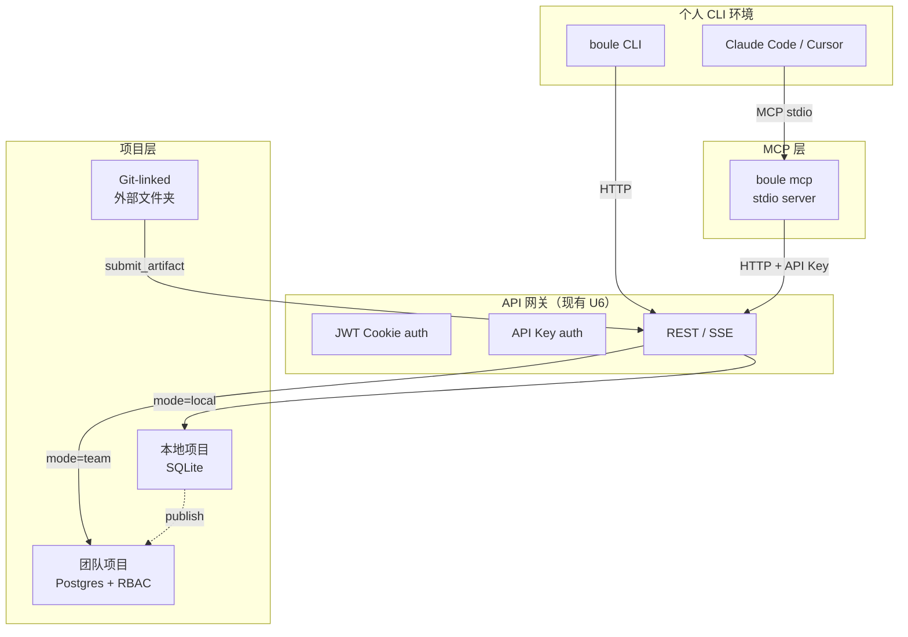

# feat: Web-CLI 协同层

## Summary

把 OpenConsult 从「纯 Web SaaS」扩展为**Web 指挥中心 + 个人 CLI 执行器**的混合架构。借鉴 open-design 的 daemon-MCP-thin-client 模型，让用户的本地 Claude Code / Cursor 能直接参与 workflow，消除「Web 适合编排、CLI 适合执行」之间的上下文断裂。

四项能力按优先级排序：MCP 桥（最高）→ 本地免登录模式 → Thin CLI → Git-linked Projects。

## Problem Frame

当前 OpenConsult 的 workflow 100% 在服务端运行（BullMQ worker + Agent SDK `query()`）。用户遇到的问题：

1. **Phase 2  researcher 在 sandbox 里空转**：Web worker 里的 agent 没有真实文件系统，也没有用户本地的知识库（既往报告、客户资料），调研深度受限于模型内部记忆。
2. **CLI 用户已有最佳工具**：重度用户已经在本地跑 Claude Code，里面有完整的 project context、skills、记忆。让他们切到 Web UI 里重新输入 context 是倒退。
3. **登录是体验门槛**：open-design 证明本地优先工具可以零注册启动。OpenConsult 当前强制 email/password 注册，阻挡了「先体验再决定」的用户路径。
4. **产出物锁在平台里**：report/deck 落在 OpenConsult 的文件系统，用户想进本地 git repo 做二次编辑需要下载-解压-导入。

## Requirements

- **R1** 暴露 MCP 服务器：`boule mcp` 启动 stdio MCP 服务器，外部 coding agent（Claude Code / Cursor / Zed）可读写 OpenConsult 项目、workflow、文档。
- **R2** Active Context：MCP 工具调用可不传 project/workflow 参数，自动使用用户在 Web UI 中当前打开的项目/phase。
- **R3** CLI agent 可提交产出：从 Claude Code 中调用 `submit_artifact` / `create_checkpoint`，产物出现在 Web UI 的待审批队列里。
- **R4** 本地免登录模式：`--local` 标志启动，SQLite 替代 Postgres，跳过 JWT 认证中间件，单用户单机即用。
- **R5** 本地模式可迁移到团队模式：本地创建的项目/workflow，在登录后可「发布」到团队空间（Postgres + 多成员）。
- **R6** Thin CLI `boule`：子命令作为 thin client POST 到 API（本地或远程），支持 `workflow status`、`document submit`、`checkpoint create`。
- **R7** Git-linked Projects：项目可配置 `gitUrl`（团队/本地皆可，clone 到服务端 workspace）或 `localBaseDir`（**仅本地模式**，agent workspace 指向真实 git repo），产出物天然可版本控制。`localBaseDir` 在团队模式被拒——服务端 worker 访问不到成员笔记本路径（见 KTD-7、C 簇）。
- **R8** 不破坏现有 U0-U10 体系：新增能力是 additive，已有认证/RBAC/workflow 引擎不做 breaking change。

## Key Technical Decisions

| # | 决策 | 选择 | 理由 |
|---|---|---|---|
| KTD-1 | MCP 协议 | **Model Context Protocol (MCP) stdio** | 已成事实标准（Claude Code / Cursor / Zed 原生支持）。Boule 作为 MCP server 暴露 tools + resources，不发明新协议 |
| KTD-2 | MCP 工具代理方式 | ** thin stdio server → HTTP fetch 到 API** | 与 open-design 同模型：MCP server 本身零状态、不碰文件系统，每个 tool 调用都是 `fetch()` 到已运行的 API。server 可独立测试、不依赖 Node 文件权限 |
| KTD-3 | Active Context 存储 | **团队模式 Redis 短时键（TTL 5min）；本地模式降级为单文件 `~/.boule/local/active-context.json`** | Web 前端每次交互刷新 `active_context:{user_id}:{session_id}`（key 带 user_id 前缀，MCP 读取时校验 API key 所属用户匹配，防越权——见 F 簇/安全）；MCP server 读该键自动定位。**本地模式不起 Redis**：active context 直接读写本地 JSON 文件（单进程无并发，文件级足够），消解「本地零依赖 vs Active Context 需 Redis」矛盾（A 簇）|
| KTD-4 | 本地模式数据库 | **SQLite（`better-sqlite3`）替代 Postgres，维护双 schema 文件 + 公用列工厂** | 单机场景不需要 PG 并发。**「同一套 Drizzle schema 切 `DATABASE_URL` 前缀」经核实不成立**（B 簇）：现有 `db/schema.ts` 用 `drizzle-orm/pg-core` 的 `pgTable`/`pgEnum`/`bigserial`，SQLite 无原生 enum/bigserial。决策：抽出 `schema/columns.ts` 列定义工厂（dialect 无关的 id/timestamp/json 辅助），`schema.pg.ts` 与 `schema.sqlite.ts` 各自 `pgTable`/`sqliteTable` 引用工厂；pgEnum → SQLite `text` + CHECK 约束。U2 第一步先做 schema 兼容 spike 验证（退出条件：12 表在 SQLite 全建成 + 一条 happy 路径跑通），spike 不过则 U2 退回「本地模式仍用 PG（docker）」|
| KTD-5 | 本地→团队迁移 | **项目级 export/import（JSON + 附件 tarball），import 强校验 + owner 重映射** | 不追求实时双写。本地点「发布到团队」→ 打包 → 上传 → 服务端 import。**owner 重映射（E 簇）**：本地记录 `userId='local'`，import 时全部归因给执行发布的已登录用户（创建 `project_members` owner 行），不保留 ghost owner。**import 安全**：tarball 文件路径白名单（拒 `../`、绝对路径、symlink）+ 大小上限 + 沙箱解压 + JSON schema 校验 + 上传需有效 JWT 且具建项目权限。可审计、可回滚 |
| KTD-6 | Thin CLI 与 MCP 的关系 | **CLI 是面向人的 convenience layer，MCP 是面向 agent 的协议层** | 两者都 POST 到同一 API，但 CLI 做参数解析/错误提示/进度条；MCP 做 JSON schema + tool annotation。不合并（人机接口 ≠ 机机接口）|
| KTD-7 | Git-linked 的 workspace 形态 + agent 执行边界 | **本地模式：cwd 指向 `localBaseDir`；团队模式：clone `gitUrl` 到服务端 `.boule/workspaces/{projectId}/`。两者 agent 执行均受 SDK 工具白名单 + 目录约束** | agent 直接在真实 repo 里运行 = 任意代码可读写删 repo 全文件（C 簇/安全 P0）。约束三层：①工具白名单沿用 `rolePolicy`（纯推理 role 禁 Bash/Write）②可执行 role（researcher）的 cwd 锁死在 `localBaseDir` 子树，SDK `additionalDirectories` 不外放③首次链接弹「agent 将在此目录执行代码」显式风险确认。产出物经 `submit_artifact` 显式回传，**不做自动 `git commit`**（与 Deferred 一致，删除原 U4 的「同步到 git」hook） |
| KTD-8 | 认证分层 + API Key scope | **JWT cookie（Web）+ API Key header（MCP/CLI），key 为 project-scoped + read/write，默认最小权限** | MCP/CLI 不走 cookie。`api_keys` 表（可撤销，只存 hash）增列 `scope`（`read`/`write`）+ `project_ids`（null=全账户，需显式授权）。**MCP 写操作（submit/checkpoint）仍过 RBAC**：认证后校验 key 所属用户在目标项目的角色，viewer 拒写（D 簇）。**本地模式 MCP 认证（F 簇）**：API 仅监听 `127.0.0.1`，本地模式注入 dummy local key，MCP 检测到 local 跳过 Bearer、中间件接受无凭证 loopback 请求（非本机来源拒绝）|

## High-Level Technical Design

### 系统架构增补



### MCP 工具集

| 工具 | 输入 | 输出 | 写/读 |
|---|---|---|---|
| `list_projects` | — | `{projects:[{id,name,mode}]}` | 读 |
| `get_active_context` | — | `{projectId,workflowId,phase,document?}` | 读 |
| `get_workflow` | `project?, workflow?` | `{id,currentPhase,status,axes}` | 读 |
| `get_documents` | `project?, since?` | `{documents:[{id,title,stale,updatedAt}]}` | 读 |
| `submit_artifact` | `project?, workflow?, name, content, encoding?` | `{artifactId, status}` | 写 |
| `create_checkpoint` | `project?, workflow?, message, payload?` | `{checkpointId, status}` | 写 |
| `list_axes` | `workflow?` | `{axes:[{id,label,status}]}` | 读 |
| `search_research` | `workflow?, query` | `{findings:[{url,summary,source}]}` | 读 |

### 资源 URI

| URI | 内容 |
|---|---|
| `boule://skills/{id}/SKILL.md` | 角色 skill prompt（只读） |
| `boule://axes/{workflowId}/AXES.md` | 当前 workflow 调研轴 |
| `boule://methods/{id}/METHOD.md` | 方法论文档 |

## Implementation Units

### U1. MCP 服务器（最高优先级）

**Goal**：`boule mcp` 启动 stdio MCP server，代理到运行中的 API。
**Requirements**：R1, R2, R3
**Dependencies**：U6 API 网关（现有）
**Files**：
- `apps/api/src/mcp/server.ts`（新建：MCP stdio server，tool 注册）
- `apps/api/src/mcp/tools.ts`（新建：8 个 tool 的实现，都是 fetch wrapper）
- `apps/api/src/mcp/resources.ts`（新建：resources 注册）
- `apps/api/src/mcp/active-context.ts`（新建：active context 读写，按 mode 走 Redis 或本地 JSON）
- `apps/api/src/routes/api-keys.ts`（新建：API key CRUD，含 scope/project_ids）
- `apps/api/src/db/schema.ts`（加 `api_keys` 表：hash + `scope` + `project_ids`）
- `apps/api/tests/mcp/...`（新建）

**Approach**：
1. 用 `@modelcontextprotocol/sdk` 建 stdio server
2. 每个 tool handler 内部 `fetch()` 到 `BOULE_API_URL`（默认 `http://localhost:3100`）
3. API key 取值优先级 env `BOULE_API_KEY` > `~/.boule/config.json`（写入设 600）> `--api-key`（标 deprecated，警告会进 shell history / `ps`）；走 `Authorization: Bearer` 头。写操作过 RBAC（viewer 拒写 403）
4. Active context：团队模式 Web 前端每 30s 心跳写 Redis（key `active_context:{user_id}:{session_id}`）；本地模式写 `~/.boule/local/active-context.json`。MCP server 按 mode 读对应源补全缺省 project/workflow，并校验 API key user 与 key 前缀匹配（防越权）

**Test scenarios**：
- MCP server 无 daemon 运行时，tool 调用返回清晰错误
- `list_projects` 返回与 REST `/api/projects` 一致
- 不传 project 时 `get_workflow` 自动命中 active context（团队 Redis / 本地 JSON 各测一路）
- `submit_artifact` 后 Web UI 刷新出现新 artifact
- viewer 角色 key 调 `submit_artifact` 被 RBAC 拒（403）
- 跨 user 的 session_id 读不到他人 active context

### U2. 本地免登录模式

**Goal**：`--local` 标志启动，跳过认证，SQLite 存储。
**Requirements**：R4, R5
**Dependencies**：U1（MCP 在本地模式下也要工作）
**Files**：
- `apps/api/src/db/schema/columns.ts`（新建：dialect 无关列工厂——id/timestamp/json/enum-as-text）
- `apps/api/src/db/schema.pg.ts` / `schema.sqlite.ts`（双 schema，各引用 columns 工厂）
- `apps/api/src/db/client.ts`（改：按 mode 选 `better-sqlite3` 或 `pg` + 对应 schema）
- `apps/api/src/config.ts`（加：`MODE=local|team`，`DATABASE_URL` 前缀路由）
- `apps/api/src/middleware/auth.ts`（改：local 模式短路 `authenticate` + loopback-only 守卫）
- `apps/api/src/app.ts`（改：条件注册 auth routes；local 仅监听 `127.0.0.1`）
- `apps/api/src/local/migrate.ts`（新建：SQLite schema 迁移）
- `apps/api/src/local/active-context.ts`（新建：本地 JSON active context 读写）
- `apps/api/src/services/project-export.ts`（新建：R5 打包 project→JSON+tarball）
- `apps/api/src/routes/projects-import.ts`（新建：R5 POST `/api/projects/import`，强校验+owner 重映射）

**Approach**：
0. **前置 schema spike**（KTD-4，U2 第一步）：验证双 schema + columns 工厂能在 SQLite 建全 12 表 + 跑通一条 happy 路径；不过则 U2 退回「本地模式仍用 docker PG」，停止 SQLite 路线
1. `MODE=local` 时 `db/client.ts` 用 `better-sqlite3` + `schema.sqlite.ts`
2. pgEnum → SQLite `text` + CHECK；bigserial → `integer` autoincrement（列工厂统一）
3. Auth 中间件短路：local 模式所有请求附 `userId='local'`、`role='owner'`；**仅接受 loopback 来源**，非本机请求拒绝
4. 本地存储 `~/.boule/local/`：`db.sqlite` + `projects/` + `active-context.json`（目录 700、文件 600）
5. **R5 迁移（KTD-5）**：export 打包本地 project；import 时 tarball 路径白名单（拒 `../`/绝对/symlink）+ 大小上限 + 沙箱解压 + JSON schema 校验，`userId='local'` 重映射为发布者

**Test scenarios**：
- schema spike：12 表在 SQLite 全建成 + 一条 workflow happy 路径跑通（退出条件）
- `MODE=local` 启动，不报错、不连 PG/Redis（active context 走本地 JSON）
- 匿名创建 project → workflow → phase0 审批，全程无登录
- 非 loopback 请求打到 local API 被拒
- 本地 SQLite 数据文件可独立备份/删除
- R5：本地 project export → import 到团队，owner 归属发布者；恶意 tarball（`../` 路径/超大）被拒

### U3. Thin CLI `boule`

**Goal**：可全局安装的 npm 包，`boule <subcommand>` 作为 thin client。
**Requirements**：R6
**Dependencies**：U1（复用 MCP 的 HTTP 代理逻辑）
**Files**：
- `packages/cli/`（新建：独立 npm 包，`bin: boule`）
- `packages/cli/src/index.ts`（子命令路由）
- `packages/cli/src/commands/workflow.ts`
- `packages/cli/src/commands/document.ts`
- `packages/cli/src/commands/checkpoint.ts`
- `packages/cli/src/commands/mcp.ts`（包装 `apps/api/src/mcp/server.ts`）

**目标用户（H 簇）**：不在 Claude Code/Cursor 里、但要脚本化/CI 调 Boule 的人（裸终端、shell pipeline、cron）。用 Claude Code 的人直接走 MCP 工具，不需要 CLI——CLI 与 MCP 功能重叠是有意的（同一 API 的人/机两个面），但 CLI 仅在「无 agent 宿主」场景有独立价值。若该场景验证不足，U3 可降级或推迟。

**Approach**：
- 纯 `process.argv` 解析，零依赖（不引 `commander`，保持全局安装信任面最小）
- 每个子命令都是 `fetch()` 到 `BOULE_API_URL`
- `boule mcp` 子命令直接启动 U1 的 MCP server（复用同一模块）
- 配置来源优先级：`--daemon-url` > env `BOULE_API_URL` > `~/.boule/config.json` > default `http://localhost:3100`

**子命令设计**：
```bash
boule workflow status [--project <id>]
boule workflow list
boule document submit --file <path> [--project <id>]
boule checkpoint create --message "..." [--project <id>]
boule mcp [--api-key <key>]
```

### U4. Git-linked Projects

**Goal**：项目关联外部 git repo，agent workspace 指向真实文件夹。
**Requirements**：R7
**Dependencies**：U2（本地模式下最自然）
**Files**：
- `apps/api/src/routes/projects.ts`（加：PATCH `/{id}/git-link`）
- `apps/api/src/services/git-link.ts`（新建：验证/链接/解链）
- `apps/api/src/workflow/engine.ts`（改：支持 `baseDir` workspace）
- `apps/web/src/pages/ProjectDetail.tsx`（加：git 链接配置 UI）

**Approach**（C 簇——本地/团队两路径分离）：
1. `projects` 表加 `git_url` / `local_base_dir` 可空列 + `link_mode`（`gitUrl`/`localDir`）
2. **路由层强制分流**：团队项目仅允许 `git_url`（clone 到服务端 `.boule/workspaces/{id}`）；`local_base_dir` 仅本地模式接受。团队请求带 `local_base_dir` → 400
3. 链接验证：`local_base_dir` 校验存在/可写/含 `.git`；`git_url` 校验可 clone
4. Agent runner 的 `cwd`：本地模式指向 `local_base_dir`，团队模式指向 clone 后的 server workspace
5. 产出物经 `writeArtifactIdempotent` 落库；**不做自动 `git commit`/`push`**（与 Deferred 一致，原「同步到 git」hook 删除）

**安全控制**：
- **agent 执行边界（C 簇 P0）**：cwd 锁死在目标目录子树，SDK `additionalDirectories` 不外放；纯推理 role 沿用 `rolePolicy` 禁 Bash/Write；首次链接弹「agent 将在此目录执行代码」风险确认
- `local_base_dir` 必须绝对路径，`realpath` 规范化后必须落在用户 home 子树内；拒 `..`/`~`/symlink 跳出（防 TOCTOU：执行前再校验一次）
- 仅 owner 可设/改 git link

## Scope Boundaries

### In Scope
- MCP stdio server（tools + resources）
- Active context：团队 Redis（user 前缀 key）/ 本地 JSON 文件双源 + Web UI 心跳
- API Key 认证（project-scoped + read/write，与现有 JWT cookie 并行）
- SQLite 本地模式（双 schema + 列工厂；先过 spike）+ loopback-only 守卫
- R5 本地→团队 export/import（owner 重映射 + tarball 强校验）
- Thin CLI 4 个子命令
- Git-linked project：本地/团队两路径分离 + agent 执行边界约束

### Deferred
- MCP 的 **binary 文件传输**（图片/PDF）：当前只传文本，binary 走 URL 签名链接
- **实时双向同步**（Web UI 与 CLI 同时编辑同一文档）：v1 单写者锁原则不变
- **多设备本地模式同步**：本地模式是单机，跨设备靠「发布到团队」
- **Git-linked 的自动 commit/push 钩子**：只做到 workspace 指向，git 操作由用户或 agent 自行决定
- **Windows 原生支持**：Thin CLI 和 MCP server 先保证 macOS/Linux，Windows 路径处理后续补

### 不属于本产品身份
- 替代 Claude Code / Cursor（Boule 是它们的协作目标，不是 competitor）
- 通用 MCP client（Boule 只当 server，消费其他 MCP 是用户 agent 的事）

## Open Questions

> 2026-05-31 ce-doc-review（product/security/scope 三 persona，24 findings）后，Q1–Q4 已在上方 KTD/U 章节给出决策，留作追溯。Q5 + 新增 Q6 仍待定。

1. ~~**SQLite schema 兼容性**~~ → **已决（KTD-4/U2）**：双 schema 文件 + dialect 无关列工厂，pgEnum→text+CHECK；U2 第一步先 spike，不过则退回 docker PG。
2. ~~**API Key 权限粒度**~~ → **已决（KTD-8）**：project-scoped + read/write，默认最小权限，全账户需显式授权；MCP 写操作仍过 RBAC。
3. ~~**Active context session 边界**~~ → **已决（KTD-3/U1）**：key 带 `user_id` 前缀防越权；多标签以最近心跳为准，写操作回显命中项目名供 agent 确认。
4. ~~**Git-linked 权限模型**~~ → **已决（KTD-7/R7/U4）**：`local_base_dir` 仅本地模式；团队项目只允许 `git_url`（clone 到服务端），路由层强制分流。
5. **Thin CLI 的发布方式**：npm 公开包（`@boule/cli`）还是本 repo pnpm workspace 本地 link？
6. **Thin CLI 是否值得做（H 簇）**：CLI 与 MCP 功能重叠，独立价值仅在「无 agent 宿主」场景。是否先做 MCP+本地模式，CLI 视真实需求再上？

## Risks

| 风险 | 严重度 | 缓解 |
|---|---|---|
| **Git-linked agent 在真实 repo 任意代码执行（C 簇）** | **高** | cwd 锁子树 + SDK `additionalDirectories` 不外放 + 纯推理 role 禁 Bash/Write（`rolePolicy`）+ 首次链接风险确认弹窗 |
| MCP SDK 版本快速迭代 | 中 | pin 版本；MCP server 逻辑极薄（全是 fetch），SDK 变更容易隔离 |
| SQLite 与 Postgres 行为分叉 | 中 | 双 schema + 列工厂统一；U2 先 spike 验证；CI 双库跑测试；不过则退回 PG |
| API Key 泄露 | 中 | 短前缀（`bk_`）+ 只存 hash + project-scoped 缩小爆炸半径；`--api-key` deprecated（防进 shell history）；config.json 600；支持撤销；日志脱敏 |
| 本地→团队 import 恶意 tarball（E 簇） | 中 | 路径白名单（拒 `../`/绝对/symlink）+ 大小上限 + 沙箱解压 + JSON schema 校验 + 需有效 JWT |
| Local 模式数据丢失 | 中 | 显式「未备份」警告；发布到团队前弹确认；定期提醒导出 |
| 本地 API 被局域网/容器访问（无认证 owner 权限） | 中 | local 模式仅监听 `127.0.0.1`，非 loopback 来源拒绝 |
| Active context 过期/越权导致 MCP 操作错项目 | 低 | key 带 user 前缀校验；每次写操作回显命中项目名，agent 可确认 |

## Sources

- open-design 反向研究（本机 fork `~/projects/open-design`，2026-05-31）：
  - `apps/daemon/src/mcp.ts` → MCP server 设计（thin stdio proxy、active context、tool/resource 分离）
  - `apps/daemon/src/cli.ts` → `od` CLI 双模式（daemon starter + thin client subcommands）
  - `apps/daemon/src/artifacts-cli.ts` / `handoff-cli.ts` → thin client 参数解析模式
  - `apps/daemon/src/projects.ts` → git-linked project（`metadata.baseDir`）
  - `apps/daemon/src/desktop-auth.ts` → 本地边界认证（HMAC 令牌，非用户账户）
  - `apps/daemon/src/runtimes/auth.ts` → 外部 agent CLI 认证探测
- MCP spec：https://modelcontextprotocol.io/
- Claude Code MCP docs：https://docs.anthropic.com/en/docs/claude-code/mcp
