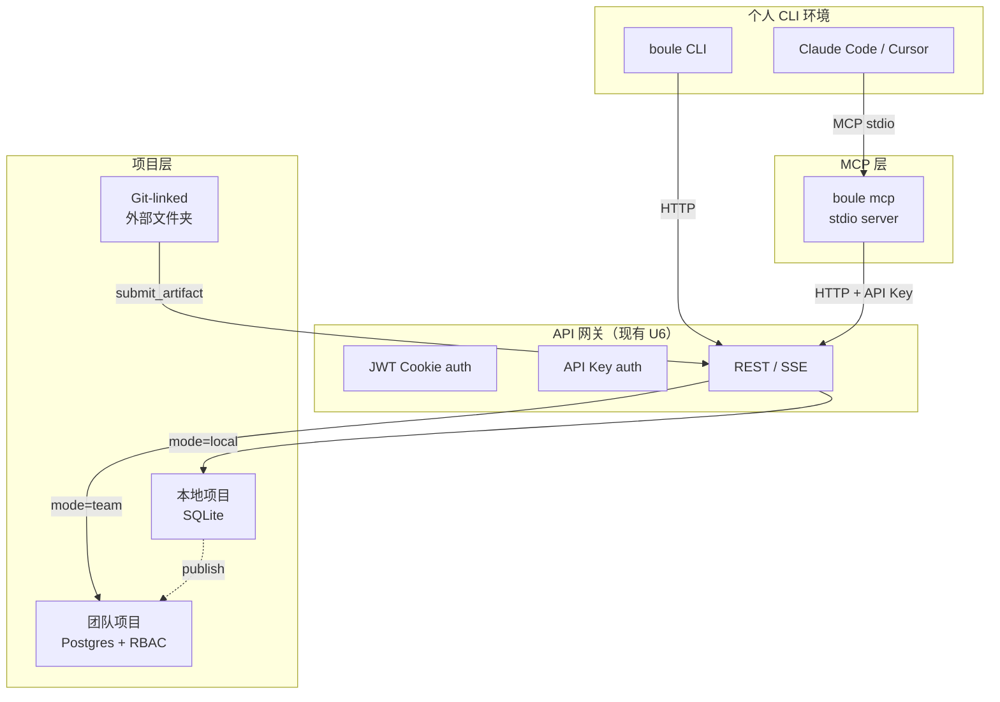

# feat: Web-CLI 协同层

## Summary

把 OpenConsult 从「纯 Web SaaS」扩展为**Web 指挥中心 + 个人 CLI 执行器**的混合架构。借鉴 open-design 的 daemon-MCP-thin-client 模型，让用户的本地 Claude Code / Cursor 能直接参与 workflow，消除「Web 适合编排、CLI 适合执行」之间的上下文断裂。

四项能力按优先级排序：MCP 桥（最高）→ 本地免登录模式 → Thin CLI → Git-linked Projects。

## Problem Frame

当前 OpenConsult 的 workflow 100% 在服务端运行（BullMQ worker + Agent SDK `query()`）。用户遇到的问题：

1. **Phase 2  researcher 在 sandbox 里空转**：Web worker 里的 agent 没有真实文件系统，也没有用户本地的知识库（既往报告、客户资料），调研深度受限于模型内部记忆。
2. **CLI 用户已有最佳工具**：重度用户已经在本地跑 Claude Code，里面有完整的 project context、skills、记忆。让他们切到 Web UI 里重新输入 context 是倒退。
3. **登录是体验门槛**：open-design 证明本地优先工具可以零注册启动。OpenConsult 当前强制 email/password 注册，阻挡了「先体验再决定」的用户路径。
4. **产出物锁在平台里**：report/deck 落在 OpenConsult 的文件系统，用户想进本地 git repo 做二次编辑需要下载-解压-导入。

## Requirements

- **R1** 暴露 MCP 服务器：`boule mcp` 启动 stdio MCP 服务器，外部 coding agent（Claude Code / Cursor / Zed）可读写 OpenConsult 项目、workflow、文档。
- **R2** Active Context：MCP 工具调用可不传 project/workflow 参数，自动使用用户在 Web UI 中当前打开的项目/phase。
- **R3** CLI agent 可提交产出：从 Claude Code 中调用 `submit_artifact` / `create_checkpoint`，产物出现在 Web UI 的待审批队列里。
- **R4** 本地免登录模式：`--local` 标志启动，SQLite 替代 Postgres，跳过 JWT 认证中间件，单用户单机即用。
- **R5** 本地模式可迁移到团队模式：本地创建的项目/workflow，在登录后可「发布」到团队空间（Postgres + 多成员）。
- **R6** Thin CLI `boule`：子命令作为 thin client POST 到 API（本地或远程），支持 `workflow status`、`document submit`、`checkpoint create`。
- **R7** Git-linked Projects：项目可配置 `gitUrl` 或 `localBaseDir`，agent workspace 直接指向真实 git repo，产出物天然可版本控制。
- **R8** 不破坏现有 U0-U10 体系：新增能力是 additive，已有认证/RBAC/workflow 引擎不做 breaking change。

## Key Technical Decisions

| # | 决策 | 选择 | 理由 |
|---|---|---|---|
| KTD-1 | MCP 协议 | **Model Context Protocol (MCP) stdio** | 已成事实标准（Claude Code / Cursor / Zed 原生支持）。Boule 作为 MCP server 暴露 tools + resources，不发明新协议 |
| KTD-2 | MCP 工具代理方式 | ** thin stdio server → HTTP fetch 到 API** | 与 open-design 同模型：MCP server 本身零状态、不碰文件系统，每个 tool 调用都是 `fetch()` 到已运行的 API。server 可独立测试、不依赖 Node 文件权限 |
| KTD-3 | Active Context 存储 | **Redis 短时键（TTL 5min）+ Web UI 心跳刷新** | Web 前端每次交互刷新 `active_context:{session_id}`；MCP server 读取该键自动定位。比 SSE 推送简单，容错高（断线 5min 内恢复仍有效）|
| KTD-4 | 本地模式数据库 | **SQLite（文件级）替代 Postgres** | 单机场景不需要 PG 的并发能力。`better-sqlite3` 或 `libsql`（Turso）。schema 用同一套 Drizzle，切换通过 env `DATABASE_URL` 前缀（`postgres://` vs `file://`）|
| KTD-5 | 本地→团队迁移 | **项目级 export/import（JSON + 附件 tarball）** | 不追求「实时同步双写」的复杂度。用户在本地模式点「发布到团队」→ 打包 → 上传 → 服务端 import。简单、可审计、可回滚 |
| KTD-6 | Thin CLI 与 MCP 的关系 | **CLI 是面向人的 convenience layer，MCP 是面向 agent 的协议层** | 两者都 POST 到同一 API，但 CLI 做参数解析/错误提示/进度条；MCP 做 JSON schema + tool annotation。不合并（人机接口 ≠ 机机接口）|
| KTD-7 | Git-linked 的 workspace 形态 | **symbolic link / bind mount 到 `.boule/workspaces/{projectId}/`** | 不直接在用户 repo 里写隐藏文件（避免污染）。agent 的 cwd 指向该链接，产出物通过 `submit_artifact` 显式回传，而非自动同步 |
| KTD-8 | 认证分层 | **API 层支持两种 auth 模式：JWT cookie（Web）+ API Key header（MCP/CLI）** | MCP server 和 Thin CLI 不方便走 cookie 流程。新增 `api_keys` 表（user-scoped, 可撤销），MCP/CLI 用 `Authorization: Bearer <api_key>`。本地模式跳过两者 |

## High-Level Technical Design

### 系统架构增补



### MCP 工具集

| 工具 | 输入 | 输出 | 写/读 |
|---|---|---|---|
| `list_projects` | — | `{projects:[{id,name,mode}]}` | 读 |
| `get_active_context` | — | `{projectId,workflowId,phase,document?}` | 读 |
| `get_workflow` | `project?, workflow?` | `{id,currentPhase,status,axes}` | 读 |
| `get_documents` | `project?, since?` | `{documents:[{id,title,stale,updatedAt}]}` | 读 |
| `submit_artifact` | `project?, workflow?, name, content, encoding?` | `{artifactId, status}` | 写 |
| `create_checkpoint` | `project?, workflow?, message, payload?` | `{checkpointId, status}` | 写 |
| `list_axes` | `workflow?` | `{axes:[{id,label,status}]}` | 读 |
| `search_research` | `workflow?, query` | `{findings:[{url,summary,source}]}` | 读 |

### 资源 URI

| URI | 内容 |
|---|---|
| `boule://skills/{id}/SKILL.md` | 角色 skill prompt（只读） |
| `boule://axes/{workflowId}/AXES.md` | 当前 workflow 调研轴 |
| `boule://methods/{id}/METHOD.md` | 方法论文档 |

## Implementation Units

### U1. MCP 服务器（最高优先级）

**Goal**：`boule mcp` 启动 stdio MCP server，代理到运行中的 API。
**Requirements**：R1, R2, R3
**Dependencies**：U6 API 网关（现有）
**Files**：
- `apps/api/src/mcp/server.ts`（新建：MCP stdio server，tool 注册）
- `apps/api/src/mcp/tools.ts`（新建：8 个 tool 的实现，都是 fetch wrapper）
- `apps/api/src/mcp/resources.ts`（新建：resources 注册）
- `apps/api/src/mcp/active-context.ts`（新建：Redis 读写 active context）
- `apps/api/src/routes/api-keys.ts`（新建：API key CRUD）
- `apps/api/src/db/schema.ts`（加 `api_keys` 表）
- `apps/api/tests/mcp/...`（新建）

**Approach**：
1. 用 `@modelcontextprotocol/sdk` 建 stdio server
2. 每个 tool handler 内部 `fetch()` 到 `BOULE_API_URL`（默认 `http://localhost:3100`）
3. API key 从 env `BOULE_API_KEY` 或 `--api-key` 参数取，走 `Authorization: Bearer` 头
4. Active context：Web 前端在 `useEffect` 里每 30s 心跳写 Redis；MCP server 读 Redis 自动补全缺省的 project/workflow

**Test scenarios**：
- MCP server 无 daemon 运行时，tool 调用返回清晰错误
- `list_projects` 返回与 REST `/api/projects` 一致
- 不传 project 时 `get_workflow` 自动命中 active context
- `submit_artifact` 后 Web UI 刷新出现新 artifact

### U2. 本地免登录模式

**Goal**：`--local` 标志启动，跳过认证，SQLite 存储。
**Requirements**：R4, R5
**Dependencies**：U1（MCP 在本地模式下也要工作）
**Files**：
- `apps/api/src/db/client.ts`（改：支持 SQLite 连接）
- `apps/api/src/config.ts`（加：`MODE=local|team`，`DATABASE_URL` 前缀路由）
- `apps/api/src/middleware/auth.ts`（改：local 模式短路 `authenticate`）
- `apps/api/src/app.ts`（改：条件注册 auth routes）
- `apps/api/src/local/migrate.ts`（新建：SQLite schema 迁移）

**Approach**：
1. `MODE=local` 时，`db/client.ts` 用 `better-sqlite3` 替代 `pg`
2. Drizzle schema 需验证 SQLite 兼容性（pgEnum → 文本检查约束）
3. Auth 中间件短路：local 模式所有请求附 `userId='local'`、`role='owner'`
4. 本地项目存储在 `~/.boule/local/projects/`（文件系统）+ `~/.boule/local/db.sqlite`

**Test scenarios**：
- `MODE=local` 启动，不报错、不连 PG/Redis
- 匿名创建 project → workflow → phase0 审批，全程无登录
- 本地 SQLite 数据文件可独立备份/删除

### U3. Thin CLI `boule`

**Goal**：可全局安装的 npm 包，`boule <subcommand>` 作为 thin client。
**Requirements**：R6
**Dependencies**：U1（复用 MCP 的 HTTP 代理逻辑）
**Files**：
- `packages/cli/`（新建：独立 npm 包，`bin: boule`）
- `packages/cli/src/index.ts`（子命令路由）
- `packages/cli/src/commands/workflow.ts`
- `packages/cli/src/commands/document.ts`
- `packages/cli/src/commands/checkpoint.ts`
- `packages/cli/src/commands/mcp.ts`（包装 `apps/api/src/mcp/server.ts`）

**Approach**：
- 用 `commander` 或纯 `process.argv` 解析（零依赖优先）
- 每个子命令都是 `fetch()` 到 `BOULE_API_URL`
- `boule mcp` 子命令直接启动 U1 的 MCP server（复用同一模块）
- 配置来源优先级：`--daemon-url` > env `BOULE_API_URL` > `~/.boule/config.json` > default `http://localhost:3100`

**子命令设计**：
```bash
boule workflow status [--project <id>]
boule workflow list
boule document submit --file <path> [--project <id>]
boule checkpoint create --message "..." [--project <id>]
boule mcp [--api-key <key>]
```

### U4. Git-linked Projects

**Goal**：项目关联外部 git repo，agent workspace 指向真实文件夹。
**Requirements**：R7
**Dependencies**：U2（本地模式下最自然）
**Files**：
- `apps/api/src/routes/projects.ts`（加：PATCH `/{id}/git-link`）
- `apps/api/src/services/git-link.ts`（新建：验证/链接/解链）
- `apps/api/src/workflow/engine.ts`（改：支持 `baseDir` workspace）
- `apps/web/src/pages/ProjectDetail.tsx`（加：git 链接配置 UI）

**Approach**：
1. `projects` 表加 `git_url` / `local_base_dir` 可空列
2. 链接时验证：文件夹存在、可写、含 `.git`
3. Agent runner 的 `cwd` 从「默认 `.boule/workspaces/{id}`」改为「`local_base_dir` 若存在」
4. 产出物仍通过 `writeArtifactIdempotent` 落库，但可选「同步到 git」钩子（`git add && commit`）

**安全控制**：
- `local_base_dir` 必须绝对路径，拒绝 `..` / `~` 展开由服务端做
- 路径穿越检查：解析后必须在允许列表内（或用户 home 下）
- 仅 owner 可设/改 git link

## Scope Boundaries

### In Scope
- MCP stdio server（tools + resources）
- Active context Redis 缓存 + Web UI 心跳
- API Key 认证（与现有 JWT cookie 并行）
- SQLite 本地模式（schema 兼容层）
- Thin CLI 4 个子命令
- Git-linked project 的链接/验证/agent workspace 重定向

### Deferred
- MCP 的 **binary 文件传输**（图片/PDF）：当前只传文本，binary 走 URL 签名链接
- **实时双向同步**（Web UI 与 CLI 同时编辑同一文档）：v1 单写者锁原则不变
- **多设备本地模式同步**：本地模式是单机，跨设备靠「发布到团队」
- **Git-linked 的自动 commit/push 钩子**：只做到 workspace 指向，git 操作由用户或 agent 自行决定
- **Windows 原生支持**：Thin CLI 和 MCP server 先保证 macOS/Linux，Windows 路径处理后续补

### 不属于本产品身份
- 替代 Claude Code / Cursor（Boule 是它们的协作目标，不是 competitor）
- 通用 MCP client（Boule 只当 server，消费其他 MCP 是用户 agent 的事）

## Open Questions

1. **SQLite schema 兼容性**：Drizzle 的 `pgEnum` 在 SQLite 下如何映射？是改 schema 用 `text` + check constraint，还是维护两套 schema？
2. **API Key 权限粒度**：一个 API key 能否限制为只读/只写特定 project？还是全账户权限？
3. **Active context 的 session 边界**：用户同时开两个浏览器标签页看不同 project，以哪个为准？（建议：以最近交互的为准，显式冲突时 MCP server 要求明确指定）
4. **Git-linked 的权限模型**：如果团队项目链接到某成员的本地文件夹，其他成员无法访问——这是否 acceptable？（建议：团队项目只允许链接到共享存储 / git URL，本地 baseDir 仅限个人项目）
5. **Thin CLI 的发布方式**：npm 公开包（`@boule/cli`）还是本 repo pnpm workspace 本地 link？

## Risks

| 风险 | 严重度 | 缓解 |
|---|---|---|
| MCP SDK 版本快速迭代 | 中 | pin 版本；MCP server 逻辑极薄（全是 fetch），SDK 变更容易隔离 |
| SQLite 与 Postgres 行为分叉 | 中 | Drizzle 抽象层覆盖大部分差异；jsonb/enum 用兼容性写法；CI 双库跑测试 |
| API Key 泄露 | 中 | 短前缀（`bk_`）+ 只存 hash、不存明文；支持撤销；日志脱敏 |
| Git-linked 路径穿越 | 高 | 绝对路径规范化 + `realpath` 校验 + 禁止符号链接跳出允许目录 |
| Local 模式数据丢失 | 中 | 显式「未备份」警告；发布到团队前弹确认；定期提醒导出 |
| Active context 过期导致 MCP 操作错项目 | 低 | 每次写操作（submit/create）回显命中项目名，agent 可确认 |

## Sources

- open-design 反向研究（本机 fork `~/projects/open-design`，2026-05-31）：
  - `apps/daemon/src/mcp.ts` → MCP server 设计（thin stdio proxy、active context、tool/resource 分离）
  - `apps/daemon/src/cli.ts` → `od` CLI 双模式（daemon starter + thin client subcommands）
  - `apps/daemon/src/artifacts-cli.ts` / `handoff-cli.ts` → thin client 参数解析模式
  - `apps/daemon/src/projects.ts` → git-linked project（`metadata.baseDir`）
  - `apps/daemon/src/desktop-auth.ts` → 本地边界认证（HMAC 令牌，非用户账户）
  - `apps/daemon/src/runtimes/auth.ts` → 外部 agent CLI 认证探测
- MCP spec：https://modelcontextprotocol.io/
- Claude Code MCP docs：https://docs.anthropic.com/en/docs/claude-code/mcp
