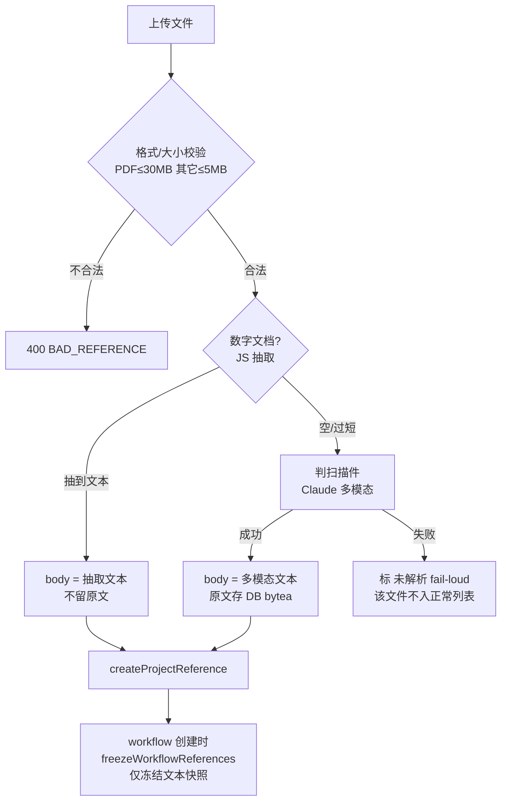
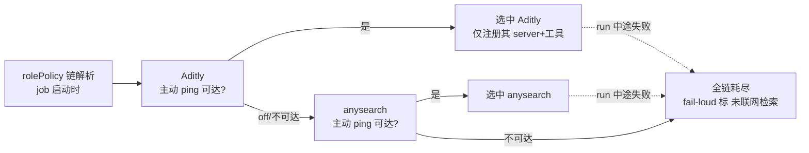

# feat: Claude-only 标注 + 文档 reference 解析 + 检索 provider 链

## Summary

三项打磨合一:(1) Web 显式标注 OpenConsult 专为 Claude 设计;(2) references 吃下 PDF/Word 等文档——数字文档走轻量 JS 抽取、扫描件交 Claude 多模态,原文存 DB;(3) web 检索从单一 Aditly 重构成可降级的 provider 抽象链,新增 anysearch 备用源。三项耦合弱,可分单元独立落地。

---

## Problem Frame

产品已强绑定 Claude(`apps/web/src/pages/Landing.tsx` 散见 "Claude Agent SDK" 等技术词),但无一处醒目声明,访客易误以为是通用 multi-LLM 平台。references 当前只收纯文本(`apps/api/src/services/references.ts` `body: text`,前端 `accept` 限文本类),客户的 PDF/Word 咨询材料递不进来。web 检索是单点:Aditly 是唯一 provider(`apps/api/src/services/agent-runner.ts` `rolePolicy()` 注入 `mcp__aditly__*`),`off` 即降级标"未联网",调研能力随一个外部网关一起塌。

完整需求与取舍见 origin: `docs/brainstorms/2026-06-01-claude-only-references-and-search-fallback-requirements.md`。

---

## Requirements

承自 origin,按特性分组(R-ID 对齐 origin 编号):

**Claude-only 定位(origin R1–R3)**
- R1. Landing hero/主 CTA 显眼处声明 Claude-only、需自带 Claude 订阅或 Anthropic key、不支持其它模型。
- R2. Settings 运行时页明示 Claude-only,口径与 Landing 一致。
- R3. README 顶部呼应同一声明。

**文档 reference 解析(origin R4–R9)**
- R4. references 接受 PDF/DOCX/PPTX/XLSX(前端 accept + 后端校验放开)。
- R5. 数字文档走轻量 JS 抽取得文本,确定性、不耗 token。
- R6. 抽取空/过短判扫描件,交 Claude 多模态解析为文本。
- R7. 存储模型扩展:扫描件存原文(DB);冻结快照固化解析后文本。
- R7-ext(plan 新增,见 KTD-2). 保留扫描件原文以支持**重解析**(OCR 质量未验证 / 模型升级后重跑),非一次性消费——这是 `bytea` 列的明确 owner。
- R8. 解析 fail-loud:单文件失败明确标注,不影响其余、不静默吞。
- R9. 保留约束:references 仍是输入材料(映射 Skill `sources/`),不复用 artifact;大小上限按二进制重定。

**web 检索 provider 链(origin R10–R14)**
- R10. web 检索抽象成有序 provider 链,按优先级择优(Aditly → anysearch → …)。
- R11(plan 收窄,见 KTD-5). provider off / **pre-flight 探测不可达** / 失败时,链解析跳过它选下一个;运行中途失败回落 fail-loud(in-flight 切换 Deferred)。
- R12. anysearch 作首个备用 provider,适配成与现有检索工具一致的形态,对 agent 透明。
- R13. 全链耗尽才降级到 fail-loud "未联网检索"。
- R14. provider 链可经 env/config 配置;Qveris 不纳入。

**安全要求(plan 新增,源自深度评审,见 KTD-8/9/11)**
- R15. 二进制解析隔离 + 解压量守门 + 选库带 zip-bomb/XXE 抗性门槛。
- R16. MIME 按 magic-byte 校验,不信客户端声明。
- R17. 扫描件出境 Anthropic 需用户可见披露 + 来源留痕。
- R18. anysearch key 仅存 env、不漏进 settings 响应;outbound URL 启动期校验(HTTPS、非环回/非内网,防 SSRF)。
- R19. references 加每项目存储上限 + 并发上传守门(防 20×30MB 放大)。

---

## Key Technical Decisions

1. **文档解析分层。** 数字文档(可抽文字)走 JS 抽取(同步、确定性、零 token);抽取结果空或过短才判扫描件,交 Claude 多模态。避免无差别上重型解析(see origin Key Decisions)。

2. **扫描件原文存 DB,不引对象存储——正当性 = 可重解析。** `project_references` 新增 nullable `bytea` 列只存**扫描件**原文(数字文档不留原文,`body` 即抽取文本)。保留原文的理由不是"消化时要"(多模态只在上传时读一次),而是 **KTD-9 的 OCR 质量未验证**:若中文扫描件多模态质量差、或日后模型升级要重跑,没有原文就只能让客户重传。这把"是否值得为一次性消费加列"的质疑转成一个有明确 owner 的能力(R7-ext,见下)。Boule 现无对象存储,为扫描件加 S3/MinIO 是不划算的基础设施跃升;存储量上限在 Risks 里量化。Drizzle pg-core **无内置 bytea**,须 `customType<{ data: Buffer; driverData: Buffer }>({ dataType: () => "bytea" })` 声明(repo 内无二进制列先例,迁移 0005 全是 text/uuid)。

3. **冻结快照只固化文本——靠分列天然成立,无需过滤。** `workflow_references.body_snapshot`(`text`)继续只复制 `project_references.body`(解析后文本)。原始二进制在**独立列**,`freezeWorkflowReferences` 复制 `body` 就天然不碰二进制——不需要在冻结函数里做排除逻辑(Coherence 担心的"机制不清"由分列设计消解)。`buildReferenceTaskContext` 仍只读 `bodySnapshot` 文本,无改动。

4. **大小上限 PDF 30MB / 其它 5MB;传输走 multipart,不走 base64-in-JSON。** 现 references 路由是默认 JSON parser(`validateReferenceUpload` 强制 `body:string`),30MB base64 膨胀到 ~41MB 全量进单个 string 分配,GC/内存峰值不可接受。**决定 U2 引入 `@fastify/multipart`**(`app.ts` 注册),二进制走流式 multipart;校验阈值按原始字节(非编码后)。30MB 二进制进 Postgres 走 TOAST。

5. **检索 provider:pre-flight 静态择优 + 主动健康探测,不做 in-flight failover(承重决定,narrows R11/AE3)。** 验证过:`rolePolicy()` 在 job 启动**跑一次**,返回 `Record<name, mcpServer>` 是**同时注册**所有 server,不是有序降级链;且它在 agent run 之前,看不到运行中的检索超时。因此本 plan 的"链"= **链解析时主动 ping 各 provider,选中第一个可达的,只注册它**;选中后若该 provider 在 run 中途失败,回落现有 fail-loud "未联网检索"(不在运行中切换)。真正的 in-flight failover 需要一层 thin-MCP 代理把多后端包起来在内部转移——**列为 Deferred**,因为它把"thin MCP"从实施细节抬成承重架构,超出 fallback 初衷。runtime 透传不变;`ADITLY_WEB_TOOLS` 泛化成各 provider 工具集。

6. **anysearch 适配成与 `mcp__aditly__*` 一致的 HTTP 形态。** 直连 HTTP vs 包一层 thin MCP 留作 execution detail;但若将来要 in-flight failover(KTD-5 Deferred),thin MCP 是唯一落点(见 Open Questions)。

7. **Qveris 排除。** 能力路由器,非搜索引擎,与 Aditly 不对位(see origin Sources)。

8. **二进制解析在隔离边界内 + 解压量守门 + 选库带安全门槛(安全承重)。** PDF/Office 解析器是 zip-bomb / XXE / RCE 重灾区(DOCX/PPTX/XLSX = zip+XML,5MB 可解压到 GB;解析发生在 DB 写入之前,能在 size guard 之后、入库之前耗尽内存)。决定:(a) 解析跑在 `worker_threads`(带 `resourceLimits` 内存上限),zip-bomb 只杀 worker 不杀主进程;(b) 解压时累计未压缩字节,超过 N×(如 20×)或硬上限即中止;(c) **选库标准显式纳入"已知 zip-bomb/XXE 抗性",不以"轻量/最小包"为唯一标准**。

9. **MIME 按 magic-byte 校验,不信客户端声明。** 现 `validateReferenceUpload` 直接采信客户端 `mimeType`。改为先读文件头校验签名(PDF `%PDF-`、Office `PK\x03\x04`)再分流大小,堵住"`.exe` 标 `application/pdf`"绕过。

10. **同步解析 + 路由超时,parseStatus 只有终态(消解 sync/async 矛盾)。** 本 plan 确定**同步**:上传请求内完成 JS 抽取(必要时多模态),返回时 `parseStatus` 已是终态(`parsed`/`failed`/`partial`),不引 BullMQ 状态机、无 `pending`。代价:30MB 扫描件多模态会占 HTTP worker 数分钟→**给 references 上传路由加独立超时**。若 U0 spike 实测大文件多模态延迟不可接受,异步化作为唯一记录在案的逃生口(Deferred,见 Open Questions)。

11. **扫描件原文出境 Anthropic 需披露 + 留痕。** 扫描件(可能是客户机密咨询材料)的原始二进制会发给 Anthropic 做多模态 OCR。决定:(a) 上传时**用户可见披露**"扫描件将发送至 Anthropic 抽取文本"(不埋在 README);(b) `project_references` 加来源标记区分"本地 JS 抽取"vs"Anthropic 多模态",供审计与未来数据不出境特性按需跳过出境。

---

## High-Level Technical Design

**文档 reference 解析路由(U2–U5):**

**web 检索 provider pre-flight 择优(U6–U7):**

链解析在 `rolePolicy()`(job 启动、agent run 之前)发生——**主动探测、静态择优、只注册选中者**。运行中途该 provider 失败回落 fail-loud,不在 run 内切换(KTD-5)。

---

## Implementation Units

> 单元顺序:U0(spike,门控 U4)→ U1(独立)→ U2→U3→U4→U5(文档解析链)→ U6→U7(检索 provider)。U0 在 U4 提交迁移之前做。

### U0. 扫描件多模态质量 spike(门控 U4)

**Goal:** 在为扫描件分支提交 schema 迁移、写多模态路径之前,先验证"中文扫描件 Claude 多模态质量可接受"这个全 plan 最弱的承重假设(origin assumption,KTD-9)。沿用本 repo 既有 U0-spike 模式(`claude-sdk.ts` 注释"U0 spike1 已 live 证明本映射")。
**Requirements:** 门控 R6/R7/R7-ext。
**Dependencies:** 无。
**Approach:** 取 5–10 份真实中文扫描件咨询 PDF(含纯扫描、混合文字+扫描),手动喂 Claude 多模态(document/vision block),人工评抽取文本质量。
**Decision gate:**
- 质量可接受 → U4 按计划落地(同步多模态 + 原文存 DB)。
- 质量差 → 扫描件分支改为 **fail-loud "暂不支持扫描件,请提供数字版"**(显式不可用),而非静默产出垃圾文本污染 `body` → 流入 `buildReferenceTaskContext`。避免在迁移落地后才发现假设崩。
**Verification:** 产出一页 spike 结论(可接受/不可接受 + 样本证据),写入 `docs/solutions/` 或本 plan 附注;U4 的形态据此定。

### U1. Claude-only 标注三处呼应

**Goal:** Web 与文档显式声明 Claude-only,消除"通用平台"误解。
**Requirements:** R1, R2, R3。
**Dependencies:** 无。
**Files:**
- `apps/web/src/pages/Landing.tsx`(hero/主 CTA 区,约 173–251 行)
- `apps/api/src/routes/settings.ts`(runtime 响应新增 `claudeOnly` 标志)
- `apps/web/src/pages/Settings.tsx`(渲染 Claude-only 声明)
- `README.md`(顶部"一句话"后或能力矩阵前插 note)
- `apps/api/tests/routes/api.test.ts`(settings 响应断言)
- `apps/web/tests/`(标注渲染,若有对应测试位)

**Approach:** settings runtime 响应加 `claudeOnly: true`(单一事实源),前端 Landing 与 Settings 读同一口径文案,README 文案与之一致。文案重点:不支持其它模型 / 需自带 Claude 访问凭证。
**Patterns to follow:** settings.ts 现有响应结构;Landing 既有 brutalist 样式(BLUE/PAPER/LINE 常量)。
**Test scenarios:**
- `GET /api/settings/runtime` 响应含 `claudeOnly: true`。
- Settings 页渲染 Claude-only 声明文本(存在性断言)。
- `Test expectation`: Landing/README 为静态文案,纯展示无行为,免测。
**Verification:** 三处文案口径一致;settings 响应新字段存在;站点 hero 可见声明。

### U2. references 接受二进制文档格式 + multipart + magic-byte + 存储上限

**Goal:** 放开上传管线接受 PDF/DOCX/PPTX/XLSX,走 multipart,按 magic-byte 校验类型与大小,加每项目存储守门。
**Requirements:** R4, R9, R16, R19。
**Dependencies:** 无。
**Files:**
- `apps/api/src/app.ts`(注册 `@fastify/multipart`;新增依赖)
- `apps/web/src/views/ProjectInputs/ProjectReferencesPanel.tsx`(`accept` 放开;二进制走 multipart FormData,不再 `readAsText`)
- `apps/api/src/routes/references.ts`(multipart handler;按 mime 流式大小阈值)
- `apps/api/src/services/references.ts`(`validateReferenceUpload` 接受二进制 + magic-byte 校验 + 分类型上限 + 每项目存储 sum 校验)
- `apps/api/tests/services/references.test.ts`(校验逻辑)

**Approach:** 传输走 multipart(KTD-4),非 base64-in-JSON。校验顺序:**先 magic-byte 验签名**(PDF `%PDF-`、Office `PK\x03\x04`,KTD-9)→ 再按类型限大小(PDF ≤30MB,Office ≤5MB,文本类沿用现 256KB,按原始字节)。入库前查该项目 `project_references` 现有总字节 + 本次,超每项目上限即拒(R19);并发上传守门(同项目在传时拒/限并行)。此 unit 只做"收下并校验",抽取在 U3/U4。
**Patterns to follow:** 现 `validateReferenceUpload` 的 `{ok}|{error}` 返回式;`MAX_REFERENCES_PER_WORKFLOW` 既有计数上限写法。
**Test scenarios:**
- magic-byte:`.exe` 内容标 `application/pdf` → 拒(签名不符)。
- PDF 29MB 通过、31MB 拒(BAD_REFERENCE)。
- DOCX 6MB 拒、4MB 通过。
- 未知/可执行 mime 拒。
- 文本类仍按 256KB 上限。
- 项目存储总量近上限时,再传超额文件 → 拒(R19)。
- 空 body / 超长 filename 仍拒(回归现有校验)。
**Verification:** 各格式按签名+阈值放行/拒绝;伪装 mime 被堵;每项目存储有界;现有文本上传不回归。

### U3. 数字文档文本抽取(JS,隔离 + 解压守门 + 混合检测)

**Goal:** 数字 PDF/Office 文档在隔离边界内抽取为文本,写入 `body`;检出混合文档不静默丢内容。
**Requirements:** R5, R15。
**Dependencies:** U2。
**Files:**
- `apps/api/src/services/document-parsing.ts`(新建:按 mime 分派抽取)
- `apps/api/src/services/document-parsing.worker.ts`(新建:`worker_threads`,带 `resourceLimits` 内存上限)
- `apps/api/src/services/references.ts`(`createProjectReference` 前置抽取)
- `apps/api/tests/services/document-parsing.test.ts`

**Approach:** 解析跑在 `worker_threads`(KTD-8,内存上限,zip-bomb 只杀 worker);解压时累计未压缩字节,超 N× 或硬上限即中止。按 mime 调对应库(PDF 文本层 / docx / pptx / xlsx)抽纯文本。**选库纳入 zip-bomb/XXE 抗性门槛,不以"最小包"为唯一标准**(具体库选型仍为 execution detail,但须满足该门槛)。
**混合文档(Adversarial Finding 2):** 抽到非空文本但 **PDF 含 image XObject** 时,判 `partial`——保留原文(`bytea`,U4)并打可见信号,不当纯数字文档"不留原文"地静默丢附录/图表。三态信号交 U4/U5:`text`(纯数字,够全)/ `empty`(扫描件,转多模态)/ `partial`(混合,留原文 + 标记)。
**Patterns to follow:** services 层纯函数 + DB 注入风格(参考 `references.ts`、`document-artifacts.ts`)。
**Test scenarios:**
- 文字版 PDF(无图)→ 抽出非空文本,`text` 信号,不触发多模态、不留原文。
- 含扫描附录的混合 PDF → `partial` 信号,留原文 + 标记。
- docx/pptx/xlsx 各抽出文本。
- 加密/损坏文档 → 抛可捕获错误(交 U5 fail-loud),不崩溃。
- zip-bomb(小体积高解压比)→ worker 内中止,不拖垮主进程。
- 抽取结果为空 → `empty` 信号(覆盖 U4 入口)。
- Covers AE1(数字文档分支)。
**Verification:** 数字文档得文本且不调 Claude;混合文档不静默丢内容;解压炸弹被守门隔离。

### U4. 扫描件 Claude 多模态解析 + 原文存 DB(独立调用路径)

**Goal:** `empty`/`partial` 信号的扫描/混合文档交 Claude 多模态转文本,原文留存 DB;同步、可重解析、出境留痕。
**Requirements:** R6, R7, R7-ext, R17。门控于 U0 spike 结论。
**Dependencies:** U3, U0(spike 通过)。
**Files:**
- `apps/api/src/db/schema.ts`(`project_references` 加:`originalBinary` nullable `bytea`(`customType`,KTD-2);`parseStatus` enum(`parsed`/`failed`/`partial`,终态,KTD-10);`parseSource` enum(`local-js`/`anthropic`,R17 留痕))
- `apps/api/src/db/migrations/`(新迁移,加上述列;**注意 0005 无 bytea 先例,须手写 customType**)
- `apps/api/src/services/document-parsing.ts`(多模态分支:**独立一次性调用**,见下)
- `apps/api/src/services/references.ts`(原文落库 + 多模态文本回填 `body` + 投影排除二进制列)
- `apps/web/src/views/ProjectInputs/ProjectReferencesPanel.tsx`(上传时披露"扫描件将发送 Anthropic",R17)
- `apps/api/tests/services/document-parsing.test.ts`

**Approach:** U3 返回 `empty`/`partial` → 把原文作为 document(PDF)/image block 交 Claude,取回文本写 `body`,原文写 `originalBinary`,`parseSource='anthropic'`。数字 `text` 文档不写原文列、`parseSource='local-js'`。
**调用路径(Feasibility major):** **不复用 `ClaudeSdkRuntime.run()`**——它只吃 string task、跑完整 agent loop(6 turn + 300s watchdog),不收 content block。改为**独立一次性调用**:默认 (a) 新 `query({ prompt: <含 document block 的单条 SDKUserMessage AsyncIterable>, options: { maxTurns: 1 } })`,复用 agent SDK 子进程 + 现有 CLI/凭证(注意:每次起子进程、大文件 inline base64 经 stdio 传输或撞限,需实测);备选 (b) 直连 `@anthropic-ai/sdk` Messages API——须提为直接依赖且要 `ANTHROPIC_API_KEY`(CLI session 用户未必有,等同 Open Q13 裸 key 路径,未 live 验证)。**"Claude API 天然可用"仅对 (a) 成立**,(b) 的 key 路径不保证。
**Patterns to follow:** 迁移参考 0005 的 text/uuid 列(bytea 部分须自写 customType);查询投影显式排除 `originalBinary`(`listProjectReferences`/`loadProjectReferences` 现 `SELECT ... body ...`,勿带新二进制列)。
**Test scenarios:**
- 扫描件 PDF(`empty`)→ 走多模态 → `body` 得文本、`originalBinary` 非空、`parseSource='anthropic'`(多模态可 mock)。
- 混合 PDF(`partial`)→ 多模态补全 + 原文留存 + 状态 `partial`。
- 多模态返回空 → `parseStatus='failed'`,交 U5。
- 数字 `text` 文档不写 `originalBinary`、`parseSource='local-js'`。
- `loadProjectReferences` 投影不含 `originalBinary`。
- Covers AE1(扫描件分支)。
**Verification:** 扫描/混合得文本且原文留存可重解析;数字文档不留原文;出境有披露+留痕;列表查询不误载二进制。

### U5. 解析 fail-loud + 冻结快照适配

**Goal:** 单文件解析失败明确标注、不污染其余;冻结只固化文本。
**Requirements:** R8, R7。
**Dependencies:** U2, U3, U4。
**Files:**
- `apps/api/src/services/references.ts`(`parseStatus` 终态落库;`freezeWorkflowReferences` 无需改——见下)
- `apps/web/src/views/ProjectInputs/ProjectReferencesPanel.tsx`(列表按 `parseStatus` 显示"已解析/未解析/部分解析")
- `apps/api/tests/services/references.test.ts`

**Approach:** 同步解析(KTD-10):上传请求内完成抽取,返回时 `parseStatus` 已是**终态**(`parsed`/`failed`/`partial`),无 `pending`、不引 BullMQ。失败的 reference 标 `failed`,列表显式标"未解析",其余正常入库,整批不失败。沿用 Aditly off 的 fail-loud 风格(显式标注不静默)。
**冻结无需改(Coherence Finding 3 消解):** 原始二进制在独立列 `originalBinary`,`body` 仍是文本;`freezeWorkflowReferences` 复制 `body`→`body_snapshot` 天然不碰二进制(KTD-3),不需要过滤逻辑。`FrozenReferences.tsx` 不在本 unit——冻结只对成功解析的文本生效,前端展示无需为本 unit 改动(失败项不进冻结由后端保证)。
**Patterns to follow:** Aditly 降级的 fail-loud 标注口径;现 `freezeWorkflowReferences` 实现(不动)。
**Test scenarios:**
- 一批 references 含一个解析失败 → 该条标 `failed`、其余正常入库,整批不失败。Covers AE2。
- `partial` 项可见标"部分解析",仍入库可用。
- 冻结快照只含文本(`body_snapshot`),不含 `originalBinary`(由分列天然成立)。
- 解析失败的 reference 仍可被删除/重传。
**Verification:** 失败/部分可见且隔离;冻结表不含二进制;无 `pending` 中间态。

### U6. web 检索 provider 抽象层(pre-flight 静态择优)

**Goal:** 把单一 Aditly 注入重构成有序、可配置的 provider 列表,链解析时静态择优。
**Requirements:** R10, R14。
**Dependencies:** 无(但建议在 U7 前落地)。
**Files:**
- `apps/api/src/services/agent-runner.ts`(`RolePolicy` + `rolePolicy()` 重构;`ADITLY_SERVER`/`ADITLY_WEB_TOOLS` 泛化)
- `apps/api/src/config.ts`(provider 列表配置:有序 provider + 各自 URL/开关)
- `apps/api/src/services/search-providers.ts`(新建:provider 定义与链解析)
- `apps/api/src/routes/settings.ts`(**同步泛化**——settings 现独立硬编码 `ADITLY_TOOLS` 与 `search.provider:"Aditly MCP"`,U6 不改则口径漂移;Feasibility sound-area 提示)
- `apps/api/tests/services/search-providers.test.ts`
- `apps/api/tests/services/agent-runner.test.ts`(rolePolicy 注入回归)

**Approach:** 抽出 provider 概念——**仅 `{ id, mcpServerConfig, toolWhitelist }`,不含 probe 槽**(Scope-guardian:probe 行为在 U7 加,不在 U6 接口预留无消费者的扩展点)。`rolePolicy()` 对 web 角色,**选中第一个可用的 provider 只注册它**(KTD-5,非同时注册全部——`mcpServers` 是 Record,同注册=同时暴露所有工具,不是降级链)。Aditly 为首,单 Aditly 时行为与现状等价(回归基线)。runtime 透传不变。
**Patterns to follow:** 现 `rolePolicy()` 的 `webEnabled`/`mcpServers` 构造;config `optional()` 读取。
**Test scenarios:**
- 仅 Aditly 配置 → 选中 Aditly,等价现状(注入 aditly server + 工具白名单)。回归基线。
- 配置 Aditly+anysearch、两者都"配置在" → 选中链首 Aditly(只注册它)。
- 全 provider off → `mcpServers` 为 undefined + web 工具不放行(等价现降级)。
- 非 web 角色 → 不注入任何检索 provider。
- settings 响应的 provider 口径与 rolePolicy 选中者一致。
**Verification:** 单 Aditly 行为不回归;多 provider 按序择优只注册一个;settings 不漂移。

### U7. anysearch provider 接入 + pre-flight 健康探测 + 降级

**Goal:** anysearch 作首个备用 provider,链解析时主动探测择优,全链不可达 fail-loud。
**Requirements:** R11(收窄), R12, R13, R18。
**Dependencies:** U6。
**Files:**
- `apps/api/src/services/search-providers.ts`(anysearch provider 定义 + HTTP 适配 + **pre-flight 主动探测**)
- `apps/api/src/config.ts`(anysearch URL/key 配置;**启动期校验 URL 为 HTTPS、非环回/非内网,R18 防 SSRF**)
- `apps/api/src/routes/settings.ts`(provider 状态展示**须 scrub key**,不漏 key-in-URL,R18)
- `apps/api/tests/services/search-providers.test.ts`
- `apps/api/tests/routes/e2e.test.ts`(researcher 检索择优 e2e)

**Approach:** anysearch 适配成与 `mcp__aditly__*` 一致的工具形态。**健康探测 = 链解析时对各 provider 的 MCP URL 主动 ping(短超时)**,选中第一个可达的只注册它(KTD-5);全不可达回落现 fail-loud "未联网检索"。**run 中途选中 provider 失败不在 run 内切换**(回落 fail-loud);真 in-flight failover 见 Deferred。key 仅 env、settings 响应 scrub。
**Patterns to follow:** Aditly HTTP MCP 注入形态;fail-loud 降级标注;现 settings "不暴露密钥" 口径。
**Test scenarios:**
- Aditly 主动 ping 不可达 → 链解析选中 anysearch。
- Aditly+anysearch 均不可达 → 标"未联网检索"、researcher 继续。Covers AE3(pre-flight 版)。
- anysearch 工具白名单正确合并/注册。
- 探测超时按不可达处理(不挂起)。
- anysearch key 不出现在 settings 响应(scrub 校验)。
- 启动期非法 URL(http/环回/内网)被拒。
**Verification:** pre-flight 按序择优;全链耗尽 fail-loud;researcher 拿带 URL 的真实结果;key 不泄露;SSRF 面收敛。

---

## Scope Boundaries

**Deferred for later(承自 origin)**
- 自托管 OCR(paddleocr/minerU):仅在硬离线/数据不出境约束下评估。
- 并行多源检索增强:质量提升非可用性,超出 fallback 初衷。
- Qveris 作为"第三方能力调用"通路:独立特性单评。

**Outside this product's identity(承自 origin)**
- 支持非 Claude 模型:定位明确单 Claude,U1 正是讲清这一点。

**Deferred to Follow-Up Work(本 plan 局部)**
- **检索 in-flight failover**:run 中途 provider 失败时实时切下一个(需 thin-MCP 代理在内部转移,KTD-5/6)。本 plan 只做 pre-flight 静态择优,运行中途失败回落 fail-loud。
- **多模态异步化**:本 plan 定同步 + 路由超时(KTD-10)。仅当 U0/实测显示大文件多模态延迟撞 HTTP 超时,才引 BullMQ 异步 + `pending` 态 + 轮询 UI。
- **每页/每段抽取覆盖率检测**:本 plan 混合文档用"含 image XObject"粗判 `partial`(U3),细到 per-page 覆盖率另议。

---

## Risks & Dependencies

- **30MB 二进制进 DB — 存储量需量化(Adversarial Finding 5)。** 上限假设:每项目 ≤ N 份扫描件 × 30MB,× M 项目。单租户咨询工具低 N 下进 Postgres 可接受;**reversal 成本是一次数据迁移(非配置开关)**,故 U2 设每项目存储上限(R19)作为有界监控点;若总 bytea 超阈值,迁移到对象存储——届时一次迁移。查询投影排除 `originalBinary`,冻结表只存文本,缓解读放大。
- **多模态调用路径与传输(Feasibility major)。** U4 是独立一次性调用,非复用 `ClaudeSdkRuntime.run()`;大文件 inline base64 经 SDK 子进程 stdio 传输可能撞限,需 U0/实测确认。(a) 子进程路径用现有 CLI 凭证;(b) 裸 Messages key 路径未必满足(Open Q13)。
- **中文扫描件多模态质量未实测 → U0 spike 门控(最弱承重假设)。** 不通过则扫描件分支降为 fail-loud "暂不支持",不静默产垃圾(U0 决策门)。
- **二进制解析器攻击面(Security CRITICAL)。** zip-bomb / XXE / 解析器 CVE。缓解:worker 隔离 + 解压量守门 + 选库带安全门槛(KTD-8/R15)。worker 隔离对单租户或属偏重,但解压守门 + magic-byte 是低成本必做。
- **出境合规(Security HIGH)。** 扫描件原文发 Anthropic,需披露 + 留痕(R17),为未来"数据不出境"特性留按需跳过出境的钩子。
- **anysearch 免费层配额/稳定性未验证**(origin assumption)——plan 外实测;SSRF/key 泄露面由 R18 收敛。
- **provider 重构触及 researcher 关键路径。** U6 须保持单 Aditly 零回归,靠 `agent-runner.test.ts` + e2e 守门;settings 同步泛化防口径漂移。
- **依赖:** `@fastify/multipart`(新增);文档解析库(满足 R15 安全门槛);anysearch 接入凭证;Claude document/vision——仅子进程路径"天然满足"。

---

## Open Questions(Deferred to Implementation)

> 评审后已**收口**的结构性分叉(不再 open):同步 vs 异步 → 定同步(KTD-10);provider 健康探测 → 定 pre-flight 主动 ping(KTD-5);in-flight failover → Deferred。

仍 open(纯实施细节):
- anysearch **直连 HTTP vs 包 thin MCP** 对齐 `mcp__aditly__*`(若将来要 in-flight failover,则 thin MCP 是承重落点)。
- U4 调用路径 **(a) 子进程 query() vs (b) 裸 Messages SDK** 的最终取舍(默认 a,见 U4)。
- 数字抽取"**过短阈值**" + 混合文档 **image-XObject 判定**的具体定义(字符数/比例/对象计数)。
- 文档解析具体库选型(须满足 R15 zip-bomb/XXE 抗性门槛)。
- 解压量守门倍数(N×)与 worker 内存上限的具体取值。
- 每项目存储上限与并发上传守门的具体阈值(R19)。

---

## Sources & Research

- origin requirements: `docs/brainstorms/2026-06-01-claude-only-references-and-search-fallback-requirements.md`(含 Qveris/anysearch 选型查证)。
- 集成点(本会话确认):references 冻结 `apps/api/src/routes/workflows.ts` → `freezeWorkflowReferences`(`apps/api/src/services/references.ts`);表定义 `apps/api/src/db/schema.ts`(`project_references.body`、`workflow_references.body_snapshot` 均 `text`);provider 注入 `apps/api/src/services/agent-runner.ts` `rolePolicy()`(`ADITLY_SERVER`/`ADITLY_WEB_TOOLS`),runtime 透传 `apps/api/src/agents/runtimes/claude-sdk.ts`,URL `apps/api/src/config.ts`;标注落点 `apps/web/src/pages/Landing.tsx`(hero 173–251)、`apps/api/src/routes/settings.ts`、`README.md`。
- 既有学习:`docs/solutions/2026-06-01-route-db-access-to-service-layer.md`(路由不直接碰 DB、SQL 收在 service——U2/U6 新增 service 应遵循)。

## Review Integration(2026-06-01 深度评审)

5 个 reviewer(feasibility / scope-guardian / coherence / security-lens / adversarial)对本 plan 做对抗式评审,交叉命中项已整合:
- **架构(双命中)**:provider 链 `rolePolicy()` 返回 Record=同时注册,非降级链 → 收窄为 pre-flight 静态择优 + 主动探测,in-flight failover 转 Deferred(KTD-5,R11 收窄,mermaid 重画,U6/U7 重写)。
- **一致性(双命中)**:sync/async 矛盾 → 定同步 + 路由超时,parseStatus 只终态(KTD-10);`parseStatus`/`originalBinary`/`parseSource` 列归 U4 迁移(Coherence 100% 命中);冻结靠分列天然不碰二进制(消解 Coherence Finding 3)。
- **调用路径**:U4 不复用 `ClaudeSdkRuntime.run()`,改独立一次性调用(Feasibility major)。
- **安全(1 CRITICAL+4 HIGH)**:R15 解析隔离+解压守门+选库门槛、R16 magic-byte、R17 出境披露+留痕、R18 anysearch key/SSRF、R19 每项目存储上限。
- **scope**:bytea 列正当性显式锚到"可重解析"(R7-ext);provider 接口去掉无消费者的 probe 槽。
- **假设**:中文扫描件多模态质量(最弱承重假设)→ 新增 U0 spike 门控 U4,不通过则降 fail-loud。
- **混合文档(adversarial 独家)**:文字+扫描/图表混合 PDF → U3 三态信号 `partial`,留原文不静默丢内容。
