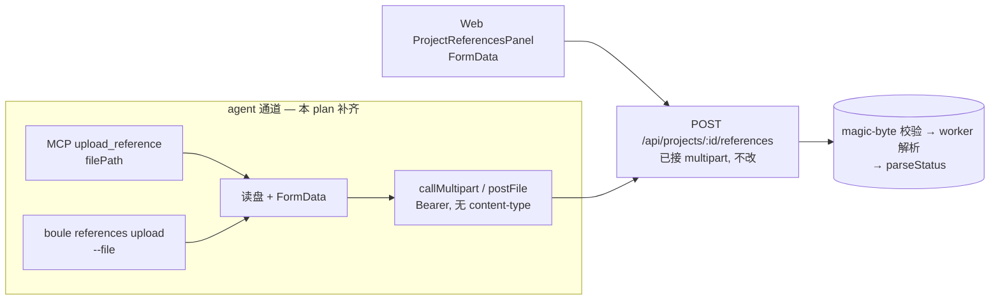
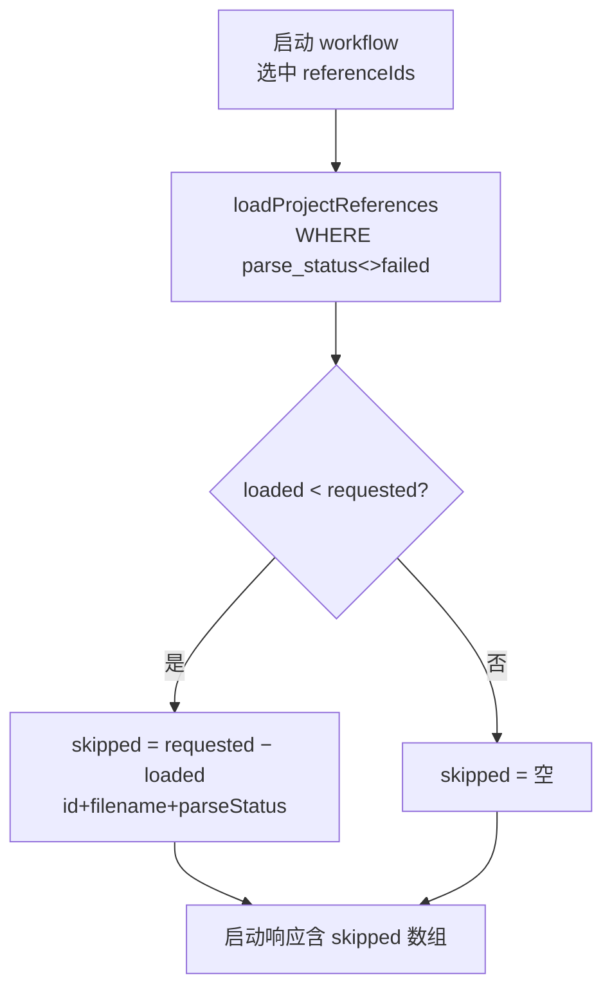

# feat: reference agent-native 对齐 + 上传正确性收口

## Summary

承接 commit `2e87494`(references 二进制上传 + 检索 provider 链)的代码评审残留三项,均需设计决策而非快修:(1) **agent-native 缺口**——web 能上传/列/删 reference,但 MCP 与 boule CLI 没有对应能力,且两者的请求层都是 JSON-only,发不了 multipart;(2) **多实例正确性**——上传锁与存储预算检查是进程内的、有 TOCTOU;(3) **静默跳过**——workflow 启动时 `failed` 的 reference 被无声丢弃,返回 count 对不上。三项弱耦合,可独立落地。

---

## Problem Frame

commit `2e87494` 让 web UI 通过 multipart 收下 PDF/DOCX/PPTX/XLSX,但配套的 agent 通道没跟上:

- **MCP**(`apps/api/src/mcp/tools.ts`)有 7 个工具,无一碰 references;其 `call()` helper 硬编码 `content-type: application/json` + `JSON.stringify`,**发不了 multipart**,新工具也无从下手。
- **CLI**(`packages/cli/src/index.ts` / `client.ts`)同样 JSON-only,`USAGE`/`switch` 无 references 子命令。
- Boule 的既定原则:**任何 web 动作 agent 也能做**(README "Web-CLI 协同层")。这条原则在这个 commit 上破了——而 references 恰是喂给 workflow 的核心输入材料。

**多实例:** `apps/api/src/routes/references.ts` 的 `activeProjectUploads` 是模块级 `Set`(单进程),`apps/api/src/services/references.ts` 的 `assertProjectReferenceStorageBudget` 是 `SELECT SUM` 后 `INSERT`(读-改-写非原子)。单机正确,多副本下锁失效、预算可被并发突破。

**静默跳过:** `loadProjectReferences`(`apps/api/src/services/references.ts`)带 `WHERE parse_status <> 'failed'`,workflow 启动选中的 `failed` reference 被悄悄丢掉,`apps/api/src/routes/workflows.ts` 返回的 `referenceCount` 与请求数不符且无信号说明哪些被跳过。

完整评审见 origin 实现的 review run;集成点均本会话已核实。

---

## Requirements

**agent-native reference 对齐(评审 #9)**
- R1. MCP 新增 `upload_reference` / `list_reference` / `delete_reference` 三工具,映射现有 REST 端点。
- R2. MCP 增 `callMultipart` 传输 helper(现 `call()` 仅 JSON),`upload_reference` 走它。
- R3. boule CLI 新增 `references list / upload / delete` 子命令 + multipart `postFile` helper;`USAGE` 同步。
- R4. `upload_reference` / `list_reference`(及 CLI 对应)回显 `parseStatus` / `parseSource` / `parseError`,agent 能据此判断解析结果。
- R5. upload 工具/命令接受**本地文件路径**(agent/CLI 进程读盘后构造 multipart),非 base64-in-JSON。

**多实例正确性(评审 #10)**
- R6. 存储预算检查改为**原子**(事务内 SUM+INSERT 或 Postgres advisory lock),消除 TOCTOU。
- R7. `activeProjectUploads` 显式注释为**单进程**适用;跨副本分布式锁(Redis SETNX+TTL)**显式 Deferred**,不在本 plan 实现。

**静默跳过(评审 #11)**
- R8. workflow 启动响应显式列出**被跳过的 reference**(选中但 `failed`/未加载),不再只给一个对不上的 count。

---

## Key Technical Decisions

1. **upload 走「本地文件路径」语义,不走 base64-in-JSON。** agent(Claude Code 内)和 CLI(脚本/CI)进程天然有本地文件系统访问;让工具收 `{ projectId, filePath }`,进程读盘 → 构造 `FormData` → multipart POST。避免 base64 把二进制塞进 JSON(膨胀 1.37× + 与 web 的 multipart 路径分叉成两套)。后端 `POST /api/projects/:id/references` 已接 multipart,无需改。

2. **MCP 加 `callMultipart`,不动现有 `call()`。** 7 个现有工具继续走 JSON `call()` 零改动;新增独立 `callMultipart(client, method, path, form)` 用 `FormData` + Bearer(不设 `content-type`,让 fetch 自动带 boundary)。CLI 同构加 `postFile`。保持「人机接口分离」(KTD-6:CLI 是人/脚本层,MCP 是 agent 层),但两层都补齐 references。

3. **delete/list 复用现有端点,零后端改动。** `GET /api/projects/:id/references`、`DELETE /api/projects/:id/references/:refId` 已存在且已返回 parseStatus 字段。三工具里只有 upload 需要 multipart;list/delete 走现有 JSON `call()`。

4. **多实例:只做原子预算 + 注释单机锁,分布式锁 Deferred。**(用户确认近期不跑多副本)`assertProjectReferenceStorageBudget` + INSERT 收进**单条原子操作**——优先 Postgres `pg_advisory_xact_lock(hashtext(projectId))` 包住「SUM→判断→INSERT」事务,杜绝 TOCTOU,且 advisory lock 跨连接生效(比纯 app 锁强)。`activeProjectUploads` 保留(单进程内防重复解析的廉价手段)但加注释标明「单进程,多副本须换 Redis」。Redis 分布式锁列 Deferred。

5. **跳过信号在 service 显式返回,route 只透传。** `loadProjectReferences` 已知 `requested ids` 与 `loaded rows` 之差即「跳过集」;由 service 返回 `{ loaded, skipped }`(或并列函数),workflow 创建处把 `skipped`(id + filename + parseStatus)带进启动响应。遵循「route 不直接碰 DB / 判断留给 service」(see origin: `docs/solutions/2026-06-01-route-db-access-to-service-layer.md`)。

---

## High-Level Technical Design

**reference upload 跨三端同一 REST 面(U1/U2):**

**workflow 启动跳过信号(U4):**

---

## Implementation Units

> 顺序:U1(MCP)→ U2(CLI,镜像 U1 形态)独立可并;U3、U4 互不依赖。

### U1. MCP reference 工具 + multipart 传输

**Goal:** MCP 补齐 upload/list/delete reference,新增 multipart 传输 helper。
**Requirements:** R1, R2, R4, R5。
**Dependencies:** 无。
**Files:**
- `apps/api/src/mcp/tools.ts`(新增 `callMultipart` helper + 三个 ToolDef;不改现有 `call()` 与 7 工具)
- `apps/api/tests/mcp/tools.test.ts`(或现有 MCP 测试文件——遵循既有位置)

**Approach:** `callMultipart(client, "POST", "/api/projects/:id/references", form)`:用 `FormData`,header 只带 `Authorization: Bearer`(**不设 content-type**,让 fetch/undici 自动加 multipart boundary),沿用 `call()` 的 15s 超时与中文错误风格。`upload_reference({ projectId, filePath })`:`fs.readFileSync` → `new Blob([buf])` append 到 FormData(字段名 `file`,与 web 一致)→ `callMultipart`。`list_reference({ projectId })` / `delete_reference({ projectId, referenceId })` 走现有 `call()`。list 返回原样透出 parseStatus/parseSource/parseError。
**Patterns to follow:** 现 `call()` 的 Bearer + 超时 + `safeJson` 错误风格;`resolveWorkflow` 那种「显式优先」参数风格;`create_checkpoint` Deferred 注释体例(若某工具暂不做,显式说明)。
**Test scenarios:**
- `upload_reference` 读一个临时 txt → 发出的请求是 multipart(无 `content-type: application/json`),命中 POST 端点(fetch 可 mock,断言 body 是 FormData、header 无 JSON content-type)。
- `list_reference` 返回的对象含 parseStatus/parseSource/parseError 字段(mock API 返回)。
- `delete_reference` 命中 `DELETE …/:referenceId`,404 透出清晰错误。
- filePath 不存在 → 抛清晰错误,不发请求。
- daemon 不可达 → 沿用「daemon 是否在运行」错误。
**Verification:** 三工具可被 MCP client 调用;upload 真发 multipart;list 带解析状态;现有 7 工具行为零回归。

### U2. boule CLI references 子命令 + multipart

**Goal:** CLI 补齐 `references list / upload / delete`,镜像 U1。
**Requirements:** R3, R4, R5。
**Dependencies:** U1(形态对齐,非代码依赖)。
**Files:**
- `packages/cli/src/client.ts`(新增 `postFile` multipart helper)
- `packages/cli/src/index.ts`(`references` 子命令路由 + `USAGE` 更新)
- `packages/cli/tests/`(遵循既有 CLI 测试位)

**Approach:** `postFile(cfg, path, filePath)`:Node 18+ 内置 `FormData` + `fs.readFileSync` → `Blob`,Bearer header,不设 content-type。`boule references list --project <id>` → `get(/api/projects/:id/references)`,打印含 parseStatus。`boule references upload --project <id> --file <path>` → `postFile`。`boule references delete --project <id> --id <refId>` → DELETE。`USAGE` 加三行。零新依赖(KTD-6)。
**Patterns to follow:** 现 `submit` 子命令(`flag()` 取参 + `readFileSync` + post)的形态;`client.ts` 的 `CliError` + 超时 + 中文错误。
**Test scenarios:**
- `references upload --file <tmp>` → `postFile` 发 multipart,命中端点。
- `references list --project p` → 命中 GET,打印含 parseStatus。
- `references delete --project p --id x` → 命中 DELETE。
- 缺 `--project`/`--file` → `CliError` 用法提示(对齐 submit 的校验)。
- `--file` 路径不存在 → 清晰错误,不发请求。
**Verification:** 三子命令端到端打通;`boule help` 列出;现有子命令零回归。

### U3. 存储预算原子化 + 单机锁注释

**Goal:** 消除预算检查 TOCTOU;显式标注上传锁单进程适用。
**Requirements:** R6, R7。
**Dependencies:** 无。
**Files:**
- `apps/api/src/services/references.ts`(`createProjectReference` 把 budget 检查 + INSERT 收进一个事务,用 `pg_advisory_xact_lock(hashtext(projectId))` 串行化同项目上传)
- `apps/api/src/routes/references.ts`(`activeProjectUploads` 加单进程注释;不删——单进程内仍是廉价防重)
- `apps/api/tests/services/references.test.ts`

**Approach:** 在 `createProjectReference` 内:开事务 → `SELECT pg_advisory_xact_lock(hashtext(${projectId}))` → `SELECT SUM(size_bytes)` 判断预算 → 超额抛 `ReferenceStorageLimitError`(已存在)→ 否则 INSERT → 提交。advisory xact lock 在事务结束自动释放,跨连接生效,从根上去掉「读后写」窗口。`activeProjectUploads` 注释:`// 单进程内防重复解析;多副本部署须换 Redis(见 plan 002 Deferred)`。
**Patterns to follow:** 现 `db.execute(sql\`…\`)` 参数化风格;`ReferenceStorageLimitError`(本 repo 上一轮已加);事务用 drizzle 现有事务 API(参考 repo 内其它多语句事务,若无则 `db.execute` BEGIN/COMMIT 包裹——实施时确认 drizzle 事务可用形态)。
**Test scenarios:**
- 预算未超 → INSERT 成功。
- 预算正好到上限 + 本次超额 → 抛 `ReferenceStorageLimitError`(route 映射 400)。
- 并发两次上传同项目、各自单独在预算内但合计超额 → 至多一个成功,另一个被拒(advisory lock 串行化后,第二个看到已提交的 SUM 而拒)。Covers R6。
- 不同项目并发上传 → 互不阻塞(锁键含 projectId)。
**Verification:** 同项目并发不能突破预算;跨项目不串行;现有上传不回归。

### U4. workflow 启动跳过信号

**Goal:** 启动 workflow 时显式返回被跳过(failed)的 reference,消除静默丢弃。
**Requirements:** R8。
**Dependencies:** 无。
**Files:**
- `apps/api/src/services/references.ts`(`loadProjectReferences` 旁路或返回 `{ loaded, skipped }`——`skipped` = 请求 id 中 `parse_status='failed'` 或不存在者,带 id+filename+parseStatus)
- `apps/api/src/routes/workflows.ts`(启动响应纳入 `skippedReferences`)
- `apps/web/src/views/ProjectInputs/`(启动后若有 skipped,提示用户哪些未纳入——存在性提示即可)
- `apps/api/tests/services/references.test.ts`、`apps/api/tests/routes/`(workflow 启动 e2e)

**Approach:** 新增 service 函数(或扩展现有)返回选中 id 的加载结果分区:`loaded`(进 freeze)与 `skipped`(failed/缺失)。route 在启动响应里加 `skippedReferences: [{ id, filename, parseStatus }]`。前端在启动反馈处显示「N 个 reference 因解析失败未纳入」。不改 freeze 行为(仍只冻 loaded)。
**Patterns to follow:** 现 `loadProjectReferences` 的 `byId` map + `filter` 形态;route 不碰 DB(see origin solution)。
**Test scenarios:**
- 选 3 个 reference,其中 1 个 `failed` → 启动成功,响应 `skippedReferences` 含那 1 个(id+filename),`loaded` 2 个进 freeze。Covers R8。
- 选的 id 全部正常 → `skippedReferences` 为空数组。
- 选一个不存在的 id → 计入 skipped(或既有 INVALID_REFERENCES 语义,二者择一,实施时与现有校验对齐)。
- 前端:有 skipped 时渲染提示文本(存在性断言)。
**Verification:** count 不再无声对不上;用户能看到哪些 reference 未纳入及原因。

---

## Scope Boundaries

**Deferred for later**
- **Redis 分布式上传锁**(R7):跨副本 SETNX+TTL。仅当 Boule 真上多副本部署时做(用户确认近期单机)。本 plan 只做原子预算 + 单机注释。
- **active context 注入 reference 摘要**(评审 #7 观察):让 agent 不必额外调 list 就有 ambient 感知。增强项,非本轮。
- **reference 重解析 / 重传 工具**(基于保留的 `original_binary`):独立特性。

**Outside this scope**
- 二进制解析管线本身、Claude OCR 启用、provider 链——已在 origin plan(001)实现,本 plan 不动。

---

## Risks & Dependencies

- **MCP multipart 在 SDK 形态未验**:`callMultipart` 用原生 `FormData` + fetch 应可,但 MCP server 进程的 fetch/undici 对 `Blob` multipart 的 boundary 自动处理需实测(U1 test 守门)。
- **drizzle 事务 + advisory lock 形态**:U3 依赖 drizzle 的事务 API 能在同一连接发 `pg_advisory_xact_lock` + SUM + INSERT。若 drizzle 事务封装不便,退路是 `db.execute` 手动 BEGIN/advisory_xact_lock/COMMIT——实施时确认(Open Questions)。
- **CLI Node 版本**:`postFile` 用 Node 18+ 内置 `FormData`/`Blob`,零新依赖;确认 CLI 目标 runtime ≥18。
- **skipped 语义与现有 INVALID_REFERENCES 校验的边界**:U4 要与 workflow 启动现有的 reference 校验(数量/UUID)对齐,别把「不存在的 id」与「解析失败」混为一谈(实施时对齐)。
- **依赖:** 后端 references 端点(已存在,不改);`ReferenceStorageLimitError`(上一轮已加)。

---

## Open Questions(Deferred to Implementation)

- drizzle 事务 API vs 手动 `db.execute` BEGIN/COMMIT 包 advisory lock 的最终取舍(U3)。
- `upload_reference` 的 mime 由谁定:进程按扩展名猜 vs 让后端 magic-byte 兜底(后端已 magic-byte,工具可不传 mime,实施时定字段)。
- U4 `skipped` 与现有 INVALID_REFERENCES 错误码的关系:合并为一个 skipped 数组,还是不存在=400、failed=skipped 二分。

---

## Sources & Research

- origin 实现 plan:`docs/plans/2026-06-01-001-feat-claude-only-references-search-fallback-plan.md`(本 plan 是其实现后评审残留的跟进)。
- 评审 run:commit `2e87494` 的 12-reviewer code-review(#9 agent-native gap、#10 多实例 TOCTOU、#11 静默跳过)。
- 集成点(本会话核实):MCP `apps/api/src/mcp/tools.ts`(`call()` JSON-only,7 工具,`create_checkpoint` Deferred 先例);CLI `packages/cli/src/index.ts`+`client.ts`(JSON-only,`submit` 子命令体例);`apps/api/src/services/references.ts`(`assertProjectReferenceStorageBudget` SELECT-SUM-then-INSERT、`loadProjectReferences` `parse_status <> 'failed'` 过滤、`ReferenceStorageLimitError`);`apps/api/src/routes/references.ts`(`activeProjectUploads` 进程内 Set);`apps/api/src/routes/workflows.ts`(启动 + freeze)。
- 既有学习:`docs/solutions/2026-06-01-route-db-access-to-service-layer.md`(route 不碰 DB、判断留 service——U3/U4 新增 service 遵循)。
