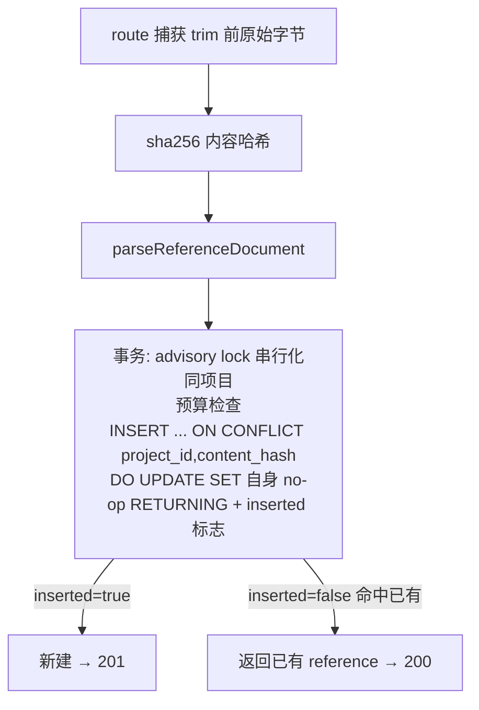

# feat: reference 上传幂等 + workflow 启动契约收口

## Summary

承接 plan 002 实现(commit `731ae8`)的代码评审残留三项:(1) **上传幂等**——reference 上传无去重,client 中途 abort + 重传会重复建 + 双扣预算;用 **内容哈希唯一约束** 让重传幂等返回已有 row;(2) **契约收口**——`POST /api/workflows` 移除 `INVALID_REFERENCES` 400、改返 `skippedReferences[]`(plan 002 U4 故意为之)是未文档化的契约变更,且 agent 经 MCP 启动 workflow 根本看不到 skipped;补 `start_workflow` MCP 工具 + 文档;(3) **测试债**——补 plan 002 自己列出却没写的并发预算用例 + CLI references 子命令路由用例。

---

## Problem Frame

plan 002 把 references 做到 web/CLI/agent 三端可用、预算原子化、workflow 启动显式跳过失败 reference。评审(commit `731ae8` 的 10-reviewer run)确认实现忠于计划,但留下三处需设计/决策或属测试债的残留:

- **上传无幂等(评审 #1b,P1)。** `createProjectReference`(`apps/api/src/services/references.ts`)在 `parseReferenceDocument`(可达 `config.references.parseTimeoutMs`=120s)之后才在事务内 INSERT。client(web FormData / MCP `upload_reference` / CLI `postFile`)若在解析期间 abort(plan 002 已把上传超时提到 130s 缩小窗口,未消除),server 仍会完成解析 + 提交 row,client 没收到 201 → 重传 → **重复 reference + 双扣存储预算**。`pg_advisory_xact_lock` 只串行化、不去重。
- **契约变更未文档化(评审 #2,P2)。** plan 002 U4 移除 `POST /api/workflows`(`apps/api/src/routes/workflows.ts`)的 `400 INVALID_REFERENCES`,改把 failed/missing 折进 `skippedReferences[]`(201 响应)。web 已处理;但这是未记录的契约收窄,且**当前无 MCP 工具包 `POST /api/workflows`**,agent 启动 workflow 看不到 skipped(`POST /api/workflows` 的消费方仅 web)。
- **测试债(评审多人交叉)。** plan 002 U3 自己列的并发用例「同项目两次上传各自在预算内、合计超 → 至多一个成功」从未实现;CLI `references` 子命令路由(`packages/cli/src/index.ts` 的 list/upload/delete + 缺 flag 的 CliError)只测了 `postFile` HTTP helper,没测 arg 解析/dispatch;`loadProjectReferencesPartitioned` 的 missing-id→`"missing"` 分支、预算超额→400 路由映射也无测。

完整评审见 origin(plan 002)实现的 review run。

---

## Requirements

**上传幂等(评审 #1b)**
- R1. reference 上传按 **(project_id, 内容哈希)** 去重:同项目、**同传输形态**、同内容重传不新建,幂等返回已有 reference。
- R2. 内容哈希 = `sha256(规范化的原始上传字节)`,在解析**之前**算——确定性、不受非确定的 Claude OCR 影响。规范化口径见 KTD-2(multipart 用原始 buffer;JSON 用 **trim 前**的 body 原始字节,在 `validateReferenceUpload` 改写之前于 route 捕获)。**跨传输形态不保证去重**(同一文件经 multipart 与经 JSON 文本是不同字节表示)——这是显式非目标,不是 bug。
- R3. 去重检测靠**唯一约束**,非靠预查:`INSERT ... ON CONFLICT (project_id, content_hash) DO UPDATE SET <自身no-op> RETURNING ...` 始终返回 row(无论新建或命中),据是否为既有行判 200(已有)vs 201(新建);不抛 500、无回查竞态。
- R4. 幂等写入收进 plan 002 的 advisory-lock 事务——**该锁对去重正确性是承重的**(非仅预算):READ COMMITTED 下它串行化同项目并发写,使 `ON CONFLICT` 看到的是已提交行。不破坏「失败 reference 标 failed」语义。
- R10(deepening 新增). **仅前向生效**:既有行 `content_hash` 为 NULL 且**无法回填**(数字/文本行未留原始字节,扫描件 OCR 非确定)——故 deploy 时已存在的 reference 不可去重,其首次重传仍可能产生重复。须在 plan 与文档显式标明,不伪装成已保护历史数据。所有**新**写入路径(JSON + multipart 两分支)一律算并写 `content_hash`,否则多 NULL 新行绕过去重。

**workflow 启动契约收口(评审 #2)**
- R5. 记录 `POST /api/workflows` 的契约变更:不再 400 `INVALID_REFERENCES`,改 201 + `skippedReferences[]`;供 CLI/MCP/外部调用方对齐。
- R6. 新增 `start_workflow` MCP 工具包 `POST /api/workflows`,响应带 `skippedReferences`,让 agent 启动 workflow 能看到哪些 reference 未纳入。

**测试债(评审多人)**
- R7. 补并发预算用例:同项目两次上传各自在预算内、合计超额 → 至多一个成功(覆盖 advisory lock + 预算原子性)。
- R8. 补 CLI `references` 子命令路由用例(list/upload/delete + 缺 flag 报 CliError + 未知子命令兜底)。
- R9. 补 `loadProjectReferencesPartitioned` missing-id→`"missing"` 分支 + 预算超额→400 路由映射用例。

---

## Key Technical Decisions

1. **内容哈希去重,返回已有(200),不走 client Idempotency-Key。**(用户确认)`(project_id, content_hash)` 唯一索引。零客户端改动——web/MCP/CLI 三端自动受益。**这是硬约束实现的软偏好,deepening 已确认接受**:字节完全相同的两份上传在同一项目内被折叠为一个 reference;「同一份客户材料重传」正是期望行为,且第二次返回 200+已有(非 409 报错),对用户不刺眼。references 是输入素材(映射 Skill sources),同字节同文件名=同素材,折叠合理。client Idempotency-Key 被排除:要改三端都生成并传 key,成本高且不解决「内容相同」的去重。

2. **哈希在解析前算;去除预查,唯一约束 + `ON CONFLICT DO UPDATE RETURNING` 是唯一路径。**(deepening 收窄)
   - **哈希口径(修正评审 Finding 1)**:JSON 路径现有 `validateReferenceUpload` 会 `body.trim()`,到 `createProjectReference` 时已非原始字节;multipart 走原始 buffer。两者口径必须统一:在 route **校验/trim 之前**捕获原始字节算哈希(multipart 用 part buffer;JSON 用未 trim 的 body 原始字节),把 `content_hash` 作为 input 显式传入 service。否则同文件不同传输、甚至同传输带尾换行都会哈希不一致。
   - **去除预查 fast-path(采纳 scope-guardian)**:不做「先 SELECT 命中则跳解析」。理由:预查对真正的 abort+retry 竞态无用(attempt-2 预查在 attempt-1 提交前就 miss),只为「事后故意重传」省解析,却换来第三条代码分支 + 事务边界 open question + 一条 spy 测试。约束才是正确性,预查是过早优化,Deferred。
   - **正确性来源 = advisory lock + `ON CONFLICT ... DO UPDATE SET <no-op> RETURNING`**(修正评审 Finding 4):`DO UPDATE`(对自身 no-op)无论插入还是命中都**返回该行**,免回查、免 READ COMMITTED 下「DO NOTHING 返回空 + 未提交行不可见」的可见性缺口。plan 002 的 `pg_advisory_xact_lock(hashtext(projectId))` 串行化同项目并发写——**对去重正确性承重,非仅预算**,须在代码注释标明(否则将来为别的原因动锁会静默重引竞态)。判 deduped:`RETURNING` 行的 `created_at` 早于本次 / 或用 `xmax<>0` / 或 `(xmax = 0) AS inserted` 投影区分新建 vs 命中。

3. **哈希列 + 唯一索引经 Drizzle schema 派生迁移;历史行仅前向。** `project_references` 加 `content_hash text`(sha256 hex)+ 唯一索引 `(project_id, content_hash)`。遵循 schema 单一真值源。既有行 `content_hash` 为 NULL——唯一索引对多 NULL 不冲突(Postgres 语义),迁移安全;**但这不等于保护了历史数据**(修正评审 Finding 2):legacy 行不可去重,其首次重传仍会产生重复。**不回填**:数字/文本行没留原始字节、扫描件 OCR 非确定,无从重算一致哈希——回填不可行,故诚实标为前向限制(见 R10、Scope Boundaries)。

4. **去重命中 200 vs 新建 201 在 route 区分。** service 返回 `{ reference, deduped: boolean }`;route 据此发 200(已有)或 201(新建)。这是对 R3 的显式契约,客户端可据状态码判断是否命中幂等(web 现忽略状态码差异,无害)。

5. **`start_workflow` MCP 工具走现有 JSON `call()`,不需 multipart。** `POST /api/workflows` 是 JSON body(projectId/mode/referenceIds);复用 plan 002 已有的 `call()`。工具回显 `skippedReferences`,agent 可据此知道哪些 reference 没进。需 editor+/owner write scope(与 route 现有 `requireProjectRole` 一致)。

6. **契约变更记进 docs/solutions(而非新建 changelog 体系)。** 沉淀一条 solution 记 `POST /api/workflows` 的 400→201+skipped 变更 + 调用方迁移提示,与既有 `docs/solutions/2026-06-01-route-db-access-to-service-layer.md` 同体例。Boule 现无 API changelog 基础设施,不为一条变更引入。

---

## High-Level Technical Design

**幂等上传流(U2):唯一约束 + ON CONFLICT DO UPDATE(无预查、无回查)**

advisory lock 对去重正确性承重:它使并发重传串行,`ON CONFLICT DO UPDATE` 始终返回行,无 READ COMMITTED 可见性缺口、无回查竞态。

---

## Implementation Units

> 顺序:U1(schema)→ U2(幂等)依赖 U1;U3(MCP 工具 + 文档)、U4(测试债)相对独立,U4 覆盖 U2/U3 行为故在其后。

### U1. content_hash 列 + 唯一索引 + 迁移

**Goal:** `project_references` 加内容哈希列与 `(project_id, content_hash)` 唯一索引。
**Requirements:** R1(载体)。
**Dependencies:** 无。
**Files:**
- `apps/api/src/db/schema.ts`(`projectReferences` 加 `contentHash text("content_hash")` nullable + `uniqueIndex` on `(projectId, contentHash)`)
- `apps/api/src/db/migrations/`(drizzle-kit 生成新迁移 + snapshot/journal)
**Approach:** schema 加列与唯一索引,`drizzle-kit generate` 派生迁移(参考既有 0006 迁移体例;生成前确认迁移工作树干净,避免 journal 序号冲突——评审 m2)。既有行 `content_hash` 为 NULL,Postgres 唯一索引允许多 NULL,`ADD COLUMN` nullable 是 metadata-only,部署安全。**不回填历史哈希**(R10:数字/文本行无原始字节、扫描件 OCR 非确定,无从重算)——legacy 行保持 NULL、不可去重,属已知前向限制。
**Patterns to follow:** `apps/api/src/db/schema.ts` 既有 `uniqueIndex`/`index` 用法;迁移派生流程(schema 真值源)。
**Test scenarios:** `Test expectation: none -- 纯 schema/迁移;行为在 U2 测`。
**Verification:** 迁移应用后列与唯一索引存在;schema 与迁移一致(无 drift);既有 NULL 行不冲突、不受影响。

### U2. 幂等 createProjectReference + route 200/201

**Goal:** 上传按内容哈希幂等;同传输形态重传返回已有 row,不重复建、不双扣预算。
**Requirements:** R1, R2, R3, R4, R10。
**Dependencies:** U1。
**Files:**
- `apps/api/src/routes/references.ts`(在 `validateReferenceUpload`/trim **之前**捕获原始字节算 `content_hash`;multipart 用 part buffer,JSON 用未 trim 的 body;把 hash 传入 service;据 service 返回的 `inserted` 发 201 或 200)
- `apps/api/src/services/references.ts`(`createProjectReference` 收 `contentHash` 入参;事务内 `INSERT ... ON CONFLICT (project_id, content_hash) DO UPDATE SET <自身列no-op> RETURNING ..., (xmax = 0) AS inserted`;返回 `{reference, inserted}`;两分支(body/buffer)都带 hash)
- `apps/api/tests/services/references.test.ts`、`apps/api/tests/routes/`(route 层 200/201)
**Approach:**(KTD-2 收窄)**无预查、无回查**。哈希在 route 校验前算(口径统一,修正 Finding 1)。service 沿用 plan 002 事务(advisory lock + 预算)但 INSERT 改 `ON CONFLICT (project_id, content_hash) DO UPDATE SET <no-op> RETURNING ... , (xmax = 0) AS inserted` —— `DO UPDATE` 保证命中也返回行,`xmax=0` 区分新建/命中。advisory lock 对去重正确性承重(代码注释标明,修正 Finding 4)。预算检查放在 `inserted=true` 才真正消费的语义里(命中不双扣——R4;实现上预算在事务内、命中时不新增行故 SUM 不变)。
**Patterns to follow:** plan 002 的 `db.transaction` + `pg_advisory_xact_lock` + 参数化 `sql`;`ReferenceStorageLimitError` 映射;route 不碰 DB(see origin solution)。
**Test scenarios:**
- 同项目同内容(同传输)上传两次 → 第二次 `inserted:false`、返回首个 row id、route 200、project_references 只 1 行。Covers R1/R3。
- **JSON 文本 vs multipart 同逻辑内容**:确认二者哈希口径已知不同 → 跨传输不去重(显式非目标,断言行为而非期望去重)。Covers R2 跨传输边界。
- JSON 文本带尾随换行/空白重传 → 与首次哈希一致仍去重(验证 trim 前捕获,而非 trim 后)。Covers R2。
- 不同项目同内容 → 各建一行(project_id 不同)。
- 并发两次同内容(同项目)→ advisory lock 串行,一个 `inserted:true`、一个 `inserted:false` 返回同 id,均不抛、无回查。Covers R3/R4 并发。
- 去重命中不增加项目存储用量(预算 SUM 不变)。Covers R4。
- 新建路径仍受预算约束(超额抛 `ReferenceStorageLimitError`→400)。
- **legacy 行(content_hash NULL)重传 → 产生新行**(前向限制的显式断言,不伪装已保护)。Covers R10。
**Verification:** 同传输重传幂等、单行、不双扣;跨传输按设计不去重;新建 201/命中 200;并发不 500、无回查;legacy 前向限制行为符合 R10;预算/失败语义不回归。

### U3. start_workflow MCP 工具 + 契约变更文档

**Goal:** agent 经 MCP 能启动 workflow 并看到 `skippedReferences`;记录 `POST /api/workflows` 契约变更。
**Requirements:** R5, R6。
**Dependencies:** 无。
**Files:**
- `apps/api/src/mcp/tools.ts`(新增 `start_workflow` ToolDef:输入 projectId/mode/referenceIds,走现有 `call()` POST `/api/workflows`,返回含 `skippedReferences`)
- `apps/api/tests/mcp/tools.test.ts`(工具计数 + 行为)
- `docs/solutions/2026-06-01-workflow-start-skipped-references-contract.md`(新建:记 400 `INVALID_REFERENCES` → 201+`skippedReferences` 变更 + 调用方迁移提示)
**Approach:** `start_workflow` 复用 JSON `call()`(非 multipart),透传 `skippedReferences`;工具描述提示「非空 skipped 表示部分 reference 因解析失败/不存在未纳入」。文档沉淀契约变更,体例同既有 solution。注:当前 CLI 无 workflow-start 子命令,故 #2 的「CLI warn」不适用——若将来加 CLI workflow-start,届时一并处理(列 Deferred)。
**Patterns to follow:** plan 002 新增 MCP 工具的体例(`call()` + `str()` + 必填校验 + 工具计数测试);`docs/solutions/` frontmatter 体例。
**Test scenarios:**
- `start_workflow` 命中 POST `/api/workflows`、带 Bearer、body 含 projectId/mode/referenceIds;返回透出 `skippedReferences`(mock API)。Covers R6。
- 缺 projectId → 抛清晰错误,不发请求。
- 工具计数从 10 → 11,命名稳定(更新既有快照断言)。
**Verification:** agent 可经 MCP 启动 workflow 并读到 skipped;契约变更有据可查。

### U4. 测试债:并发预算 + CLI 路由 + 分支覆盖

**Goal:** 补 plan 002 遗留的并发预算用例、CLI references 子命令路由用例及未覆盖分支。
**Requirements:** R7, R8, R9。
**Dependencies:** U1, U2(并发用例覆盖幂等 + 预算路径)。
**Files:**
- `apps/api/tests/services/references.test.ts` 或 `apps/api/tests/routes/`(并发预算 + missing-id + 预算超额→400)
- `packages/cli/tests/`(CLI `references` 子命令路由)
**Approach:** 并发预算:真 DB 两连接/两 inject 并发上传同项目、各自在预算内合计超额,断言至多一个成功(advisory lock + 预算原子性,plan 002 U3 自列用例)。CLI 路由:驱动 `run(argv)` 或导出的命令分发,断言 list/upload/delete 命中对应 client 调用、缺 `--project`/`--file`/`--id` 抛 CliError、未知子命令兜底 CliError。分支:`loadProjectReferencesPartitioned` 传一个不存在的 id → skipped `parseStatus:"missing"` filename null;预算超额上传 → route 400 BAD_REFERENCE。
**Patterns to follow:** `apps/api/tests/routes/e2e.test.ts` 的 `app.inject` + 真 DB 体例;plan 002 的 CLI `postFile` 测试体例(mock fetch)。
**Test scenarios:**
- 并发同项目两上传各自 < 预算、合计 > 预算 → 恰一个成功、一个 400。Covers R7。
- `boule references list --project p` → 命中 GET;`upload --file f` → postFile;`delete --id r` → DELETE。Covers R8。
- `references upload` 缺 `--file` → CliError 用法提示;`references foo` 未知子命令 → CliError。Covers R8。
- `loadProjectReferencesPartitioned([不存在 id])` → skipped 含 `{parseStatus:"missing", filename:null}`。Covers R9。
- 预算超额上传 → 路由 400 BAD_REFERENCE(`ReferenceStorageLimitError` 映射)。Covers R9。
**Verification:** 并发预算/CLI 路由/missing-id/预算超额全部有用例守门;全包测试绿。

---

## Scope Boundaries

**Deferred to Follow-Up Work**
- **req.raw.on('close') 解析中止**:client 断开时 server 主动停解析。内容哈希幂等已消除重传的重复后果(真正的危害),主动中止是省算力优化,非正确性,另议。
- **CLI workflow-start 子命令 + 其 skipped 警告**:当前 CLI 无 workflow-start;若将来加,再补「skipped 非空时警告」。本 plan 的 #2 由 `start_workflow` MCP 工具 + 文档覆盖。
- **历史行 content_hash 回填**:**当前不可行**——数字/文本行未留原始字节,扫描件 OCR 非确定,无从重算一致哈希(评审 Finding 2)。故仅新写入参与去重,legacy 行前向不去重(R10)。若将来上传管线改为保留原始字节,可评估回填。
- **预查 fast-path(跳解析优化)**:deepening 去除(scope-guardian)。约束 + `ON CONFLICT` 即正确性;预查对真正的 abort+retry 竞态无用,只省「事后故意重传」的解析。有 profiling 证据再加。

**Outside this scope**
- 多副本分布式上传锁(Redis):plan 002 已显式 Deferred,本 plan 不触。
- 跳过-vs-400 的决策本身:plan 002 U4 已定(折进 skipped),本 plan 只补文档与 agent 可见性,不重开。

---

## Risks & Dependencies

- **哈希口径必须统一(评审 Finding 1,最高优先)**:JSON 路径 `validateReferenceUpload` 会 trim，到 service 已非原始字节;multipart 走原始 buffer。必须在 route trim 前捕获原始字节算哈希，否则同传输带空白差异、跨传输同文件都哈希不一致，去重静默失效。U2 已据此把哈希计算上移到 route。
- **仅前向、不保护历史(评审 Finding 2)**:legacy 行 content_hash NULL 不可去重，首次重传仍重复;回填不可行（无原始字节）。已在 R10/KTD-3/Scope 诚实标明，不当作已解决。
- **advisory lock 对去重正确性承重(评审 Finding 4)**:`ON CONFLICT DO UPDATE RETURNING` 的并发安全依赖 plan 002 那把 `pg_advisory_xact_lock`（READ COMMITTED 下串行化同项目写）。代码须注释「此锁亦为去重正确性所需，非仅预算」，防将来动锁静默重引竞态。
- **新写入一定带哈希**:两分支(body/buffer)都算并写 `content_hash`，否则多 NULL 新行绕过去重。
- **哈希算在大文件上的成本**:30MB sha256 毫秒级，远小于解析。可忽略。
- **`ON CONFLICT` 需要唯一约束就位**:U2 依赖 U1 的唯一索引;顺序不能倒。
- **唯一索引建索引锁(评审 fc33ac3 / data-migration+performance)**:`0007` 的 `CREATE UNIQUE INDEX`(非 `CONCURRENTLY`)建索引期间持 `project_references` 的 ACCESS EXCLUSIVE 锁、阻塞读写。当前表小、亚秒级可接受;迁移已落地不可改写(改 .sql 会破坏 drizzle 迁移哈希)。**待表增长后**,由运维以 `CREATE UNIQUE INDEX CONCURRENTLY`(事务外)重建,作为后续 deploy 守则,不在本 plan 代码内处理。
- **去重 = 硬约束实现软偏好(评审 Finding 3,已接受)**:同项目同字节内容被 unique 约束强制折叠，「故意同文件二次 attach」不可能、返 200+已有。references 语义下可接受(KTD-1),但记录为有意的产品取舍;若将来要允许有意重复，需 drop 索引改软去重(高反转成本)。
- **start_workflow MCP 工具的 write scope**:依赖 `POST /api/workflows` 现有 `requireProjectRole` owner 校验;工具只透传,不放松鉴权。
- **依赖:** plan 002 已落地的 `createProjectReference` 事务/预算、MCP `call()`、references 端点。

---

## Open Questions(Deferred to Implementation)

- `content_hash` 存 sha256 hex(text)vs bytea:倾向 text hex(可读、索引友好),实施时定。
- deduped 检测的具体写法:`(xmax = 0) AS inserted` vs 比较 `created_at` vs 其它——倾向 `xmax=0`,实施时验证在 `ON CONFLICT DO UPDATE` 下的可靠性。
- `start_workflow` 工具是否复用 `resolveWorkflow` 式的 active-context 回退取 projectId:倾向显式必填 projectId(与 list/upload/delete 一致),实施时定。

> deepening 已收口的两处:预查 fast-path（去除，约束即正确性）；事务边界 open question（随预查去除而消失）。

---

## Sources & Research

- origin:`docs/plans/2026-06-01-002-feat-reference-agent-parity-and-correctness-plan.md`(本 plan 跟进其实现 commit `731ae8` 的评审残留)。
- 评审 run:commit `731ae8` 的 10-reviewer code-review(#1b 上传幂等 P1、#2 契约变更 P2、测试债)。
- 集成点(本会话核实):`apps/api/src/services/references.ts`(`createProjectReference` 事务 + `assertProjectReferenceStorageBudget` + `loadProjectReferencesPartitioned`);`apps/api/src/routes/references.ts`(上传 route)、`apps/api/src/routes/workflows.ts`(启动 + `skippedReferences`);`apps/api/src/mcp/tools.ts`(`call()` + 现有工具计数);`packages/cli/src/index.ts`/`client.ts`(references 子命令 + `postFile`);`apps/api/src/db/schema.ts`(`projectReferences`)。
- 既有学习:`docs/solutions/2026-06-01-route-db-access-to-service-layer.md`(route 不碰 DB、判断留 service——U2/U3 遵循)。

## Review Integration(2026-06-01 ce-doc-review 深度评审)

4 lens(feasibility / coherence / scope-guardian / adversarial-document)对本 plan 评审,交叉命中项已整合:
- **Finding 1(feasibility+adversarial)哈希口径错**:JSON 路径 `body` 已被 `validateReferenceUpload` trim,非原始字节,且与 multipart raw buffer 口径不一致 → 哈希上移到 route trim 前捕获;跨传输不去重显式标为非目标(R2/KTD-2/U2/Risks)。
- **Finding 2(adversarial)历史行首传重复**:NULL 不冲突 ≠ 保护历史;回填不可行(无原始字节)→ 诚实标为前向限制(R10/KTD-3/U2 测/Scope)。
- **Finding 3/coherence F7(scope-guardian+coherence)去预查**:预查对真竞态无用、混淆契约 → 去除,约束即正确性(KTD-2/HTD/U2/Scope);事务边界 open question 随之消失。
- **Finding 4(adversarial+feasibility)并发归因**:READ COMMITTED 下 `DO NOTHING`+回查有可见性缺口 → 改 `ON CONFLICT DO UPDATE RETURNING`(始终返回行)+ 显式标注 advisory lock 对去重承重(R3/R4/KTD-2/Risks)。
- coherence 的「plan 承诺 X 但代码未实现」类条目按「这是未实现的 plan」折扣处理,非真矛盾。
