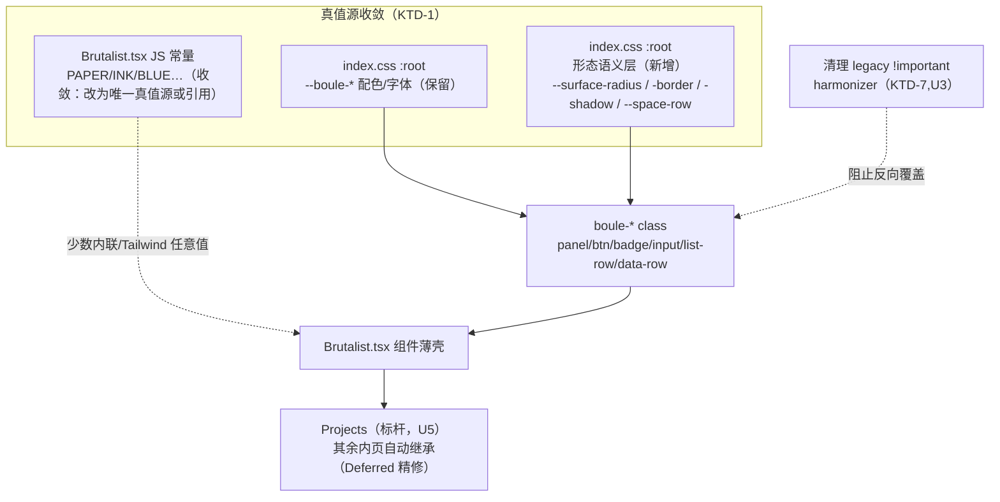
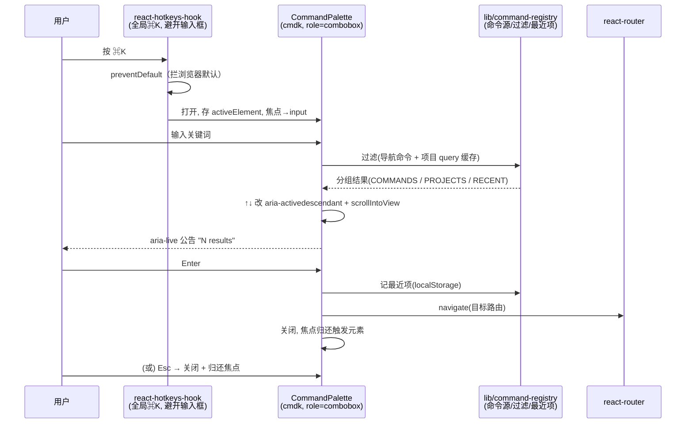

# feat: 工作台内页控制台化重做（标杆页 Projects + ⌘K 命令栏）

## Summary

把 Boule 已登录工作台内页从「野性现代（brutalist）」重做成「控制台工具感」（Linear/Raycast 风）：**保留 landing 的配色 token 与 mono 基因**，把硬边 / 超大字 / 硬投影（`4px 4px 0`）换成圆角 + 柔阴影 + 紧凑行式布局 + 信息密度 + hover/选中微交互 + 状态点色，并新增 **⌘K 命令栏**（搜索 + 键盘导航）。

路径：先用 **open-design 产出新内页设计稿作真值源**，**Projects 作标杆页先落地定稿**，改动集中在共享 token/CSS/组件层；其余内页（ProjectDetail/Workflow/Methodology/Settings/Share）与暗色模式列入 Deferred，待标杆定稿后另起。

不碰：Landing 页（已定稿）、后端与业务逻辑、登录/认证流、数据结构。

---

## Problem Frame

当前内页视觉刻意对齐 landing 的 brutalist 语言（`index.css:18` 注「matches Landing visual standard」，`States.tsx` 注「重绘为 Landing 同款」）。这套语言在落地页有冲击力，但在**高频操作的工作台内页**里交互友好度弱：

- 无圆角、2px 硬黑边、硬投移位（`translate(2px,2px)` 的「按下」感）→ 视觉攻击性强、长时间操作疲劳。
- 列表行靠「整行反色」做 hover（`index.css:76` ink↔paper 整片翻转）→ 闪烁感强、缺乏分级反馈。
- 状态全靠装饰性 Badge（`plain/blue/orange/dark`），**没有语义状态点色**（进行中/完成/失败一眼难分）。
- 几乎零键盘交互（全仓 `metaKey/keydown/cmdk` 0 命中），重度用户没有快速导航/检索通路。

目标是把内页的「形态语言与交互」换成控制台工具风，同时**配色 token 与 mono 字体保留**以呼应 landing，避免品牌断裂。

承认的取舍：内页将与已定稿的 landing 在「形态语言」上分叉（landing 仍 brutalist，内页转控制台），配色一致维持品牌连续性。

---

## Requirements

来源：用户直接请求 + Phase 0.4/0.7 澄清确认（solo 规划，无 upstream brainstorm）。

- **R1** 内页形态语言从 brutalist 切到控制台工具感：圆角、柔阴影、紧凑行式、信息密度、hover/选中微交互。
- **R2** 配色 token（`--boule-paper/ink/blue/orange/muted`）与三套字体栈保留不变，呼应 landing。
- **R3** 新增语义状态点色：进行中=蓝、需注意=橙、完成=绿、失败=红、草稿/终态中性=灰；状态文案仍过 `lib/labels.ts`，不直出枚举码。
- **R4** Projects 作标杆页完整落地控制台风（行式密度 + 状态点 + 相对时间 + 键盘可选中行）。
- **R5** ⌘K 命令栏：全局快捷键唤起，模糊搜索，键盘导航（↑↓ 选择 / Enter 执行 / Esc 关闭并归还焦点），命令源含导航跳转 + 项目检索跳转；满足 combobox/listbox a11y。
- **R6** 改动集中在共享 token/CSS/组件层，降低逐页成本；不逐页另起炉灶。
- **R7** 所有新交互/微动效尊重 `prefers-reduced-motion`（沿用 `shouldAnimate()` / `gsap.matchMedia()` 约定）。

成功标准：Projects 页在登录态下呈现控制台风（行式 + 状态点 + 微交互），⌘K 可用键盘完成「唤起→搜索→跳转」全流程且通过键盘/屏幕阅读器实测；切换形态后其余内页不破版（即便尚未精修）。

---

## Scope Boundaries

### 本计划交付

- 形态语义 token 分层 + 颜色双真值源收敛（`index.css` + `Brutalist.tsx`）。
- 清理 `index.css` 的 legacy `!important` harmonizer。
- 共享组件（Panel/Button/Badge/Input/list-row/data-row）控制台化 + 状态点语义。
- Projects 标杆页重做（据 open-design 真值源对账）。
- ⌘K 命令栏（逻辑层 + UI 层）。

### Deferred to Follow-Up Work

- **其余内页精修铺开**：ProjectDetail / Workflow / Methodology / Settings / Share。token 层切换后它们会自动继承新形态（不破版即可），但行式密度/状态点/页面专属 class（`method-*`/`project-*`）的精细控制台化留后续单独 plan。
- **暗色模式**：本轮亮色优先（呼应 landing 米白）。token 分层（U2）为暗色预留 `data-theme` 接入点，但不实现第二套 token。
- **⌘K 跨项目跳 workflow**：受限于「无全局 workflows 列表端点」（仅项目级 `/api/projects/:id/workflows`）。本轮命令源只含导航 + 项目跳转；workflow 跳转走「先进项目再选」，不新增后端端点。
- **组件测试栈**（vitest + testing-library）：本轮不引入，见 KTD-6。

### 非目标

- 不改后端、业务逻辑、数据结构、认证流。
- 不改 Landing 页。
- 不改 `lib/labels.ts` / `lib/phases.ts` 的文案/阶段契约（只消费，不改）。

---

## Key Technical Decisions

- **KTD-1 形态语义 token 分层。** 在 `index.css` 抽出形态语义变量（`--surface-radius` / `--surface-border` / `--surface-shadow` / `--space-row` 等），各 `boule-*` class 改引用语义变量而非写死 `0` / `2px solid` / `6px 6px 0`。配色与字体 token 不动。一处改形态、全站生效（R1/R6）。
- **KTD-2 ⌘K 用 cmdk 1.1.1 + react-hotkeys-hook 5.3.2，不自建、不用 kbar。** cmdk headless + 零样式注入，React 19 已正式支持（peerDep `^18||^19`），自带键盘导航/分组/`command-score` 模糊匹配/`aria-selected`；react-hotkeys-hook 默认在 input/textarea/contentEditable 聚焦时不触发，正好避开富文本编辑器冲突。kbar 仍 beta 且偏重、自带样式与既有设计系统打架；自建易漏焦点陷阱/IME/公告边界。(see 研究：control-tool UI best practices)
- **KTD-3 ARIA 走 combobox + listbox + `aria-activedescendant`，焦点留在 input。** 不在 input 上叠 `role="dialog"` 的 activedescendant（W3C APG 明文 dialog 不支持 activedescendant）。高亮变化配 `scrollIntoView({block:'nearest'})`，结果数用 `aria-live="polite"` 公告，Esc 关闭归还焦点至触发元素。
- **KTD-4 状态色克制。** 状态只用 8px 圆点不用满块/满行底色：进行中=蓝（复用 accent）、需注意/等待操作=Claude 橙、完成=低饱和绿（新增 success token）、失败=中性红（已有 `--boule-red`）、草稿/中性终态=灰。正文 95% 中性灰阶，彩色只落在点与左侧选中条。状态语义经 `lib/labels.ts` 映射，UI 不直出枚举码（R3）。
- **KTD-5 亮色优先呼应 landing，暗色 Deferred。** 控制台风常 dark-first，但用户明确「呼应 landing 配色」（landing 是米白亮色）。本轮维持亮色控制台；token 分层预留暗色接入点，不实现。
- **KTD-6 不引 vitest/testing-library。** 现有测试体系是 `node:test` 测 `lib/` 纯逻辑、零组件测试。本轮把 ⌘K 的可测逻辑（命令注册/过滤/最近项排序）抽进 `lib/command-registry.ts` 用 `node:test` 覆盖；DOM/键盘/焦点/a11y 行为靠浏览器 + 屏幕阅读器**实测验证**（对应 learnings「实测优先」）。引入组件测试栈是独立决策，留 Deferred。
- **KTD-7 清理 legacy `!important` harmonizer（`index.css:90-115`）。** 该块用高特异性 `!important` 强制把嵌套 utility-heavy 视图「掰回」无圆角/硬阴影，与控制台风（圆角/柔阴影）正面冲突。改为让 `views/` 子组件继承新的语义形态 token，而非反向覆盖。
- **KTD-8 微交互归 CSS、编排归 GSAP。** hover/行高亮/淡入用纯 CSS transition（120-150ms ease-out）；GSAP 只管编排型动效（⌘K 入场 stagger、已有页面转场）。两层都过 reduced-motion，但 GSAP 侧统一用 `gsap.matchMedia()`。动手前读 `docs/plans/2026-06-02-002-feat-gsap-animation-layer-plan.md` 划清边界，避免两套机制打架（编码纪律 7）。
- **KTD-9 本轮单形态直接改默认 token 值，不引 `data-skin` 双形态开关。** 本轮是一次性 brutalist→console 迁移，不需两套形态并存切换，把 console 值设为默认更简单（YAGNI）；`data-skin`/`data-theme` 开关机制留给暗色 Deferred。

---

## High-Level Technical Design

### token 分层与改动收敛

形态迁移成本从「逐页改 class」压到「改一组语义变量 + 组件薄壳」，其余内页通过继承获得新形态（不破版），精修留 Deferred。

### ⌘K 命令栏交互与键盘流（R5 / KTD-2/3）

---

## Implementation Units

### U1. 用 open-design 产出控制台风设计稿真值源

**Goal:** 在 open-design 里产出 Projects 标杆页 + 共享组件的控制台形态设计稿（HTML/JSX 原型），评审定稿，作为后续编码对账的视觉真值源（沿用 landing 当初 `_design/landing-brutalist-demo.html` 真值源模式）。
**Requirements:** R1, R4（视觉真值源）。
**Dependencies:** 无（前置）。
**Files:**
- `_design/console-workbench-demo.html`（或 open-design 项目导出）— 新建，标杆页 + 组件形态规格
- 形态规格记录：圆角/边框/阴影/间距/状态点色具体数值（落进 U2 的 token）
**Approach:** 用 open-design MCP（用户点名的权威工具）创建 artifact，呈现 Projects 行式布局（标题 + 状态点 + 元信息 + 相对时间 + hover/选中态）、共享组件控制台形态（柔阴影圆角 Panel/Button/Badge/Input）、⌘K 命令栏视觉。配色取 landing 既有 token，仅定义新增的「形态语义数值」与「状态点色值」（success 绿、灰、橙/蓝/红语义分配）。定稿后这些数值是 U2 token 的输入。
**Patterns to follow:** landing 真值源工作流（demo HTML → 实现对账）；配色照搬 `--boule-*`。
**Test scenarios:** Test expectation: none — 设计资产产出，无运行时行为。验证 = 用户对设计稿评审通过（人工 checkpoint）。
**Verification:** 设计稿覆盖 Projects 全态（列表/空态/错误/选中）+ 共享组件形态 + ⌘K 视觉；形态数值与状态点色清单明确可落 token；用户确认定稿。

---

### U2. 形态语义 token 分层 + 颜色双真值源收敛

**Goal:** 在 `index.css` 抽出形态语义 CSS 变量并把 console 数值设为默认；收敛 `Brutalist.tsx` JS 常量与散落硬编码 hex 到单一真值源；新增状态点色 token。
**Requirements:** R1, R2, R3, R6；KTD-1/4/5/9。
**Dependencies:** U1（形态/状态色数值来自定稿）。
**Files:**
- `apps/web/src/index.css` — 修改 `:root`，新增形态语义层（`--surface-radius` / `--surface-border-width` / `--surface-shadow` / `--surface-shadow-hover` / `--space-row` 等）+ 状态点色（`--boule-success` 等）；配色/字体 token 原样保留
- `apps/web/src/components/Brutalist.tsx` — 收敛颜色常量（改为从单一真值源引用或明确标注唯一来源），消除与 `index.css` 的重复定义
**Approach:** 形态语义变量以 console 形态为默认值（圆角 4-6px、border 1px subtle、shadow 柔和低海拔 `0 1px 2px`、行间距收紧）。预留 `:root[data-theme="dark"]` 注释位（不填值，KTD-5）。状态点色按 KTD-4 语义分配。收敛双真值源：保留 CSS 变量为唯一色值来源，`Brutalist.tsx` 常量改为文档化引用或仅保留必要 JS 消费点。
**Patterns to follow:** 现有 `:root` 变量块（`index.css:19-30`）；Tailwind v4 CSS-first（无 config）。
**Test scenarios:** Test expectation: none — 纯样式 token 定义，无行为。验证靠 U3-U5 的视觉实测。
**Verification:** 各 `boule-*` class 不再写死形态字面量、改引用语义变量；全站颜色仅一处定义；`tsc --noEmit` 通过；token 变更后页面整体不报错可渲染。

---

### U3. 共享组件控制台化 + 清理 legacy harmonizer

**Goal:** 把 `boule-*` 组件类（panel/btn/badge/input/list-row/data-row）改写为控制台形态（引用 U2 语义变量、柔阴影圆角、紧凑、hover/选中微交互、状态点 Badge tone）；删除/重写 `index.css:90-115` 的 `!important` harmonizer。
**Requirements:** R1, R3, R6, R7；KTD-1/4/7/8。
**Dependencies:** U2。
**Files:**
- `apps/web/src/index.css` — 重写 `.boule-panel/.boule-btn/.boule-badge/.boule-input/.boule-list/.boule-list-row/.boule-data-row`；删除或语义化 `.boule-page .rounded{...!important}` harmonizer 块（90-115）；调整 `.boule-list-row:hover` 从整行反色 → 淡 surface 提升 + 左侧 accent 条
- `apps/web/src/components/Brutalist.tsx` — `Badge` tone 扩展状态语义（新增 `success/running/draft` 或以「status dot」props 表达）；其余组件薄壳按需调整 className
- `apps/web/src/components/States.tsx` — 收敛散落硬编码（如 `shadow-[4px_4px_0_#0B0B0B]`）到语义变量
**Approach:** hover/选中走 CSS transition（120-150ms，KTD-8），键盘高亮与鼠标 hover 复用同一视觉态。Badge 新增状态点（8px 圆点 + 文案），色值取 U2 状态色 token。清理 harmonizer 后改为子视图继承语义形态：把必须统一的项（边框色/背景）用**非 `!important`** 的常规级联表达，或在 `views/` 组件上显式用语义 class。
**Patterns to follow:** 现有 `.boule-list-row`（行式基座）、`.boule-btn` transition 写法；Raycast accessory 行结构（主体靠左 + accessory 靠右）。
**Test scenarios:**
- Test expectation: none（纯样式）对 CSS 部分。**回归验证场景**（浏览器实测，因清理 harmonizer 风险面广）：
  - 进入 ProjectDetail / Workflow / Methodology / Settings / Share 各页，确认清理 `!important` 后无破版（圆角/边框/背景符合新形态，不出现失控的原生圆角白底）。
  - DocumentWorkspace（tiptap）/ RunTimeline / 方法论 xyflow 图等 utility-heavy 视图重点查。
**Verification:** 标杆与其余内页在新形态下不破版；hover/选中为柔反馈非整片翻转；Badge 能表达状态点色；`prefers-reduced-motion` 下过渡降级为瞬时；`tsc --noEmit` 通过。

---

### U4. ⌘K 命令源逻辑层（lib/，可测）

**Goal:** 把命令栏的纯逻辑（命令注册表、模糊过滤排序、最近项 localStorage 读写）抽到 `lib/`，用 `node:test` 覆盖。
**Requirements:** R5；KTD-2/6。
**Dependencies:** 无（可与 U2/U3 并行）。
**Files:**
- `apps/web/src/lib/command-registry.ts` — 新建：命令类型定义（id/label/group/keywords/action 描述）、静态导航命令源（复用路由表 + `Navigation.tsx` 的 `NAV`）、合并动态项（项目列表）入口、最近项排序
- `apps/web/src/lib/command-registry.test.ts` — 新建：node:test
**Approach:** 逻辑与 React/DOM 解耦（action 用回调描述符，不在此层调 `navigate`）。模糊匹配可直接复用 cmdk 的 `command-score`（若可独立 import）或在此层做轻量包含/打分；最近项存 `localStorage`，去重 + 上限 + 按时间排序。
**Patterns to follow:** 现有 `lib/` 纯逻辑 + 注入式测试（`lib/api.test.ts` 注入 `fetchImpl`、`lib/debounce.ts`）。
**Test scenarios:**
- Happy path：给定命令源 + 查询串，返回按相关度排序的匹配项；空查询返回最近项分组在前。
- Edge：空查询且无最近项 → 返回全部命令默认序；查询无匹配 → 空数组（驱动 UI 空态）；最近项超过上限 → 截断保留最新。
- 最近项持久化：记录一次执行后 localStorage 含该项；重复执行同项 → 去重且置顶（注入 mock storage，不依赖真实 DOM）。
- 动态项合并：项目列表注入后，项目名匹配查询出现在 PROJECTS 分组。
**Verification:** `node --test` 全绿；逻辑层不 import React/DOM；契约可被 U5 UI 直接消费。

---

### U5. ⌘K 命令栏 UI（cmdk + react-hotkeys-hook，挂 Layout 层）

**Goal:** 实现 ⌘K 命令栏 UI 组件，全局快捷键唤起，键盘导航 + a11y，消费 U4 逻辑层，挂到 `Layout` 全局。
**Requirements:** R5, R7；KTD-2/3/8。
**Dependencies:** U4（逻辑源），U2/U3（形态样式）。
**Files:**
- `apps/web/src/components/CommandPalette.tsx` — 新建：cmdk 结构（combobox/listbox），焦点陷阱 + Esc 归还，`aria-activedescendant` + `scrollIntoView`，`aria-live` 结果公告，入场动效过 `shouldAnimate()`/`gsap.matchMedia()`
- `apps/web/src/components/Layout.tsx` — 修改：挂载 `CommandPalette`，注册全局 ⌘K（react-hotkeys-hook）
- `apps/web/src/hooks/useCommandPalette.ts`（可选）— 新建：开关状态 + 热键绑定封装
- `apps/web/package.json` — 新增依赖 `cmdk` `react-hotkeys-hook`
- 消费 `lib/command-registry.ts`（U4）、`useNavigate`、`["projects"]` query 缓存
**Approach:** react-hotkeys-hook 注册 `mod+k`，`preventDefault` 拦浏览器默认，默认避开 input/contentEditable（与 tiptap 共存）。命令执行：导航命令 `navigate(path)`，项目命令 `navigate(/projects/:id)`，执行后记最近项（U4）并关闭、归还焦点。样式用 U2/U3 语义形态 + 状态/分组排版。workflow 跨项目跳转本轮不做（Deferred / KTD-9）。
**Patterns to follow:** cmdk 默认 combobox+listbox 结构；`lib/gsap.ts` 的 `shouldAnimate()`；`Layout.tsx` 现有全局挂载（OfflineBanner/ErrorBoundary）。
**Test scenarios:**
- Test expectation: none（自动化）— 无组件测试栈（KTD-6）。**浏览器 + 屏幕阅读器实测验证场景**：
  - ⌘K 唤起，焦点进入 input；Esc 关闭且焦点归还触发元素。
  - ↑↓ 移动高亮，`aria-activedescendant` 跟随且当前项 `scrollIntoView` 可见；Enter 执行跳转并关闭。
  - 在 tiptap 文档编辑器聚焦时按 ⌘K：热键被正确拦截唤起命令栏，不被编辑器吞（验证 react-hotkeys-hook 避让生效）。
  - 输入关键词 → 结果数经 `aria-live` 公告（VoiceOver/NVDA 实听）；无匹配显示空态。
  - `prefers-reduced-motion: reduce` 下入场为瞬时无过渡。
**Verification:** 键盘可完成「唤起→搜索→选择→跳转」全流程；屏幕阅读器读出 combobox 角色、选中项、结果数；不与浏览器/编辑器快捷键冲突；`tsc --noEmit` 通过。
**Execution note:** 先用 U4 逻辑层 + 一个最小命令源把键盘流/焦点/a11y 走通，再接项目动态源与样式精修。

---

### U6. Projects 标杆页重做（据 U1 真值源对账）

**Goal:** 把 `Projects.tsx` 重做成控制台风：行式密度布局、状态点、相对时间、hover/选中微交互、键盘可选中行，对账 U1 设计稿。
**Requirements:** R1, R3, R4, R7。
**Dependencies:** U2, U3（token/组件就绪），U1（对账真值源）。建议 U5 之后或并行（⌘K 中「项目跳转」与本页共用 `["projects"]` 数据）。
**Files:**
- `apps/web/src/pages/Projects.tsx` — 重做列表区为控制台行式（标题 + 状态点 + 元信息 + 相对时间右对齐 tabular-nums + 左侧选中条）；保留数据层（`useQuery(["projects"])` / 创建 mutation / 客户端筛选）与四态分支
- `apps/web/src/index.css` — 调整/新增 `.project-list-row` 等专属类为控制台密度
- 复用 `lib/labels.ts`（状态文案）、`components/States.tsx`（四态）
**Approach:** 不动数据契约与四态结构（`isLoading/isError/empty/filtered-empty`），只换行的呈现：紧凑行高、状态点（经 labels 映射）、相对时间。hover/选中走 U3 的柔反馈。保留 `useFadeIn`/`useStaggerIn`，但确认其与新微交互不冲突（KTD-8 边界）。键盘可选中行（与 ⌘K 的 listbox 范式一致的焦点处理）。
**Patterns to follow:** 现有 `Projects.tsx` 数据/态结构；Raycast List 行结构；`lib/labels.ts` 状态映射。
**Test scenarios:**
- Test expectation: none（自动化，无组件栈）。**浏览器实测验证场景**：
  - 有数据：行式列表呈现，状态点色按语义正确（进行中蓝/完成绿/失败红/草稿灰）、相对时间对齐。
  - 空态 / 搜不到 / 加载 / 错误四态分别正确渲染（与重做前行为一致，业务逻辑未变）。
  - 客户端搜索过滤行为不变（输入关键词即时筛选）。
  - hover/选中为柔反馈；reduced-motion 下入场降级。
  - 创建项目成功后列表刷新（mutation→invalidate 链路未破）。
**Verification:** 视觉与 U1 设计稿对账一致；四态与搜索/创建行为与重做前等价（无回归）；状态点经 labels 映射不直出枚举码；`tsc --noEmit` 通过。

---

## System-Wide Impact

- **所有已登录内页**：token 层切换（U2/U3）一次性改变全部内页形态。Projects 精修（U6），其余页继承新形态（Deferred 精修）——需逐页快速回归确认不破版（U3 验证场景）。
- **Layout 全局层**：新增 ⌘K 命令栏挂载点与全局热键（U5），影响所有 RequireAuth 页。
- **依赖**：`apps/web` 新增 `cmdk` + `react-hotkeys-hook` 两个轻依赖。
- **与 GSAP 动画层的边界**（`docs/plans/2026-06-02-002-...`）：微交互归 CSS、编排归 GSAP（KTD-8），动手前对齐避免双机制冲突。
- **受影响人群**：重度内页操作用户（获得键盘流 + 更友好交互）；后续接手其余内页精修的开发者（token 层已就绪）。

---

## Risks & Dependencies

- **R1 清理 legacy harmonizer 的回归面**（U3）：`!important` 块原本兜住 `views/` 里 utility-heavy 旧组件（tiptap / xyflow / RunTimeline）。删除后这些视图可能露出原生 utility 样式。缓解：U3 含逐页回归场景；必要时对特定子视图保留最小语义级联（非 `!important`）。
- **R2 ⌘K 与富文本/画布快捷键冲突**：tiptap、xyflow 可能有自身键盘处理。缓解：react-hotkeys-hook 默认避开输入框/contentEditable（KTD-2），U5 含编辑器聚焦实测场景。
- **R3 无组件测试栈，交互回归靠手测**（KTD-6）：⌘K 键盘/焦点/a11y 无自动化护栏。缓解：可测逻辑下沉 `lib/`（U4，node:test 覆盖）；UI 用浏览器 + 屏幕阅读器实测清单；引测试栈列 Deferred。
- **R4 内页与 landing 形态分叉**：刻意取舍（配色一致、形态分叉）。风险是品牌观感割裂——靠保留配色 token + mono 基因缓解。
- **R5 标杆未定稿即铺其余页 → 返工**：本计划只精修 Projects，其余 Deferred，正是规避此风险。
- **依赖前置**：U1 设计稿定稿（人工 checkpoint）是 U2/U6 的输入；`pnpm add cmdk react-hotkeys-hook`（apps/web）。

---

## Alternatives Considered

- **逐页重写 vs token 层切换。** 逐页重写每页另起控制台 class，工作量大且风格易漂移。选 token 层切换（KTD-1）：形态语义变量 + 组件薄壳改一处全站生效，其余页继承。
- **`data-skin` 双形态开关 vs 直接改默认 token 值。** 研究推荐 `data-skin="console"` 让两套形态并存切换。但本轮是一次性 brutalist→console 迁移、不需并存，直接把 console 设为默认更简单（KTD-9）；开关机制留给暗色 Deferred。
- **kbar / 自建 vs cmdk。** kbar 偏重且仍 beta、自带样式打架；自建易漏焦点陷阱/IME/公告。选 cmdk headless（KTD-2）。
- **引 vitest+testing-library 给 ⌘K 写组件测试 vs 逻辑下沉 node:test + UI 实测。** 引测试栈成本高、偏离既有约定；选逻辑下沉 + 实测（KTD-6），引栈列 Deferred。

---

## Dependencies / Prerequisites

- `pnpm --filter @boule/web add cmdk react-hotkeys-hook`（执行期）。
- U1 设计稿用户评审定稿（人工 checkpoint）。
- 阅读 `docs/plans/2026-06-02-002-feat-gsap-animation-layer-plan.md` 与 `docs/brainstorms/2026-06-02-gsap-animation-layer-requirements.md` 划清动画边界。

---

## Sources & Research

- **本地仓库研究**（ce-repo-research-analyst）：设计系统 = `components/Brutalist.tsx`（token + 10 组件薄壳）+ 单个 `apps/web/src/index.css`（243 行）；双真值源问题（JS 常量 + CSS 变量 + 散落 hex）；`index.css:90-115` legacy `!important` harmonizer；无暗色/无键盘交互/无组件测试栈（node:test 测 lib/）；workflow 无全局列表端点；约定「UI 不直出枚举码、过 lib/labels.ts」「尊重 prefers-reduced-motion」。
- **外部最佳实践**（ce-best-practices-researcher）：cmdk 1.1.1（React 19 已支持）+ react-hotkeys-hook 5.3.2；ARIA combobox+listbox+activedescendant（dialog 不支持 activedescendant）；状态色克制（8px 点 + 中性灰阶 95%）；Tailwind v4 形态 token 语义层切换；GSAP `matchMedia` 尊重 reduced-motion、微交互归 CSS。来源含 W3C APG Combobox、cmdk/kbar npm、Raycast List API、Tailwind v4 theme 文档。
- **历史经验**（ce-learnings-researcher）：`docs/solutions/` 无前端设计系统相关沉淀（开荒）；可迁移纪律「标度/单位/运行期行为实测优先，不靠静态推断或多 agent 共识」；建议落地后 `/ce:compound` 沉淀 (a) 设计 token/`boule-*` 真值源约定 (b) open-design 真值源工作流。
